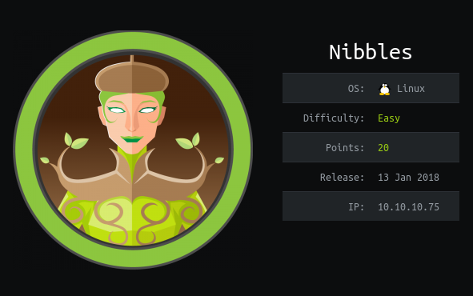
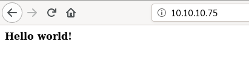
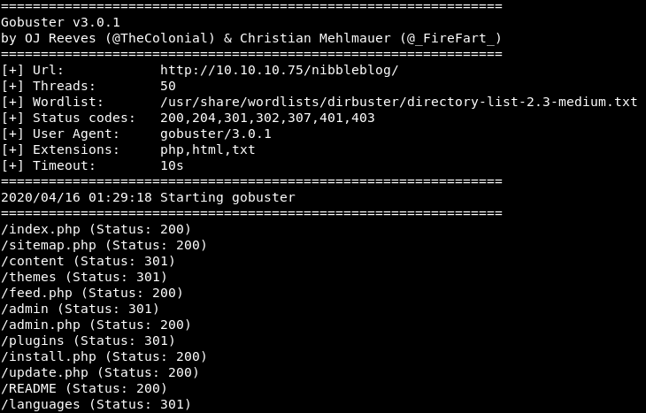
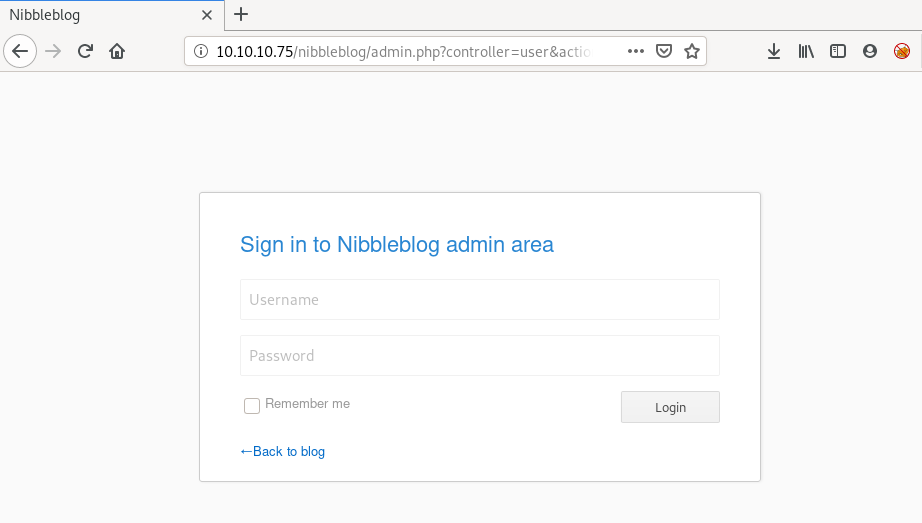
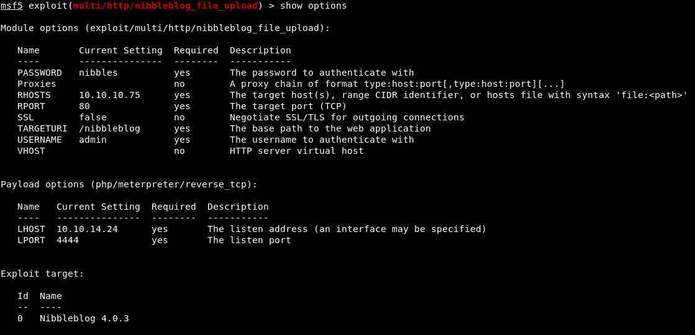
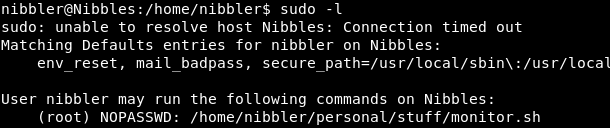
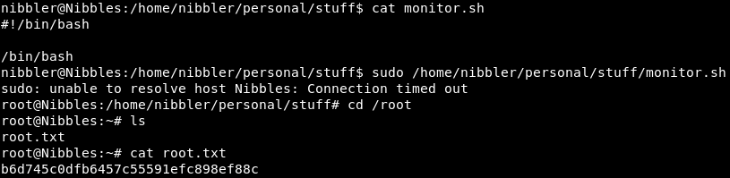

## nmap
nmap -sC -sV 10.10.10.75
```
Starting Nmap 7.80 ( https://nmap.org ) at 2020-04-16 01:05 EDT
Nmap scan report for 10.10.10.75
Host is up (1.5s latency).
Not shown: 998 closed ports
PORT   STATE SERVICE VERSION
22/tcp open  ssh     OpenSSH 7.2p2 Ubuntu 4ubuntu2.2 (Ubuntu Linux; protocol 2.0)
| ssh-hostkey: 
|   2048 c4:f8:ad:e8:f8:04:77:de:cf:15:0d:63:0a:18:7e:49 (RSA)
|   256 22:8f:b1:97:bf:0f:17:08:fc:7e:2c:8f:e9:77:3a:48 (ECDSA)
|_  256 e6:ac:27:a3:b5:a9:f1:12:3c:34:a5:5d:5b:eb:3d:e9 (ED25519)
80/tcp open  http    Apache httpd 2.4.18 ((Ubuntu))
|_http-server-header: Apache/2.4.18 (Ubuntu)
|_http-title: Site doesn't have a title (text/html).
Service Info: OS: Linux; CPE: cpe:/o:linux:linux_kernel

Service detection performed. Please report any incorrect results at https://nmap.org/submit/ .
Nmap done: 1 IP address (1 host up) scanned in 28.54 seconds
```




```
/root/go/bin/gobuster dir -u 10.10.10.75/nibbleblog/ -w /usr/share/worlists/dirbuster/directory-list-2.3-medium.txt -x php,html,txt -t 50
```





there was some guessing involved the admin password was nibbles  
using hydra will get you blacklisted  
found a metasploit module for nibble arbitrary file upload  







