## nmap
nmap -sC -sV 10.10.10.79
```
Starting Nmap 7.80 ( https://nmap.org ) at 2020-04-16 13:58 EDT
Nmap scan report for 10.10.10.79
Host is up (0.51s latency).
Not shown: 997 closed ports
PORT    STATE SERVICE  VERSION
22/tcp  open  ssh      OpenSSH 5.9p1 Debian 5ubuntu1.10 (Ubuntu Linux; protocol 2.0)
| ssh-hostkey: 
|   1024 96:4c:51:42:3c:ba:22:49:20:4d:3e:ec:90:cc:fd:0e (DSA)
|   2048 46:bf:1f:cc:92:4f:1d:a0:42:b3:d2:16:a8:58:31:33 (RSA)
|_  256 e6:2b:25:19:cb:7e:54:cb:0a:b9:ac:16:98:c6:7d:a9 (ECDSA)
80/tcp  open  http     Apache httpd 2.2.22 ((Ubuntu))
|_http-server-header: Apache/2.2.22 (Ubuntu)
|_http-title: Site doesn't have a title (text/html).
443/tcp open  ssl/http Apache httpd 2.2.22 ((Ubuntu))
|_http-server-header: Apache/2.2.22 (Ubuntu)
|_http-title: Site doesn't have a title (text/html).
| ssl-cert: Subject: commonName=valentine.htb/organizationName=valentine.htb/stateOrProvinceName=FL/countryName=US
| Not valid before: 2018-02-06T00:45:25
|_Not valid after:  2019-02-06T00:45:25
|_ssl-date: 2020-04-16T18:01:59+00:00; +2m32s from scanner time.
Service Info: OS: Linux; CPE: cpe:/o:linux:linux_kernel

Host script results:
|_clock-skew: 2m31s

Service detection performed. Please report any incorrect results at https://nmap.org/submit/ .
Nmap done: 1 IP address (1 host up) scanned in 48.52 seconds
```

## gobuster
both http and https gave the same results
```
/root/go/bin/gobuster dir -u 10.10.10.79 -w /usr/share/wordlists/dirbuster/directory-list-2.3-medium.txt -x php,html,txt -t 50
```

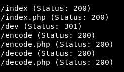

## SSH key
both http and https were identically similar and there was no Virtual Host Routing  

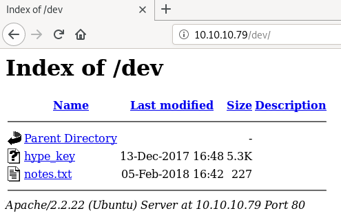

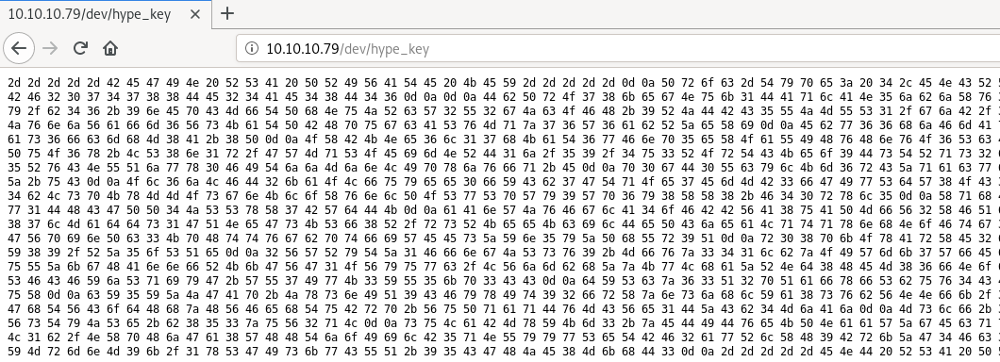

converting the hex to ascii gave an encrypted SSH private key  
the key is probably for user "hype" because the name of private key is usually USER.key  
using john to crack the password for SSH key did not gave any result  

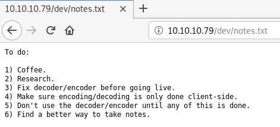

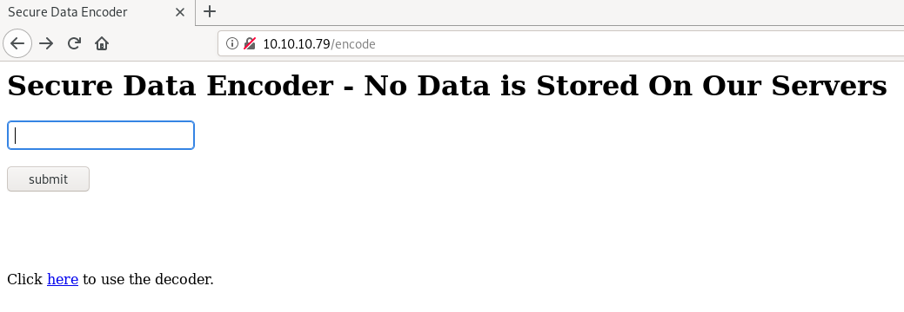

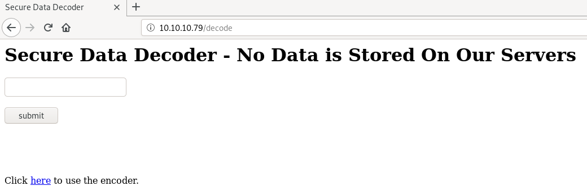

encoder just convert into base64 and decoder from base64 to ascii, so nothing useful  

## Heartbleed
Heartbleed is a security bug in the OpenSSL cryptography library, which is a widely used implementation of the Transport Layer Security protocol  
It allows anyone on the Internet to read the memory of the systems protected by the vulnerable versions of the OpenSSL software  

the image on the index page hints us towards heartbleed vulnerability because heartbleed logo is also a bleeding heart   


we can check if it is vulnerable for heartbleed using nmap  
if we also want to check for other vulnerabilities we can use "--script vuln" instead of "--script ssl-heartbleed"
```
nmap -p 443 --script ssl-heartbleed 10.10.10.79
```

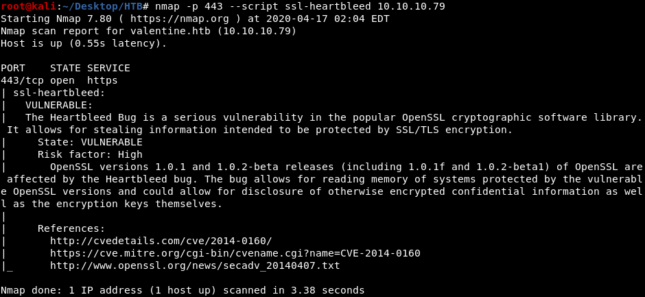

so now we know it is definitely vulnerable to heartbleed  
this image efficiently explains heartbleed  


i searched for "heartbleed exploit python" and i used the script from the first result  
https://gist.github.com/eelsivart/10174134  
```
./heartbleed.py 10.10.10.79 -n 10
```


this base64 encoded string "aGVhcnRibGVlZGJlbGlldmV0aGVoeXBlCg==" decoded to --> "heartbleedbelievethehype"

## Metasploit
rather than using a python script we can also use the metasploit module for heartbleed  

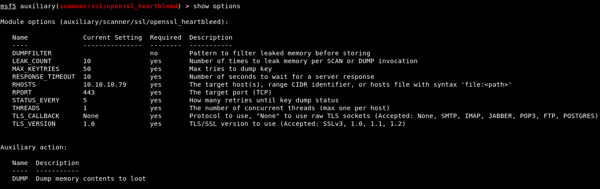

use strings on the result bin file to the base64 encoded string  

## user shell
i was able to SSH as hype using "heartbleedbelievethehype" as password for the encrypted SSH key obtained from /dev/hype.key

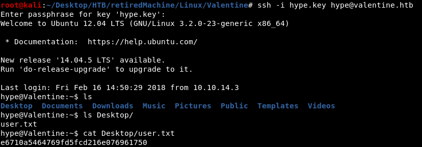

# privEsc
## Method 1 - tmux socket
bash_history is not redirected to /dev/null so we can read the commands run before  

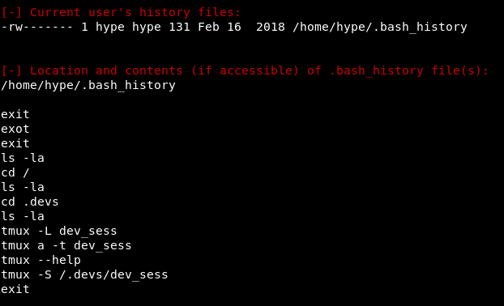

"tmux -L" started tmux as hype but "tmux -S" started tmux as root

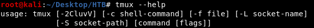

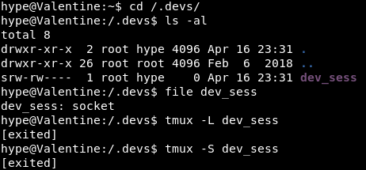

dev_sess is owned by root and we have read write permission on it  
as root is already running the same tmux socket if we use "tmux -S" we get attached to the same tmux socket that root is running  

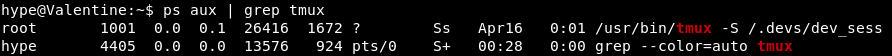

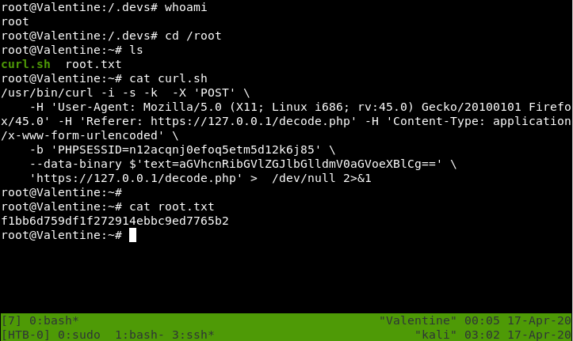

## Method 2 - dirtycow
as the kernel was last updated in 2012 we can probably do dirtycow to get root

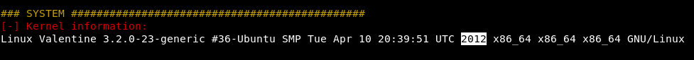

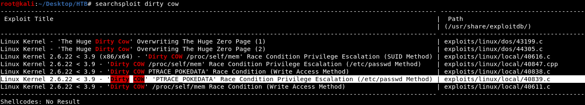

we will use the one that changes /etc/passwd to get root  

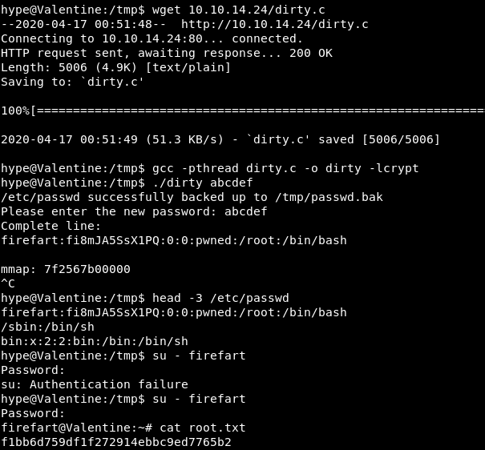
